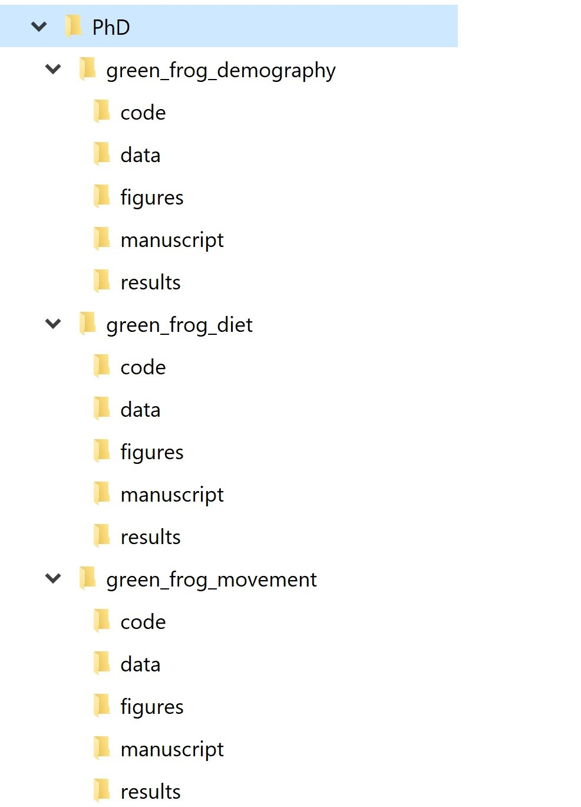
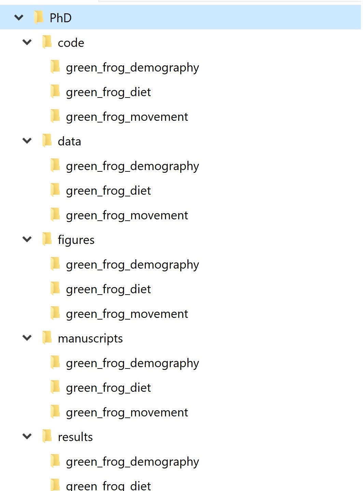
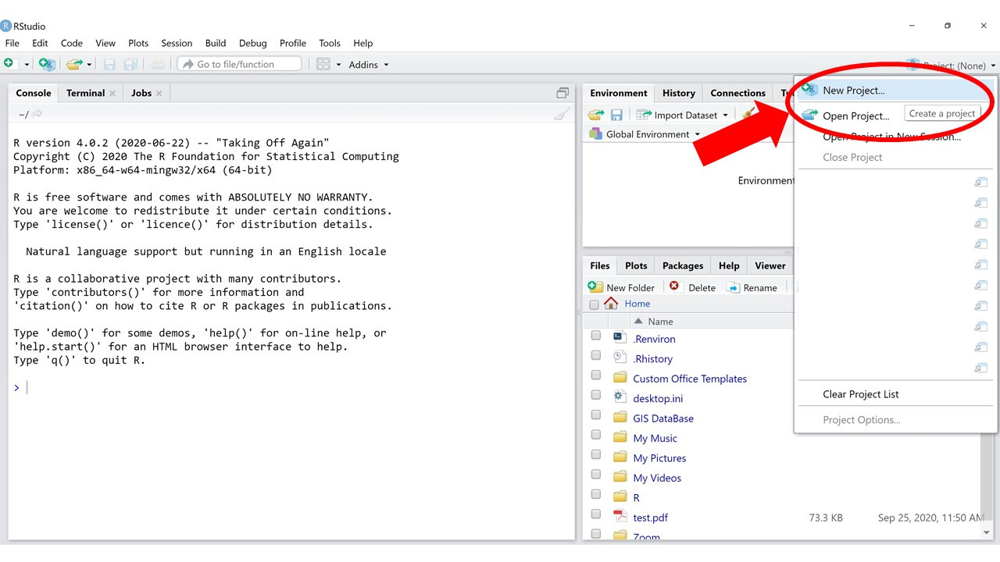
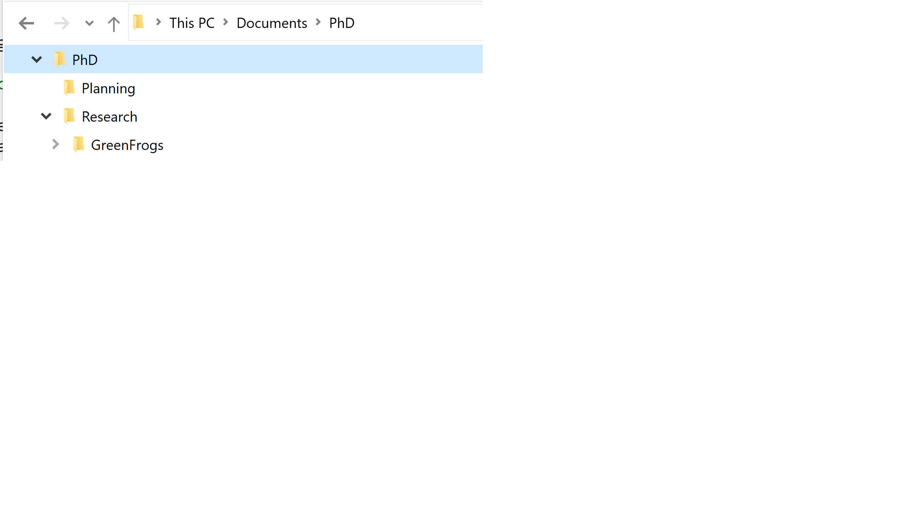

# Project Organization {#project-organization}

## Directory structure

When starting a new project, it is worthwhile to spend some time thinking about how to best organize its content. This means asking questions such as:

* What are my project inputs?
* What types of outputs do I expect to come out of this project?
* How does this project relate to other projects I am working on? 

Answering these questions can help us decide on a directory structure to house our project files. For example, say that we are working on a research project that entails data cleaning, analysis, and writing of a manuscript. One way to go about it is to have a root project directory that contains subfolders for data, analysis code, results, and the manuscript file/s. We can call this a "project-based directory layout." Alternatively, if we have multiple projects underway, we can split our files by activity rather than by projects and have a "data" folder, an "analyses" folder, a "manuscripts" folder, etc., all with a subfolder for each project. We can call this an "activity-based directory layout."

{width=50%}
  
  
{width=50%}

  
How you define a project is largely up to you. It could be all the work you do on a given dataset, or all the work you do for a thesis or dissertation, or each manuscript could be its own project even if it uses the same dataset as a different project. 

With so many options, how do we choose? Ultimately, the way you structure your project directories will have a big impact on the efficiency and reproducibility of your work, so there are some criteria to keep in mind. 

### Overlap 

The first thing to consider is the overlap in data and code files between a project and other past/current projects. If two projects don't share any data, it's probably best to manage them separately. If two projects share a large amount of data, it might make more sense to manage them together as one. If you are writing functions to use across several different projects, they should probably be in their own project.  

### Minimizing duplication

The reason why it's important to account for overlap is because you want to minimize duplication as much as you can. Duplication of both data and code files is dangerous because it's easy to lose track of modifications you have made to a file saved in one place but not in the other place. As you keep making changes, the two files will have the same name but different content, which generates confusion. Duplication is also inefficient because it occupies precious space on your computer. 

### Self-containedness

A fundamental quality of reproducible projects is that they are self-contained, meaning that ideally you could zip up the entire project directory and send it to a friend and they should be able to run your code and reproduce your results without changing anything. This means everything the project needs to work, from A to Z -- data, functions, code -- is contained in its root directory. 

### Tradeoffs

The self-containedness criterion is sometimes in contradiction with minimizing duplication: if two projects share one or more data files, you can either violate the duplication criterion by making sure each project contains all the necessary data for the sake of self-containedness; or you can choose to sacrifice self-containedness to avoid file duplication and save space on your computer. The answer will depend on whether you anticipate the project to be widely shared or mostly for your personal use, how large the shared data files are, etc. 
  
The bottom line is that there is no one-size-fits-all solution for project organization. Most importantly, the structure you choose needs to be functional for your needs. Putting thought into it is a great place to start. 

## Golden rules

Whichever directory structure you choose for a project, there are some universal rules to keep in mind for how to organize files within it. 

1. First and foremost, **raw data should never be changed**. Save it into a "data" folder and treat it as immutable. You can even set it as read-only to make sure there is no room for accidents. 

2. The processed, clean version of your data will go into a dedicated "processed_data" folder. 

3. Anything that can be generated from code goes into its own folder. This includes basically everything but the raw data and the code itself. You can have an "output" folder, or separate folders for output files and figures (e.g., "output" and "figures".) 

4. If there are text documents, put them in their own folder (e.g., "docs")

5. Code also has its own folder. If you write a lot of functions, it can be helpful to have a "funs" folder to store those and a "src" (for 'source') folder to save processing/analysis code. 

6. If processing/analysis scripts are meant to be used in a certain order, you can number them (more on this in a minute.) Sometimes the pipeline is not linear but branched, so numbering may not always make sense. Function scripts should not be numbered. 

7. Modularize your code: instead of having a giant script to run your entire analysis from data cleaning to final figures, break up your workflow into several short, single-purpose scripts with well-defined inputs and outputs. 

## Be flexible

It can be challenging to anticipate the structure of a project that is just about to start (especially the first time you start thinking through optimal directory structures.) It helps to be flexible and allow some room for adjustments. For example, you can start with a basic directory structure where you have a "data" folder, a "code" folder, and an "output" folder, and then you may decide to split the "code" folder into "src" and "funs", or to further split the "output" folder into "output" and "figures", etc. Sometimes these changes can break your code and become frustrating, but these problems are easy to fix.

Similarly, it can be challenging to have the long-term vision to know where it's best to break a script and start a new one. It's easy to tunnel vision into an analysis and keep adding lines and lines of code without thinking about break points that make sense. One good way to deal with this is to reserve some time at the end of your coding session to look at your script and notice if there are any intermediate products that you can save and use as input of the next step of the workflow. Then you can make the necessary adjustments in terms of code compartmentalization, paths to input and output files, etc.
  
In the words of Wilson et al. (2017, see references below), "consistency and predictability are more important than hairsplitting" when organizing the directory structure for your projects. Besides a few universal rules, designing the optimal structure often requires consideration of project specifics. Ultimately, the goal is to improve efficiency -- by allowing you to find your files easily, only run the minimal amount of code you need for a task, making it easy for collaborators and future you to wrap your head around the project content -- and reproducibility. 

## Documentation

One very important aspect of reproducibility is good documentation. Each of your projects should always be accompanied by a README file. The README should contain all the information an outsider would need to understand what the project is all about, what are the inputs and outputs, where to find files within the project directory, etc. The README is simply a text file, there's nothing special to it -- you can just create it in your Notepad or other text editor. 

Writing down everything about a project in a README can be tedious, but it pays off ten-fold. It's good to get in the habit of starting a project by creating a README file right after the directory structure is created. Record who the author/s is/are, the date the project was started, and a description of what the project is for. Then, any time a new file is added, specify what it is and where you got it from. For example, "File X.csv was sent by Mary White in an email on 2/1/2019 to my.address @ gmail.com", etc. Be meticulous: what seems obvious today can become a puzzle to solve in a few months. 

## Naming files 

There is a science to choosing good file names, too. Here is a list of file names that are **not** good, for a variety of different reasons:

> data.csv
> data_cleaned_03-22-2012.csv
> analysis code.R
> Green Frogs Manuscript_Final_edits.docx
> final.docx

Why are those names bad, and what makes a good file name? Good file names are machine-readable, human-readable, and work well with default ordering. Let's break these three criteria down one by one. 

### Machine-readable file names

What makes a file name machine readable? First, machine readable files contain no spaces, no punctuation, and no special characters. They are case-consistent, which means that you always stick to the same case pattern, whether that be full lowercase, camel case (ThisIsWhatIMeanByCamelCase), or whatever else. Finally, good file names make deliberate use of text delimiters. Wise use of delimiters makes it easy to look for patterns when you are searching for a specific file. Usually, it's recommended that you use an underscore (_) to delimit metadata units and a dash (-) to delimit words within a metadata unit. For example, here is a good, machine-readable file name:

> 2018-04-26_reproducible-science_slides_lesson-01.pptx

### Human-readable file names

The example file name above is not only machine-readable, it's also human-readable. This means that a human can read the file name and have a pretty good idea of what's in that file. Good file names are informative! You shouldn't be afraid to use long names if that's what it takes to make them descriptive. 

### File names that work well with default ordering

If you sort your files by name in a folder, you want them to be ordered in a way that makes sense. Whether you sort your files by date or by a sequential number, the number always goes first. For dates, use the YMD format, or your files created in April of 1984 and 2020 will be closer than the ones created in March and April 2020. If you are using sequential numbering, add a sensible amount of zeros in front based on how many files of that category you expect to have in the future. If you expect to have more than 10 but not more than 99 files, you can add a single leading zero (e.g., "data_analysis_01.R" instead of "data_analysis_1.R"), whereas if you expect to have between 100 and 999 you can add two (e.g., "Photo_001.jpeg" instead of "Photo_1.jpeg" or "Photo_01.jpeg".)

## RStudio Projects 

RStudio Projects are a great tool to help you stay organized. The concept behind RStudio Projects is that each Project is a self-contained unit where inputs, outputs, and code are all in one place. Sounds familiar? RStudio Projects work seamlessly with the directory organization framework we have been talking about. It's a good idea to make sure each of the projects (with a lowercase p) you work on has its own associated RStudio Project (with a capital P). 

You may be familiar with the concept of a working directory in R. The working directory is the place where, unless otherwise specified, all of your outputs are saved. All relative paths are also interpreted relative to the working directory (more on relative paths in a minute.)  

The cool thing about an RStudio Project is that it automatically makes sure that your project directory is set as the working directory. All the clunkiness of having to set, change, or double check which directory you're working in is forgotten: all you do is open up your Project and then the paths you use to load or save data are already, by default, relative to your project directory. 

## Relative and absolute paths

Paths define the location of files within the file system. There are two ways to point to a file from within a command prompt such as R. The first is to use what is called an absolute path: this describes the full sequence of folders a file is contained in, starting from the root directory of a computer. When you right click on any file on your computer, you can look up its absolute path in the Properties. This is an example of an absolute path:

> C:/Users/MJS/Documents/PhD/Planning/schedule_2021.csv

Relative paths describe the position of a file with respect to a reference directory. In R, that reference directory is your working directory. When you type a relative path to open a file in R, R appends that path to the path of the working directory to get the full absolute path, which it then uses to open the file. For example, if our working directory was "Documents", this would be the relative path to reach the same file as above:

> PhD/Planning/schedule_2021.csv

If our working directory was "Planning", this would be the relative path to the same file:

> schedule_2021.csv

To work across subfolders of our working directory, we can just use relative paths to navigate and locate files. But relative paths also work to navigate across folders that are outside of the working directory, if need be. Using "../" in front of a folder name navigates to the parent of that folder ("parent" means the folder where that is contained.) Let's consider the following directory structure:

We can navigate to a file into "PhD/Research" from "Planning" like so:

> ../Research/GreenFrogs/data-cleaning.RProj

The "../" means "the parent directory of the working directory", which is "PhD". We can also stack these to navigate further up the directory tree:

> ../../../../DAJ

The path above navigates all the way up to "Users" and into a different user's directory. 

### Path separators

Something to be mindful of is that the separator between folder names in a path is different on different operating systems. On Windows, it is a backslash ("\"), while on Mac/Linux, it is a slash ("/"). However, R uses the Mac/Linux convention, so always use "/" when typing paths in R. 

### References 

* Wilson G, Bryan J, Cranston K, Kitzes J, Nederbragt L, Teal TK (2017) Good enough practices in scientific computing. PLoS Comput Biol 13(6): e1005510. https://doi.org/10.1371/journal.pcbi.1005510 
* https://speakerdeck.com/jennybc/how-to-name-files
* https://r4ds.had.co.nz/workflow-projects.html