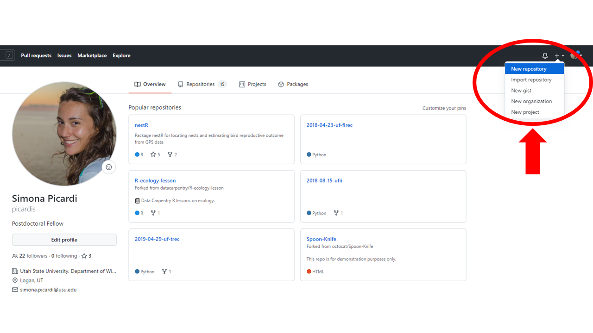
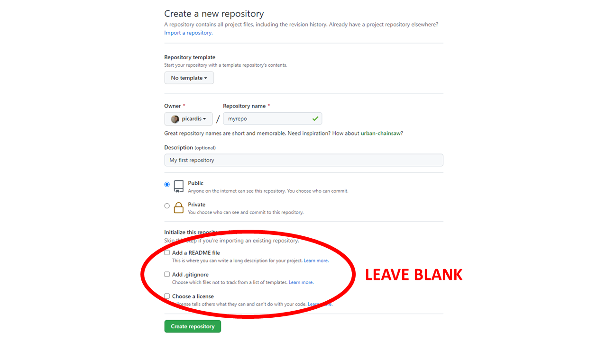
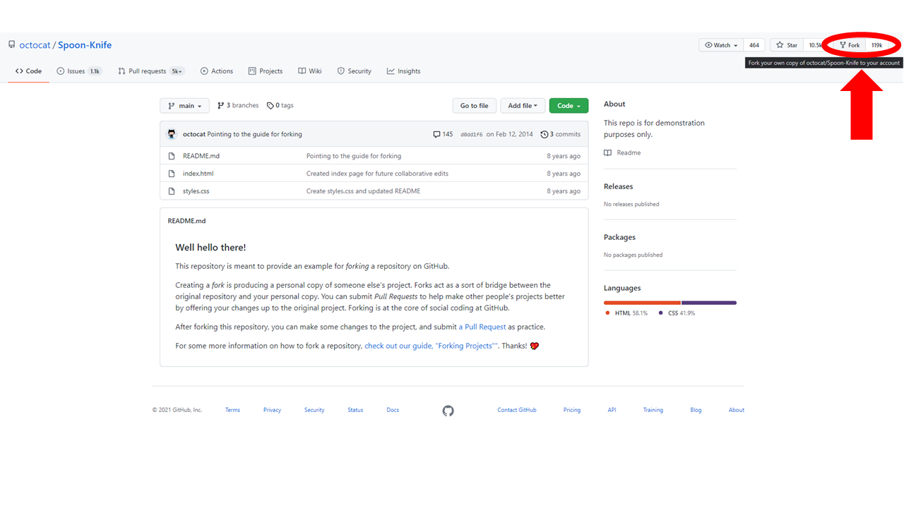
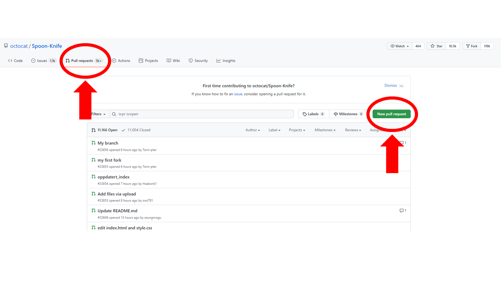

# Collaborative Science with GitHub {#github}

```{r setup-github, include=FALSE}
knitr::opts_chunk$set(echo = TRUE, eval = FALSE)
```

So far, we have gained a good understanding of how Git works locally on our computer. Now we are going to see how to work with remote repositories and use Git to collaborate with others. A remote repository is a copy of a repository that is stored elsewhere than your local copy, such as a web server or a private network server. In most cases, when collaborating, you'll have a copy of a repository on your machine (the local repository) and a copy on a server that is accessible to others (the remote repository). The remote repository can be hosted on GitHub. 

There are two ways to set up your local and remote repositories to interact. One is to set up the local first and link it with a remote later. The second one is to create the remote first and "clone it" on your computer to get a local copy. If you're starting a brand new repository you can go either way, but the first approach is what you would do if you wanted to link a repository that already exists on your local machine to a GitHub repository.

## Adding a remote to a local repository

Starting from an existing Git repository on your computer, you can link this to its GitHub counterpart by adding a remote URL. To set up a URL, go on the GitHub website, click on the '+' sign in the top-right corner and select 'New Repository'. 

```{r github01, fig.cap="Create new GitHub repository", fig.align='center', out.width='100%', echo = FALSE, eval = TRUE}

```

You can choose any name for your repository, but I find it intuitive to give it the same name as the folder where my local Git repository is. Since the remote repository will need to be connected to a local one, it needs to be completely empty: if there are conflicts in the content of the two repositories to begin with, Git won't be able to link them. Therefore, do not add a README, a .gitignore file, or a license.

```{r github02, fig.cap="Create new GitHub repository", fig.align='center', out.width='100%', echo = FALSE, eval = TRUE}

```

To connect the local and remote repositories, you can copy the URL of the remote repository and paste it in the following command in the terminal:

```{sh}
> git remote add origin https://github.com/picardis/myrepo.git
```

'Origin' is the conventional name given to a remote repository. You could use any other name, but since GitHub uses 'origin' as the default name when creating a repository from the website, using this convention will make things easier later. You'd need a very good reason to use a different name. 

To check that the remote was added correctly you can view the list of remotes associated with your local repository:

```{sh}
> git remote -v
```

We'll talk about branches later in this chapter, and we'll see that a repository can have multiple branches. At a minimum, each repository includes one main branch, which is created by default when you create your repository. By default, this branch is called `master`. Starting in 2020, GitHub has started to switch to using `main` instead of `master` to remove unnecessary references to slavery. We like this change,
because Black Lives Matter. So we'll go ahead and rename the `master` branch to `main`:

```{sh}
> git branch -M main
```

## Pushing to a remote repository

Now it's time to transfer an exact copy of the files in the local repository to the remote one. This action is called 'pushing'. The first time you push, it's a good idea to specify which branch Git should use as the default remote for the local main branch in the future. We do this by adding the flag '-u' (for upstream), followed by the name of the remote and the name of the local branch that you want to link up:

```{sh}
> git push -u origin main
```

This command is identical to the following:

```{sh}
> git push --set-upstream origin main
```

You only have to set the upstream the first time you push a certain branch. After the upstream is set up, you will be able to just push changes to the remote repository by doing:

```{sh}
> git push
```

You will be prompted to enter your GitHub password for the push to go through.

Once you push, all the files you committed are transferred and your two repositories will mirror each other. To keep the remote repository synchronized with the local, any time you commit changes to tracked files you will also need to push them. That adds a new step to our workflow: add/stage, commit, push. 

## Cloning a repository

The other way to get a local-remote repository pair set up is to create a GitHub repository first and clone it on your computer. In this case, it doesn't matter whether the remote repository is empty or not, so you can add a README. Cloning a repository is also useful if you are collaborating on a project with someone on their repository. You and your collaborator/s can all have a copy of the same repository on each of your computers by cloning a shared remote repository, which will then be synchronized with changes made by anyone on the team. The person who created the repository will need to add the others as collaborators so that they're able to clone it. 

To clone a repository, open the terminal and navigate to the folder where you want to download it. Then use the following command:

```{sh}
$ git clone https://github.com/picardis/myrepo.git
```

The repository will be copied to your computer into the folder you specified.

## Synchronizing changes among collaborators

The inverse of pushing is pulling, which transfers files and changes from the remote repository to the local one:

```{sh}
$ git pull 
```

When you are working with collaborators on a shared GitHub repository, you will periodically need to pull from it to make sure your local copy is synchronized with changes somebody else might have made. You certainly need to pull before you push your own changes, because Git won't allow you to push if the remote repository has changes that you don't have on your local copy. If the two repositories are already up-to-date and you try to pull, nothing will happen because there are no changes on the remote repository that aren't already in the local. 

If a collaborator makes a change that is in conflict with what we committed to our own local repository, when we try to pull we are going to encounter a merge conflict. Merge conflicts occur when two collaborators work on the same file at the same time. GitHub does not know how to automatically reconcile changes to the same file, and it will throw an error that we'll need to resolve manually. 

## Resolving conflicts

Having to deal with merge conflicts is eventually very likely when working on collaborative projects, but they can be handled and resolved without too much pain. 

If two collaborators edit the same file at the same time without pulling each other's changes first, when one tries to push their changes to the remote they will get an error message that looks like this: 

```{sh}
To https://github.com/picardis/myrepo.git
 ! [rejected]        master -> master (fetch first)
error: failed to push some refs to 'https://github.com/picardis/myrepo.git'
hint: Updates were rejected because the remote contains work that you do
hint: not have locally. This is usually caused by another repository pushing
hint: to the same ref. You may want to first integrate the remote changes
hint: (e.g., 'git pull ...') before pushing again.
hint: See the 'Note about fast-forwards' in 'git push --help' for details.
```

Git is rejecting the push because it found some updates in the remote repository that have not been incorporated in the local copy. To solve this, the person who got the error will need to pull the most recent changes, merge them into their current copy, and then push the resulting file. 

After pulling, if we open the file where the conflict is, we'll find that Git did not erase one person's changes in favor of the other's; instead, it marked the lines where conflicting changes occur. The beginning and end of the problematic chunk are highlighted, and the two versions are separated by '=' signs.

Now it is up to us to reconcile these changes however we consider appropriate. We could keep our own changes, keep the changes made by our collaborator, write something new to replace both, or delete the change entirely. Once the conflict is removed and the file is saved, we can proceed as usual by staging the file, committing it, and pushing it. Now, when any of the other collaborators pulls from the repository again, they will get the merged version of this file.

In some cases, collaborators will make simultaneous changes to a file that are mutually exclusive -- for example, one person will delete a line of code while another person will edit that same line. However, changes don't need to be mutually exclusive for a merge conflict to happen: any time two users edit the same line of the same file at the same time (for example, two users may both add a new argument to the same function), Git is going to play it safe and call a merge conflict regardless of whether the changes contradict each other or not. Conflict resolution requires the user to verify whether the changes affect each other and if they can both stay or not.

## Avoiding conflicts

Merge conflicts need to be manually resolved by a person, which is time-consuming. More importantly, the person who resolves a merge conflicts is making a judgement call on what is the best way of fixing the situation. Having to introduce subjective judgement calls is perhaps the weakest spot of the entire collaborative version control workflow. Preventing conflicts from happening in the first place is better than having to fix them. There are a few things that can help prevent merge conflicts:

* Pull often: decreases probability that your working version is not up-to-date;
* Make small and frequent commits: decreases probability that your recent changes are not in other people's working version; 
* Organize your code in small modules: decreases probability of two users working on the same file;
* Working on branches or forks... more on this in the next sections. 

## Working with branches

By default, a new repository contains a single branch: the main branch. However, we can create new branches within a repository. A branch is like a parallel universe where any changes we make on the files only exist on that branch and do not affect the main branch. Branches allow you to freely experiment with editing files and code without affecting the original project until you're ready to merge them.

The command to create a branch is:

```{sh}
> git branch my-branch
```

To start working on the new branch, we switch to it with the following command:

```{sh}
> git checkout my-branch
```

Or we could also create the branch and switch to it all in one:

```{sh}
> git checkout -b my-branch
```

Where "b" stands for branch. To verify which branch we're on, we can use 'git log' (we've used this same command before to look at the commit history):

```{sh}
> git log 
```

The word 'HEAD' in the output of `git log` is called a pointer; it tells us which branch we're currently working on. On creation, a new branch shares the commit history of the main branch up until the moment the branch was created. After that, the two commit histories are allowed to diverge. Any changes we commit to a branch will be only effective on the that branch and not affect the others. This takes off all the pressure of making changes to your code that could potentially break your workflow downstream. Once you've had a chance to verify that the changes work the way you want them to, you can merge the branches back into one.

To merge changes made in a branch into the main branch we use:

```{sh}
> git merge my-branch
```

And then we can delete the 'my-branch' branch which is no longer needed:

```{sh}
$ git branch -d my-branch
```

If there are conflicting changes on the two branches we are trying to merge, Git will halt the process and issue a merge conflict similar to what we have seen before.

## Forking a repository 

Forking a repository means creating a copy of an existing repository where you can make changes without affecting the original repository. You can technically fork your own repository, but forking is mostly used to get a copy of somebody else's repository. For example, if you want to contribute to a project that was created by a person you don't know, or if you want to build off of their code because it does something similar to what you need to do, you can fork their repository and work on it without their copy being affected. 

The cool thing about forking is that, if the owner makes changes to their repository, you can pull those changes to your fork so that your copy of the repository stays in sync with the original. Also, you can contribute your own changes by submitting them to the original repository through pull requests. This is the main difference between forking and cloning somebody else's repository: by cloning, you won't be able to update your copy to include new changes made in the original and you won't be able to contribute back unless you're added as a collaborator. 

Unlike all the other functionalities we have seen so far, which are Git commands, forking is a GitHub functionality. There is no built-in Git function to fork a repository from the command line. To fork a repository, go to the web page of that repository and click "Fork" in the top-right corner. This will create a copy of the repository on your GitHub account. 

```{r github03, fig.cap="Fork GitHub repository", fig.align='center', out.width='100%', echo = FALSE, eval = TRUE}

```

Now, if you also want a local copy of this repository on your computer, you can clone your fork. For example, if I forked octocat's Spoon-Knife repository onto my GitHub account, I could then clone it onto my computer like so:

```{sh}
> git clone https://github.com/picardis/Spoon-Knife
```

To keep my fork up-to-date with the original repository, I can configure it as follows: 

```{sh}
$ git remote add upstream https://github.com/octocat/Spoon-Knife.git
```

Now I will be able to pull from the original repository and keep my local copy synchronized. I won't be able to push because I do not have collaborator privileges on this repository. 

## Pull requests

Pull requests are the way to ask that the edits you made in a fork (or a branch) get merged into the original repository (or main branch). To ask the owner of a repository to view and potentially integrate the changes you made in your own forked version, you submit a pull request. Similarly, to let your collaborators know about the edits you made and let them review them before they get merged, you submit a pull request. There is a key difference here: while as an external agent you have no other choice but submitting a pull request to merge a fork into a repository, as a collaborator you could simply merge your edits if you wanted to. If you are working on your own repository by yourself, there is no need to go through pull requests to merge a branch. But if you are collaborating with people, it is still good and courteous practice to use pull requests as a heads-up before you merge your changes, so that others on the project can review and approve them.

The most straightforward way to submit a pull request is from the GitHub website. To start a pull request, you must have some changes committed to the repository or branch where you want to merge them. Then you can go to the repository page on GitHub and click on the 'Pull requests' tab, then click 'New pull request'. Choose your target branch, enter a title and description, and then click 'Send pull request'. Once the pull request is open, everyone can write comments on it, see all the commits it includes, and look at the changes it proposes within files. 

```{r github04, fig.cap="Pull request", fig.align='center', out.width='100%', echo = FALSE, eval = TRUE}

```

Once everyone is happy with the proposed changes, you are ready to merge the pull request. If there are no merge conflicts, you will see a 'Merge pull request' button. 

## References

* GitHub Community Forum: https://github.community/ 