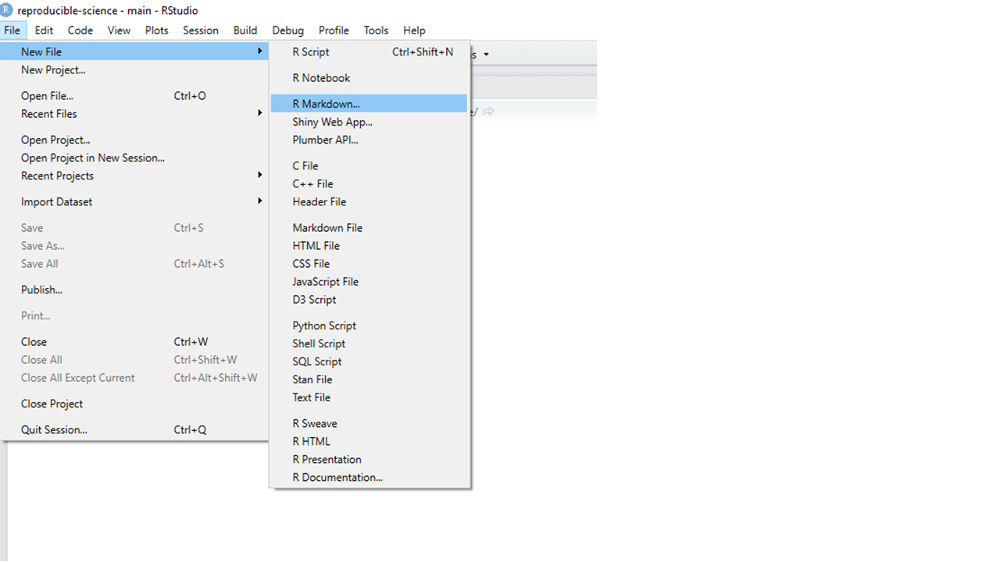
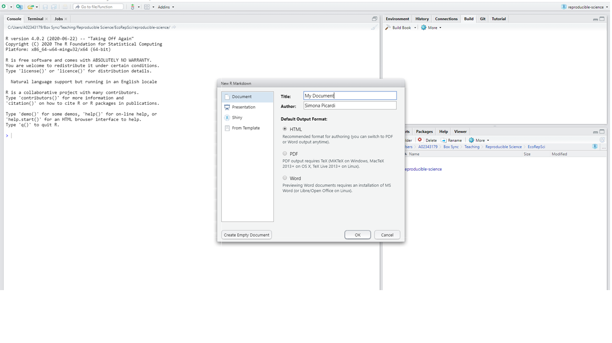
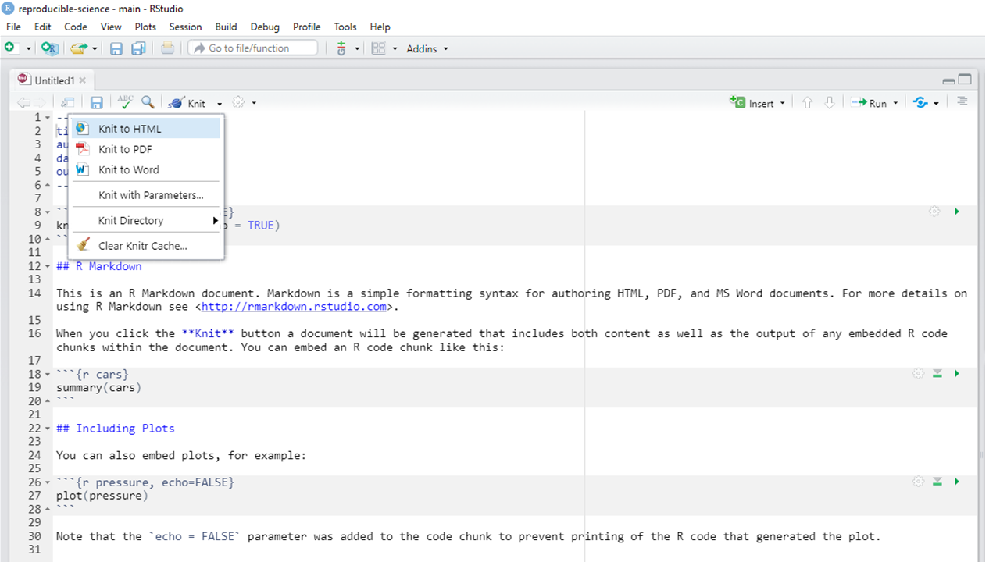

# Dynamic Documents with RMarkdown {#rmarkdown}

## What is a dynamic document? 

This Chapter is an introduction to creating dynamic documents in R using the
`rmarkdown` package. But what do I mean by *dynamic document*? In this context,
a dynamic document is a file that combines code, the output of that code, and 
narrative writing all in one. As a matter of fact, you are reading a dynamic
document right now: this whole book is written in RMarkdown!   

```{r art3, fig.cap="Artwork by Allison Horst", fig.align='center', out.width='80%', echo = FALSE, eval = TRUE}
knitr::include_graphics("img/rmarkdown_wizards.png")
```

In a dynamic document, the code is executed within the document in real
time and it produces "living" figures, tables, models, etc. that are updated any
time the code itself or the underlying data is updated. We can combine text and 
code to reproduce any graphical output we want to display in our finished 
document without having to do anything manually, and the document gets 
automatically updated any time there is a change upstream in the code or the 
input data. Because of this, dynamic documents are also reproducible. 

## Markdown and RMarkdown

Markdown is a system that translates plain text into HTML (the standard language 
for creating web pages). RMarkdown is a variant of Markdown specifically created 
for R that combines Markdown with code and allows you to export dynamic 
documents in a variety of formats ranging from PDF documents to presentation 
slides to web pages. The advantages of preparing documents in RMarkdown are 
numerous:

1. Your text and code are consolidated in the same place rather than in separate 
documents;
2. You don't need to save code-generated images and then insert them into a 
different document;
3. You don't have to re-save all your plots and manually replace them if you 
change something in the data or the code; 
4. You can forget about all the headaches of having to figure out page breaks or
figure placement;
5. You can put all your documents under version control, not just your code.

The file format for RMarkdown is `.Rmd`. This is the format of the dynamic 
document that includes code chunks and narrative text. The process of exporting
this document into a publishable format (such as .pdf, .html, etc.) is called 
**knitting**. The knitting consists of two steps that happen under the hood. First,
the R package `knitr` will take the `.Rmd` file, run the R code that is 
contained in it, and convert it into an `.md` file. The `.md` file is then 
passed on to Pandoc, which is a universal document converter. Pandoc will handle 
the conversion to the final file format. 

## Installing RMarkdown

To get started with RMarkdown documents, we need to make sure we have the 
necessary R packages installed:

```{r, eval = FALSE, echo = TRUE}
install.packages("rmarkdown") 
install.packages("knitr")
```

## Writing an RMarkdown document

### Creating the document

In RStudio, we create a new RMarkdown document by clicking on the *File* tab
and selecting *New File* > *R Markdown*. 

```{r rmarkdown1, fig.cap="Create a new RMarkdown file", fig.align='center', out.width='100%', eval = TRUE, echo = FALSE}

```

A window will pop up asking us what do we want the default format of our 
document to be. If you are putting together a document to be displayed as a web
page, you will select HTML. Even if you want to produce a PDF or other type of 
document, it's still a good idea to select HTML here, because you can easily
switch from HTML to PDF or others but not the other way around. 

```{r rmarkdown2, fig.cap="Create a new RMarkdown file", fig.align='center', out.width='100%', eval = TRUE, echo = FALSE}

```

### YAML headers

Once you click OK, RStudio will create a new document that automatically 
contains a YAML header. YAML stands for "YAML Ain't Markup Language" and it
encodes the metadata of the document. This is what it looks like: 

````markdown
---
title: "Untitled"
author: "Simona Picardi"
date: "2/18/2021"
output: html_document
---
````

The author and date were automatically added in, as well as the default output
format (HTML). We can go ahead and edit the title, or anything else that is in
quotes if we want the date to be different our our name to appear differently 
(or add more names). The content of the YAML header will appear on top of our 
document. 

### Code chunks

Under the YAML header, the template document contains what is called a code 
chunk: 

````
```{r setup, include=FALSE}`r ''`
knitr::opts_chunk$set(echo = TRUE)
```
````
A code chunk is recognized by RMarkdown as containing code. Inside the curly
brackets, we specify the language the code is written in (RStudio defaults to R,
but we can change this to a different programming language -- RMarkdown 
understands SQL, python, css, and many others.) Then comes the name of the code 
chunk. This one was automatically named "setup" by RStudio, but we can give it
any other name. The important thing is that we can never repeat the same name
for a code chunk within the same document. After the comma we can include
options that will determine how the code chunk behaves. In this case, the code
chunk has the option `include=FALSE`, which means neither the code or its result
will be displayed in the finished document. Other frequently used `TRUE/FALSE` 
options are:

* `eval`: when set to `FALSE`, the code will not be run when knitting the 
document (default is `TRUE`);
* `echo`: when set to `FALSE`, the code will not show up in the document but
it will be run under the hood and its results will be displayed (default is
`TRUE`);
* `warning`: this option controls whether warning messages are displayed 
(default is `TRUE`);
* `error`: this option controls whether error messages are displayed (default is
`FALSE`). 

By playing with `eval` and `echo` we can control whether our code is run and 
displayed or any combination of these. For example, `eval = FALSE, echo = TRUE`
means our code chunk won't be run but it will show up in the document (this
is great for a tutorial where you want to show someone how to install a package,
but you don't want to reinstall it yourself every time you knit the document); 
`eval = TRUE, echo = TRUE` means our code chunk will be displayed as well as run,
and its results will be displayed too (this is great for teaching purposes, when
you want to show how to write code to produce a certain result); 
`eval = TRUE, echo = FALSE` means the code will be run but it will not be 
visible in the final document (this is great for including a graph in the final
document, where the code that produced the graph is not the point.)  
  
To insert a new code chunk in your document, you can click on the green "+C" in
your RStudio script toolbar (ore use the shortcut Ctrl + Alt + I).

### Inline code

Besides code chunks, you can also embed code within the text using the syntax
`` `r '\x60r my_code\x60'` ``. The code will be run and the results displayed in
its place. For example, if I want to know what 2 + 2 is, I can type 
`` `r '\x60r 2 + 2\x60'` `` in the document and the results displayed will be
`r 2+2`.  
   
To quote code verbatim (which means without interpreting it or executing it, 
just displaying it), omit the "r" between the two grave symbols. I also like to 
use the same syntax whenever I mention R functions or any other R-specific words, 
so it looks like this: `function`. That makes it clear to the reader that I'm 
using the word to refer to something that exists in R (a function, an object, a package) and not to the common meaning of that word.

### Text formatting

Anything that is not inside a code chunk or inline code is interpreted by 
RMarkdown as text. There are many different formatting styles that you can
achieve with RMarkdown syntax. You can use *italics* by wrapping text in 
asterisks, **bold** with double asterisks, and ~~strikethrough~~ with double
tilde. You can add block quotes using a > at the beginning of a line:

> This is a block quote.

Or equations:

$$E = mc^{2}$$

The headers in this book are formatted using RMarkdown, and so are bullet lists.
Headers are lines that start with one or more hashtags, with the number of 
hashtags determining the size of the header (one hashtags for main headers, two
for sections, three for subsections, etc.)
For an overview of how to format text I recommend consulting the [RMarkdown cheatsheet](https://github.com/rstudio/cheatsheets/raw/master/rmarkdown-2.0.pdf).
Wonder how I just embedded that link? Just type the words you want to
hyperlink in brackets followed by the link in parentheses: ````[]()````. 

### Embedding images

Sometimes you may want to add an image in an RMarkdown document that is not 
code-generated (for example, a photo). There are several ways to do that. One is
to use the syntax ```````` (this needs to be in a 
new line). Another option is to use the `include_graphics` function from `knitr`.
You can create a new code chunk where you want the image to appear:

````markdown
```{r image, fig.cap="this is a caption", fig.align='center', out.width='100%'}`r ''`
knitr::include_graphics("img/my_image.png")
```
```` 

Note the chunk options: `fig.cap` allows you to add a caption under the figure,
`fig.align` allows you to tweak the alignment of the image with respect to the
page, and you can control the size with `out.width`. 

### Adding a table of contents

You can add a table of contents to your document by adding an option for it in 
the YAML header: 

````markdown
---
title: "Untitled"
author: "Simona Picardi"
date: "2/18/2021"
output: 
  html_document:
    toc: true
    toc_depth: 2
---
````
The option `toc: true` activates the table of contents. You can then list 
additional options to tweak the appearance of the table of contents. For 
example, `toc_depth` controls how many header levels are visible in the table of
contents (default is 3, which means headers that range from `#`-`###`). Another
option is `toc_float`, which means the table of content will float on the side
of the page even as we scroll down. 

### Knitting the document

When you are done composing your document and you want to see the rendered 
version, it's time to knit. You can click *Knit* on the RStudio script toolbar
and the process will start. 

```{r rmarkdown3, fig.cap="Knitting an RMarkdown file", fig.align='center', out.width='100%', eval = TRUE, echo = FALSE}

```

You will see the progress status in the console. If
there are any formatting mistakes, you will get an error that points you to the
line where the problem is. A very common reason why knitting may fail is if you
forgot to give the code chunks different names, so watch out for that! Once the
knitting is complete, you'll find an HTML file in your working directory with
the same name as the `.Rmd` file. Double click on it, and your rendered document
will open in a browser window. 

### The sky is the limit!

This is a brief overview on how to get started with RMarkdown, but the sky is 
the limit when it comes to possibilities for customization of RMarkdown 
documents. You can add tables, footnotes, and even a bibliography to your
document which can be automatically synchronized with your reference management
system. You can choose among several different themes for your rendered document
or you could even make your own theme. Here are some great resources if you want
to learn more about these and other functionalities of RMarkdown:

* [The RStudio tutorial to RMarkdown](https://rmarkdown.rstudio.com/lesson-1.html)
* [R Markdown: The Definitive Guide](https://bookdown.org/yihui/rmarkdown/)
* [Creating Dynamic Documents with RMarkdown and Knitr](https://rstudio-pubs-static.s3.amazonaws.com/180546_e2d5bf84795745ebb5cd3be3dab71fca.html#1_welcome)