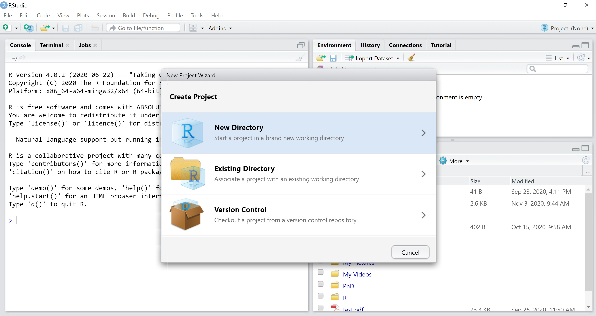
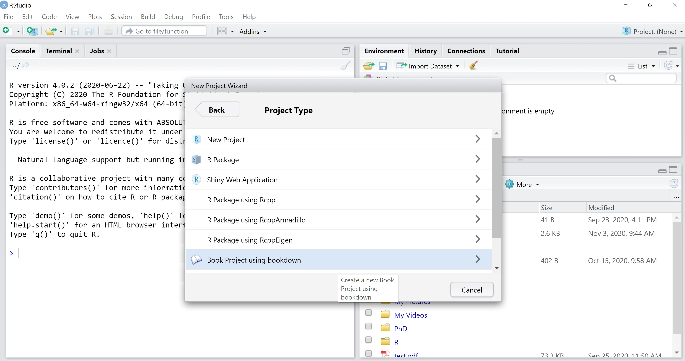
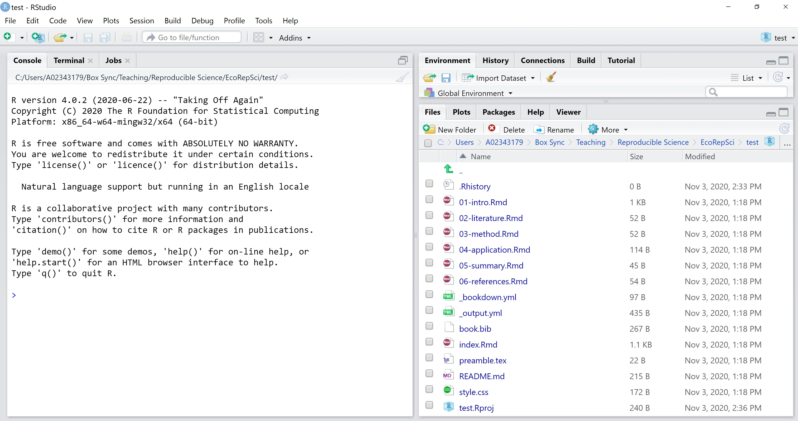
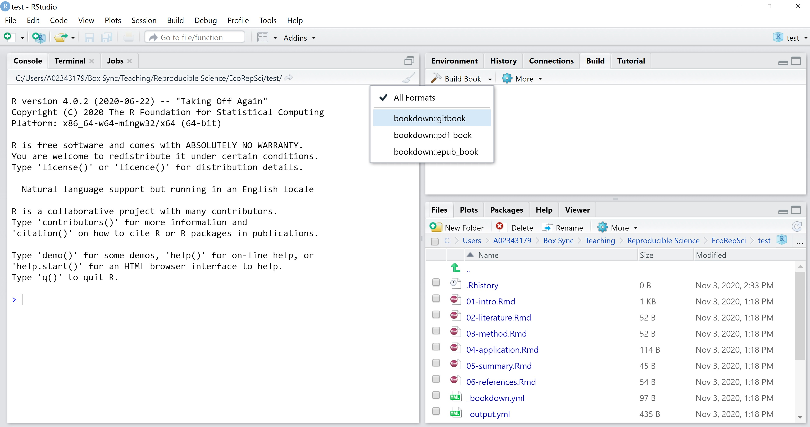
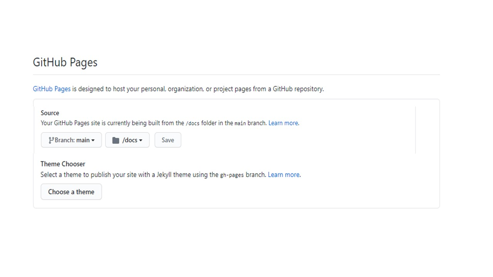

---
output:
  pdf_document: default
  html_document: default
---
# Automatically Generated Websites with GitHub Pages {#github-pages}

We have seen how to knit RMarkdown documents into HTML, which is the standard format for web pages. From this to publishing your HTML documents as an actual website is a short step, thanks to GitHub Pages. GitHub Pages lets you turn your GitHub repositories into websites for free. Because it is GitHub, you can manage all the content of your website from RStudio and have it under version control, which means your website is reproducible. Sign us up, amirite?! Here, we are going to see how to create a web book using the R package `bookdown` and GitHub Pages.

## Bookdown

The R package `bookdown` is built on top of RMarkdown, so it uses the same syntax we have learned so far for writing documents. On top of it, `bookdown` lets you have multi-page output, cross-referencing between different pages, and it uses the GitBook style to create beautiful, professional-looking digital books. In fact, the book you are reading right now is built with `bookdown`!

### Creating a book

Once you have `bookdown` installed, you can create your first book by opening RStudio and creating a new Project. Select "New Directory", and then "Book Project using bookdown".





When you create the Project, `bookdown` automatically generates all the files you need for your book to function. These include:

* A .Rproj file, which is your RStudio Project;
* A README file;
* An index.Rmd file, which is the first section of your book and by default will be the home page if you publish it as a website;
* A series of numbered chapters as .Rmd files;
* Two .yml files, _bookdown.yml and _output.yml, which contain metadata (stuff like the file name of the book, the word used to refer to chapters within the book, etc;)
* A style.css file, which defines the style and appearance of the book;
* A preamble.tex file, with more customization options;
* A book.bib file, which contains the bibliography.



In practice, you can ignore most of these files unless you want to customize the appearance and functioning of your book. If all you want to do is edit the content, all you need to care about are the .Rmd files. The other files are necessary for the book to work properly, but you can simply leave them where they are and not worry about them.

To knit the book, go to the "Build" tab in RStudio, open the "Build Book" dropdown menu, and choose "bookdown::gitbook" as the output format. This format is compatible with GitHub Pages and will allow us to publish our book as a website. When we do this, `bookdown` will knit each .Rmd file into HTML format and save them into a new folder called "_book".



## Publishing a book with GitHub Pages

To publish the book online using GitHub Pages, we are going to initialize a Git repository in our Project folder, link it up with a GitHub repository, and enable Pages. To enable Pages, we need to tell GitHub where to go find the .html files that compose our book. We have two options: we can put these files into a dedicated branch called "gh-pages", or we can have them in a folder called "docs" on the main branch. The second option allows for a slightly simpler workflow, so we'll go with that. 

### Step 1: Set up compatibility with GitHub Pages

By default, `bookdown` puts the .html files it generates when knitting the book into the "_book" folder. Instead, we want these to be in a "docs" folder. We can go ahead and delete the _book folder with all its content (everything in this folder is generated when knitting the files so we can delete it without fear.) Then, we tell `bookdown` that it should save all the .html files into a folder called "docs" instead of the default "_book". We do this by opening the _bookdown.yml file and adding this line to the bottom of it: output_dir: "docs".

We also need to create a file called .nojekyll in the "docs" folder. You can do this by typing `touch .nojekyll` in your command line (make sure you're in the Project folder), or you can simply use the notepad to create a new empty file, name it ".nojekyll", and save it in "docs". Make sure there's no file extension (e.g., .txt) at the end of the filename. Notepad will complain and warn you that terrible things will happen if you remove the file extension, but actually they won't. The reason why we need to create this ".nojekyll" file is because GitHub Pages will assume that your website is built using Jekyll, a static website builder, unless you tell it otherwise. Our website does not use Jekyll, so we tell GitHub that.

### Step 2: Set up Git repository

It's time to put our book under version control. To do so, we open a terminal into our Project folder and we initialize a repository:

```{bash, eval = FALSE}

git init

```

After we create our .gitignore file, we can add and commit our files:

```{bash, eval = FALSE}

git add --all
git commit -m "First commit"

```

Let's also rename our main branch:

```{bash, eval = FALSE}

git branch -M main

```

### Step 3: Link Git repository to remote GitHub repository

Now, we create an empty GitHub repository to link with our local one. Because we are setting this as the upstream for an existing repository, it *must* be completely empty, so make sure you are not creating a README file or anything (uncheck all those boxes). Also, make sure you choose the option for a *Public* repository. GitHub Pages are not available for private repositories. 

Back in the terminal, we link this newly created remote repository to our local copy (make sure you replace the URL below with the correct one):

```{bash, eval = FALSE}

git remote add origin https://github.com/username/my-repo

```

And we push our files to it:

```{bash, eval = FALSE}

git push -u origin main

```

### Step 4: Enable GitHub Pages

The final step is to enable GitHub Pages on our repository. On GitHub, go to the repository Settings. Scroll down to the "GitHub Pages" section. Change the source to the docs folder in the main branch and save:



The site will be published within a few minutes at the address in the green box that just appeared on your screen. 

## Maintaining the website

Once the website is live, it will be automatically updated any time we push updates to the .html files in the docs folder. Remember that modifying the .Rmd files is not enough for the website to update: we also need to knit the book so that `bookdown` will update the .html files. This is also a great reminder that you can play around with edits without them showing up on the website if you're not ready to broadcast them: until you knit the book and push to the remote, the website won't be updated.

## References

* https://bookdown.org/yihui/bookdown/
