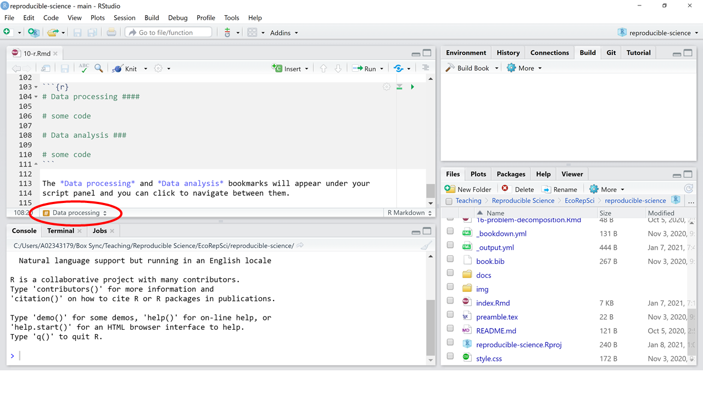

# Introduction to R {#intro-to-r}

## Getting started

Some of you may already be familiar with R, so we are going to go over some 
basics and then breeze through the fundamentals of R programming to get to the 
more advanced stuff.  
  
```{r lover, fig.cap="Artwork by Allison Horst", fig.align='center', out.width='80%', echo = FALSE, eval = TRUE}
knitr::include_graphics("img/heartyr.gif")
```

Let's start with some definitions: R is both a programming language and a 
software. However, the R software is just an R command line and it has no 
additional interface. RStudio is an Integrated Development Environment (IDE)
that facilitates working with R by providing an interface that makes it easy to
save code script, keeping track of your working environment, looking up your 
directory structure, and visualize your plots while you're coding. We'll be 
using RStudio throughout the remainder of this course. Remember what we said in
Chapter \@ref(project-organization) about RStudio Projects -- make sure you are
always working within a Project and you're aware of your working directory!  

You can check what Project you are working on on the top-right corner of your
RStudio window. When you open up a Project, the working directory will show up
in the *Files* tab in the bottom-right panel. This is also the panel where your
plots appear and where you can look up help files for R functions. The top-left 
panel is where you will type your code to then save it in a script. The 
bottom-left panel is the console and it is where you will see results and run 
any line of code that you do not need to save. The top-right panel has several 
tabs but by default it shows your R environment, that is, all the objects and 
functions that exist in your session at any given time.  

When you want to run code from your script, you can send it to the console to
execute by pressing *Ctrl* (or *Cmd*) *+ Enter*. If nothing in the script is 
highlighted, the command that gets run is the one where your cursor is. If 
something is highlighted, that will be the only piece of code that gets run 
(this will turn out to be very useful).  

The `>` prompt means R is ready to execute a command. If a `+` sign shows up
instead, it means the code you tried to run is incomplete (in many cases,
this means you're missing a closing parenthesis). You can press *Esc* to abort the
command when this happens and you're not sure what's missing. 

## Basics of R programming

### Assigning objects

The `<-` operator is called an *assignment* operator. Whatever is on the right of 
the arrow is going to be assigned to the name on the left, and the object will
show up in your *Environment* tab on the top-right. A shortcut for the assignment
operator is *Alt + -*. 

```{r baser1, echo = TRUE, eval = TRUE}
x <- 2
```

You can name an object anything you want, but the name
cannot start with a number. Also, R is case-sensitive, so make sure you are 
consistent with uppercase/lowercase. Back in the day someone would have told you
to choose names that are short so you save yourself some typing, but RStudio
has an autocomplete option that makes this not a problem at all, so I say: above 
all, choose names that are descriptive because that will make your code much 
more readable and easy to understand! 

### Adding comments 

One of the recommendations you are going to hear most often is, "always comment
your code". Indeed, it is very important to make sure your scripts contain
enough information that a reader unfamiliar with your code (a colleague, or 
yourself in a few weeks) can understand what's going on and what each piece is
doing. You can add comments using a hashtag. Anything on a line after the `#` 
will not be treated as code. 

```{r baser2, echo = TRUE, eval = TRUE}
x <- 2 # This is a comment
```

### Headers and description

Even when I'm not writing an RMarkdown file and I'm just working with a .R file,
I like to start my scripts with a header that says who the author is, what the
script is about, when it was created, and when it was last modified. Something
like this:

```{r baser3, echo = TRUE, eval = FALSE}
# # # # # # # # # # #
# Simona Picardi
# Getting started with R
# Created January 8th, 2020
# Last modified January 25th, 2020
# # # # # # # # # # # 
```

After the header, I like to add a general description providing some context of
what the script does and where it fits in with related ones. For example, you 
may want to describe what project the script is part of, what is it for, what 
are the inputs and outputs, etc. 

### Navigating through the script

Often you'll find yourself writing scripts that are many many lines long. If you
are looking for a specific piece within a large script, you could spend a long
time crossing your eyes trying to find it. Because nobody likes their eyes to
bleed, it's much more convenient to add bookmarks to your script so that you can
easily jump to the section you're looking for. You can add a bookmark using four
hastags like so:

```{r baser4, echo = TRUE, eval = FALSE}
# Data processing ####

# some code

# Data analysis ####

# some code
```

The *Data processing* and *Data analysis* bookmarks will appear under your 
script panel and you can click to navigate between them. 

```{r r-bookmarks, fig.cap="Bookmarks in RStudio help you efficiently navigate your script", fig.align='center', out.width='80%', echo = FALSE, eval = TRUE}

```

### Functions and their arguments

A function is an executable scripts that takes a well-defined input and returns
a certain desired output. The inputs of a function are called *arguments*. For
example, the function `round` takes as input an argument called `x` which is 
the number you want to round:

```{r baser5, echo = TRUE, eval = TRUE}
round(x = 10.46)
```

The function takes also a `digits` argument, although it is optional: if we
don't specify it will just use the default value. You can check what the default 
is by looking at the help file for the function:

```{r baser6, echo = TRUE, eval = FALSE}
?round
```

The default is 0 decimal digits, so unless we specify something different the 
function will round to the closest integer. Arguments that are optional are also called *options*. It's important to be aware of what default values are assigned 
to optional arguments when we don't manually specify them. Another thing to be 
aware of is that function interpret their inputs positionally unless the 
arguments are explicitly spelled out. So for example, running `round(10.465, 1)`
is the same as running `round(x = 10.465, digits = 1)`. If we shuffle the order
of the inputs and do `round(1, 10.465)` the function won't understand that x is 
10.465 and not 1. But if we spell out which input is which, the order no longer
matters: `round(digits = 1, x = 10.465)` works just fine. 

### Writing functions

Now that we learned about the anatomy of a function, we can write our own. A 
function is like a recipe where the arguments are the ingredients and the 
function code is the procedure. At the end, you get your baked goods. The 
syntax to write a function is `function(arguments){code}`. First, we define what
inputs the function should take (i.e., we pick names for the arguments). Then,
inside the curly braces, we describe what the function does with those inputs. 
For example, let's write a function to add two numbers together:

```{r baser7, echo = TRUE, eval = TRUE}
# We'll call this function 'add'. 
add <- function(x, y) { # It takes as input two arguments named `x` and `y`
  return(x + y) # and it returns x + y
}

add(4, 5)
```

We can then assign this value to an object:

```{r baser8, echo = TRUE, eval = TRUE}
(z <- add(4, 5)) # by wrapping the assignment statement in parentheses I also automatically print it to the console

```

We can also write functions that, instead of returning a value that can be 
assigned to an object, print something in the console without returning anything:

```{r baser9, echo = TRUE, eval = TRUE}
print_words <- function(x, y) {
  print(paste(x, y))
}

x <- "Hello"
y <- "world!"

print_words(x, y)
```

```{r baser10, echo = TRUE, eval = TRUE}
x <- "Hello"
y <- "Simona!"

print_words(x, y)
```

### Data types 

Data in R can be of several types. The four most common ones are `character`,
`numeric`, `integer`, and `logical`. There's also `complex` and `raw`, but we
won't talk about those here. Character data consists of strings of text and it
is defined using quotes:

```{r baser11, echo = TRUE, eval = TRUE}
x <- "some text"

class(x)
```

Numbers and integers are pretty self-explanatory. Logical data is boolean `TRUE`/
`FALSE`:

```{r baser12, echo = TRUE, eval = TRUE}
x <- TRUE

class(x)
```

### Vectors

A vector (or atomic vector) is the most basic data structure in R. It is a 
collection of items of the same data type. You can concatenate different elements 
into a vector using `c`:

```{r baser13, echo = TRUE, eval = TRUE}
x <- c(1, 4, 27, 5, 32) # this is a numeric vector
class(x)

y <- c("A", "B", "C") # this is a character vector
class(y)
```

As a matter of fact, a vector that only has one element is still a vector! So
`x <- 43` is a vector with 1 element (that is, a vector of `length` = 1).  
  
You can't have elements of different data types within the same vector. 
If we try to mix data types inside a vector, R will fall back to the data type
that is most inclusive and interpret all the elements in the vector as belonging
to that data type. For example, if we do:

```{r baser14, echo = TRUE, eval = TRUE}
x <- c(1, "B", 3, 4)
class(x)
```

R interpreted the whole vector as character because there's no way to turn "B"
into a number, but you can read numbers as text strings. If instead we do:

```{r baser15, echo = TRUE, eval = TRUE}
x <- c(FALSE, 1)
class(x)
```

R interprets the whole vector as numeric because `TRUE` and `FALSE` are encoded
as 1 and 0, respectively. So R converted the logical element into a number and 
now the entire vector is numeric. If we mix logical and character, character 
will win because there is no way to turn a text string into `TRUE` or `FALSE`,
but `TRUE` and `FALSE` are literally words so it's easy to read them as text:

```{r baser16, echo = TRUE, eval = TRUE}
x <- c("test", "FALSE")
class(x)
```

Anything in quotes is always interpreted as character, no matter what:

```{r baser17, echo = TRUE, eval = TRUE}
class("1")
class("TRUE")
```

So, in the hierarchy of data types, `character` is the most general because you
can always turn something into a character; `numeric` follows because you can
read all other data types (`integer` and `logical`) as numbers; and `logical` is
the least general because you cannot turn any of the others into logical. The 
process of converting an object of one type into another type is called 
*coercing*. You may run into this term in error messages so it's good to know 
what it means so you can diagnose problems. 

### Factors

Categorical data is represented in R using *factors*. A factor is stored as a 
vector of labels called *levels* but, under the hood, each level gets assigned 
an integer (or index value). R uses the integer component of a factor to do its 
job but it displays the level to you so that it's descriptive and meaningful. 
This weird nature of factors is often a source of confusion. For example, if we 
have the following factor,

```{r baser18, echo = TRUE, eval = TRUE}
years <- factor(c(2017, 2018, 2019, 2020, 2021))
```

and we want to convert the years back into numeric, we would maybe try:

```{r baser19, echo = TRUE, eval = TRUE}
as.numeric(years)
```

The result is not what we expected. This is because R converted the index values 
into numbers, not the factor levels. To specify that we want to convert the 
factor levels into numbers, not the underlying vector of integers, we have to be
explicit about it:

```{r baser20, echo = TRUE, eval = TRUE}
as.numeric(levels(years))
```

### Data frames

R stores tabular data in data frames. A data frame is a data structure composed
by rows and columns, where each column is a vector (and therefore contains
elements of the same type). Different columns in a data frame can contain data 
of different type but they must all be the same length or they won't line up. 
More often than not, you'll create data frames by importing external files (such
as .csv) or by connecting to a SQL database, in which case the output of a query
is returned as a data frame by RSQLite (see Chapter \@ref(rsqlite)). But you can
also manually create a data frame:

```{r baser21, echo = TRUE, eval = TRUE}
df <- data.frame(numbers = c(1, 2, 3),
                 letters = c("A", "B", "C"),
                 colors = factor(c("blue", "red", "green")))

str(df)
```

Using `str` to look at the structure of the data frame, we can confirm that it
contains three columns: a numeric vector, a character vector, and a factor.   

You can select columns of a data frame by name using a `$`:

```{r baser22, echo = TRUE, eval = TRUE}
df$colors
```

### Dimensions

One thing that it's important to be aware of is the dimensions of the objects we
work with. A vector is a one-dimensional data structure. If we wanted to make 
an analogy with geometry, a vector is like a line. There is no scalar in R
because a single element is still a vector (of length 1). A data frame is like a 
plane because it has two dimensions (rows and columns). This is important to understand because it determines how we subset data. For example, let's look at the dimensions of the data frame we just created:

```{r baser23, echo = TRUE, eval = TRUE}
dim(df)
```

This is a 3x3 object (3 rows and 3 columns), and therefore it has 2 dimensions.
A vector, on the other hand, only has a length (its one dimension):

```{r baser24, echo = TRUE, eval = TRUE}
length(x)
```

Matrices are also 2-dimensional objects like data frames, but they differ from 
data frames because they can only contain elements of the same data types, while
columns in a data frame can be of different data types. For example:

```{r baser25, echo = TRUE, eval = TRUE}
(mat <- matrix(data = 1:25, nrow = 5, ncol = 5))

```

Arrays are objects that can have more than 2 dimensions. For example, an array
with 3 dimension is like a 3D matrix, where the first dimension is the number of
rows, the second is the number of columns, and the third is the number of 
matrices that compose the array. For example:

```{r baser26, echo = TRUE, eval = TRUE}
(arr <- array(data = 1:24, dim = c(2, 4, 3)))

```

This array has 3 dimensions:

```{r baser27, echo = TRUE, eval = TRUE}
dim(arr)
```

### Subsetting

Knowing how many dimensions an object has makes it straightforward to write
syntax to subset it. For example, to subset the following vector to only include
the first two elements:

```{r baser28, echo = TRUE, eval = TRUE}
test <- c("blue", "red", "green")
```

We can specify which elements we want to subset in brackets:

```{r baser29, echo = TRUE, eval = TRUE}
test[c(1, 2)]

# A better way to write this:
test[1:2] # using : automatically returns a vector of integers from the number on the left to the one on the right
```

The numbers in square brackets provide the indexes of the elements we want to 
keep. For an object that has more than one dimension, we need to specify 2 sets
of indexes, one for each dimension. In the case of a data frame, these would be
rows and columns:

```{r baser30, echo = TRUE, eval = TRUE}
df
```

```{r baser31, echo = TRUE, eval = TRUE}
df[1, 2] # subset the first row of the second column

```

```{r baser32, echo = TRUE, eval = TRUE}
df[1, ] # subset the entire first row
```

```{r baser33, echo = TRUE, eval = TRUE}
df[, 2] # subset the entire second column
```

Note that when we subset a column, the output is a vector (all elements are of
the same type). But when we subset a row, the output is still a data frame 
(elements need not be of the same type):

```{r baser34, echo = TRUE, eval = TRUE}
class(df[, 2])
class(df[1, ])
```

If you want to exclude a row or a column instead of keeping it, you can use a `-`
in front of the index:

```{r baser35, echo = TRUE, eval = TRUE}
df[, -1]
```

```{r baser36, echo = TRUE, eval = TRUE}
df[-2, ]
```

We can subset a matrix with positional indexes the same way we would subset a
data frame:
  
```{r baser37, echo = TRUE, eval = TRUE}
mat[1, 2]
```

To subset rows, columns, or matrices within a 3-dimensional array we need to use 
3 indexes instead of 2, like we've been doing for matrices and data frames. For 
example, to subset the first row:

```{r baser38, echo = TRUE, eval = TRUE}
arr[1, , ]
```

To subset the first column:

```{r baser39, echo = TRUE, eval = TRUE}
arr[, 1, ]
```

To subset the first matrix:

```{r baser40, echo = TRUE, eval = TRUE}
arr[, , 1]
```

### Logical conditions

Logical conditions are statements that can be answered with `TRUE` or `FALSE`. 
For example, is 10 greater than 5?

```{r baser41, echo = TRUE, eval = TRUE}
10 > 5
```

Is 2 + 2 = 3?

```{r baser42, echo = TRUE, eval = TRUE}
2 + 2 == 3
```

Is `df` a data frame?

```{r baser43, echo = TRUE, eval = TRUE}
class(df) == "data.frame"
```

Logical conditions are very useful for conditional subsetting. More often than
wanting to subset a specific row or column of a data frame, we may want to 
subset rows based on a condition. For example, if we only want rows where the 
color is blue:

```{r baser44, echo = TRUE, eval = TRUE}
df[df$colors == "blue", ]
```

Instead of putting a numeric index where we tell R which rows we want, we used a
logical condition. R will evaluate that logical condition and only keep the rows
for which it's true. Let's decompose that:

```{r baser45, echo = TRUE, eval = TRUE}
df$colors == "blue"
```

When you plug in the above statement in place of the subsetting index, R will
return the rows that satisfy the condition (the ones that return `TRUE`):

```{r baser46, echo = TRUE, eval = TRUE}
df[df$colors == "blue", ]
```

Note that a double equal `==` will evaluate a logical condition, while a single
equal sign `=` is equivalent to an assignment operator `<-`. These are not the 
same thing!

To exclude a column or a row when using conditional subsetting, we can't use `-`
like we did when we were using indexes. Instead, logical conditions are denied
with `!`:

```{r baser47, echo = TRUE, eval = TRUE}
df[!df$colors == "blue", ]

```

In the example above, we write the logical condition *"color is equal to blue"* 
and then we deny it by putting `!` in front of it. We can also directly write
the logical condition *"color is NOT equal to blue"*:

```{r baser48, echo = TRUE, eval = TRUE}
df[df$colors != "blue", ]
```

So far, we have seen four logical operators: `>`, `<`, `==`, `!=`. Another one
you'll be finding yourself using a lot is `%in%`, which tests whether a value is
within a list of values:

```{r baser49, echo = TRUE, eval = TRUE}
df[df$colors %in% c("red", "blue"), ]
```

### Lists 

Lists are the most flexible data structure in R. They can contain elements of
different data type and size. For example:

```{r baser50, echo = TRUE, eval = TRUE}
# This list contains numeric vectors of different length
(list1 <- list(1, 1:2, 1:10))
```

```{r baser51, echo = TRUE, eval = TRUE}
# This list contains vectors of different data types
(list2 <- list(1:5, c("cat", "dog", "lion", "giraffe")))
```

```{r baser52, echo = TRUE, eval = TRUE}
# This list contains a numeric vector, a character vector, a matrix, and a function
(list3 <- list(1:10, c("A", "B"), matrix(0, 4, 4), function(x) {x + 1}))

```

We can name the elements of a list:

```{r baser53, echo = TRUE, eval = TRUE}
names(list3) <- c("numbers", "letters", "matrix", "function")

list3
```

We can subset lists by using double brackets. For example, to extract the second
element of `list3` we would do:

```{r baser54, echo = TRUE, eval = TRUE}
list3[[2]]
```

This returns the character vector with the letters A and B. Using a single 
bracket instead of a double bracket will return a list with the element/s we
called for:

```{r baser55, echo = TRUE, eval = TRUE}
list3[2]
```

Imagine the single bracket as returning the bin where the object is and the 
double bracket as returning the actual content of the bin. 

### Control structures

Control structures allow you to "activate" or "de-activate" your code based on 
circumstances you can define as you need. Think of them as switches that 
modulate the operations you do on your data.  

The most commonly used control structure in R is the combination of `if` and 
`else`. By using `if`, you can specify a logical condition and the code that you
want to run if that condition is verified. The syntax is as follows:

```{r if, echo = TRUE, eval = FALSE}
if (condition) {# do something}
```

If `condition` returns `TRUE`, the code in the curly braces will be executed, 
otherwise it won't. If you want to specify what to do in case the condition is
`FALSE`, you can pair the `if` with an `else`:

```{r else, echo = TRUE, eval = FALSE}
if (condition) {# do something
} else {
    # do something else
  }
```

Other control structures include `break`, which stops a loop when a condition
is met, and `next`, which skips one iteration of a loop. Loops themselves are
control structures, but we'll talk about them in the next section. 

### Repeating operations 

Many times in R you will find yourself having to repeat the same operation over
a set of values/rows. There are multiple ways to do so: vectorized operations, 
loops, and `apply` functions.

#### Vectorization

Unlike many other programming languages, R supports vectorization, which means
some operations can be carried out in parallel across R objects. Without
knowing, we've already made some examples of vectorized calculations in R. For
instance, applying a logical comparison to all elements of a vector:

```{r baser56, echo = TRUE, eval = TRUE}
vec <- 1:10

vec > 4
```

The sum of two vectors can also be vectorized:

```{r baser57, echo = TRUE, eval = TRUE}
x <- 1:5
y <- 6:10

x + y
```

In languages that don't use vectorization, you would have to write a loop to 
sum each element of `x` to the corresponding element of `y`. Vectorization makes
many operations very fast and it also makes your code more readable because all
you have to type is `x + y` instead of `for (i in 1:length(x)) {for (j in 1:length(y)) {sum(x[i], y[j])}}`...  

A pitfall that it's important to be aware of when doing vectorized calculations
is vector recycling. In the example above, the two vectors `x` and `y` have the
same length: they are each composed of five elements. If we try to do a 
vectorized calculation on two vectors that aren't the same length, R will 
recycle values from the shortest vector when it runs out, leading to unexpected
results:

```{r baser58, echo = TRUE, eval = TRUE}
x <- 1:6
y <- 7:10

x + y
```

The vector `y` has only 4 elements. So for the first 4 values we got what we 
expected: 1 + 7, 2 + 8, 3 + 9, 4 + 10. From the fifth value onwards, R kept 
going with the values of `x` but started over with `y` and returned 5 + 7, 
6 + 8. The output was accompanied by a warning message. Whenever you see this 
warning message, it means there's an instance of vector recycling going on in 
your code.

#### Loops

The first thing to know about loops is when you should or shouldn't use a loop.
Loops can be inefficient when compared to vectorized alternatives, so whenever
you can do what you need by using a vectorized operation, do that instead of a 
loop.   

The second thing to know about loops is that there are multiple types of them 
(`for`, `while`, `repeat`). These mostly differ in the way you tell the loop how
many times it should repeat the operation. Most of the time you'll find yourself
using `for` loops, so we'll go over those in detail.  
  
A `for` loop is written by specifying how many times we want to repeat an 
operation and what is the operation we want to repeat:

```{r for, echo = TRUE, eval = FALSE}
for (i in n_times) {
  # do something
  }
```

This can be as simple as printing the numbers from 1 to 10:

```{r baser59, echo = TRUE, eval = TRUE}
for (i in 1:10) {
  print(i)
}
```

Or it can be more complicated, such as multiple consecutive operations:

```{r baser60, echo = TRUE, eval = TRUE}
for (i in 1:10) {
  x <- i * 2
  y <- x^2
  print(x + y)
}
```

The two examples above print the results to the console. If you want to store
the results, you start by defining an object that will store the values as you 
compute them:

```{r baser61, echo = TRUE, eval = TRUE}
res <- c()

for (i in 1:10) {
  x <- i * 2
  y <- x^2
  res[i] <- x + y
}
```

#### The `apply` family

Functions from the `apply` family include `apply`, `sapply`, `tapply`, `mapply`,
`vapply`, `lapply`. All of these functions work similarly to a loop by applying
the same operation to a certain piece of input data. However, they differ from
one another in the data structure they take in input and those they return in 
output.  

The most basic member of the family is the `apply` function. This takes as input
a matrix or array and it can return a vector, an array, or a list according to
what we're asking it to do. The function takes three arguments:

* `X` is the matrix or array that we're doing calculations on;
* `MARGIN` specifies whether we want to apply the operation across rows (if set
to 1) or columns (if set to 2);
* `FUN` is the function we want to apply.   

For example, remember our matrix?

```{r baser62, echo = TRUE, eval = TRUE}
mat
```

We can use `apply` to get a row-wise sum:

```{r baser63, echo = TRUE, eval = TRUE}
apply(mat, 1, sum)
```

All other members of the `apply` family are a variation on this basic theme.   
  
One other member of the `apply` family that you will find extremely useful is 
`lapply`. This function applies an operation to each element of a list. Given
the flexibility lists give in terms of what they can contain, using `lapply` 
opens up a world of possibilities in terms of what kind of operations we can
automate. Here is a basic example that illustrates how to use `lapply`:

```{r baser64, echo = TRUE, eval = TRUE}
(l <- list(1:10, 2:20, 3:30))
```

Notice that this list contains 3 elements of different length. This means they
could not be rows or columns in the same matrix or data frame, and we couldn't 
just use `apply` to repeat an operation on each of them. But because we're using
a list and `lapply`, we can. If we want to get the sum of values within each
element of the list:

```{r baser65, echo = TRUE, eval = TRUE}
lapply(l, sum)
```

Or if we want to apply a custom function:

```{r baser66, echo = TRUE, eval = TRUE}
lapply(l, function(x) {mean(x + 2 * 456)})
```

## References

* https://bookdown.org/rdpeng/rprogdatascience/
* https://swcarpentry.github.io/r-novice-inflammation/
* https://datacarpentry.org/R-ecology-lesson/index.html