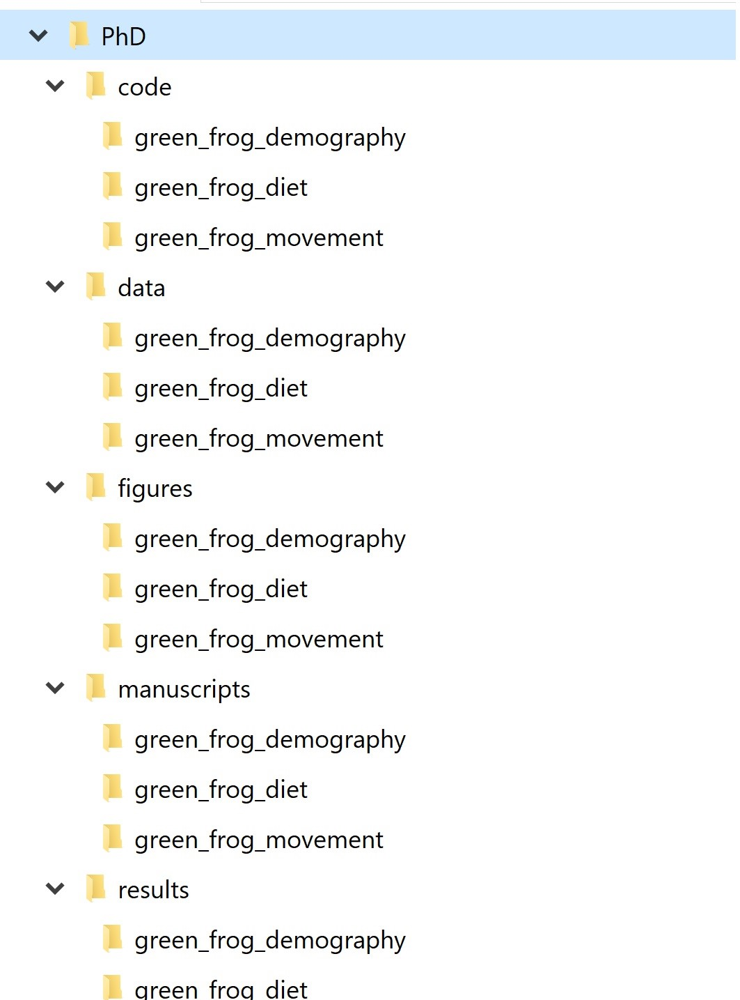
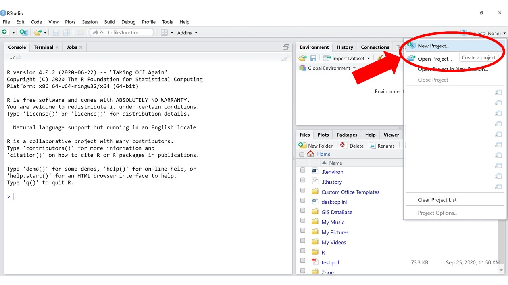
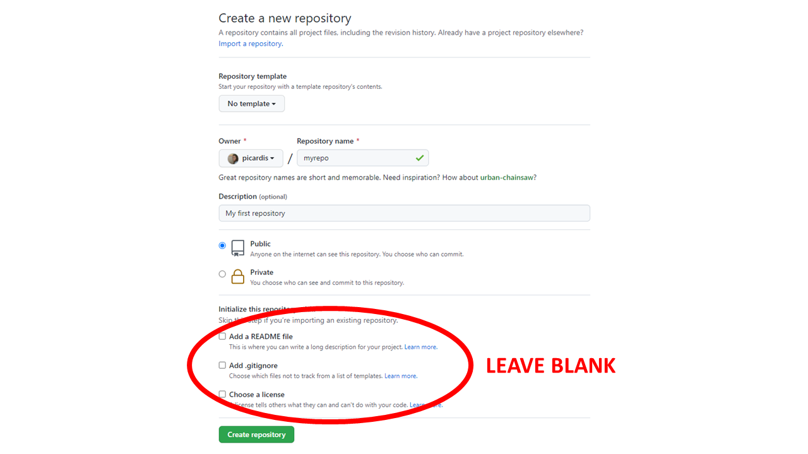
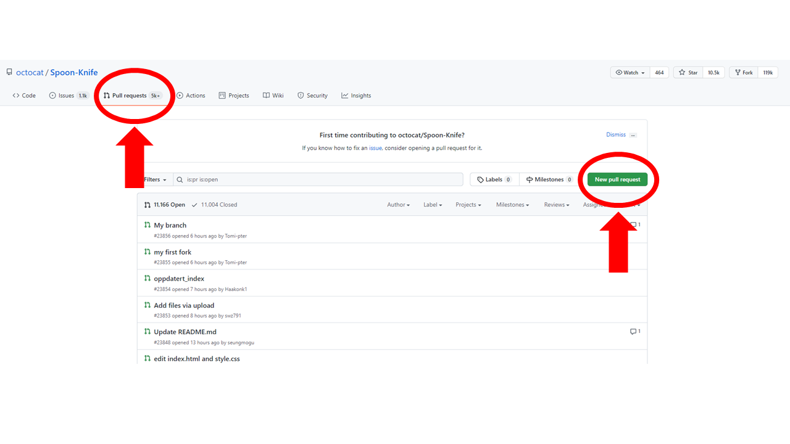
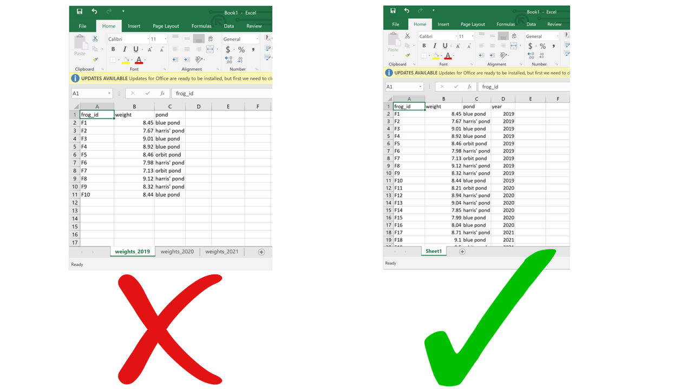
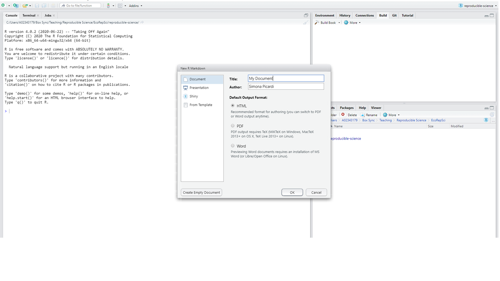
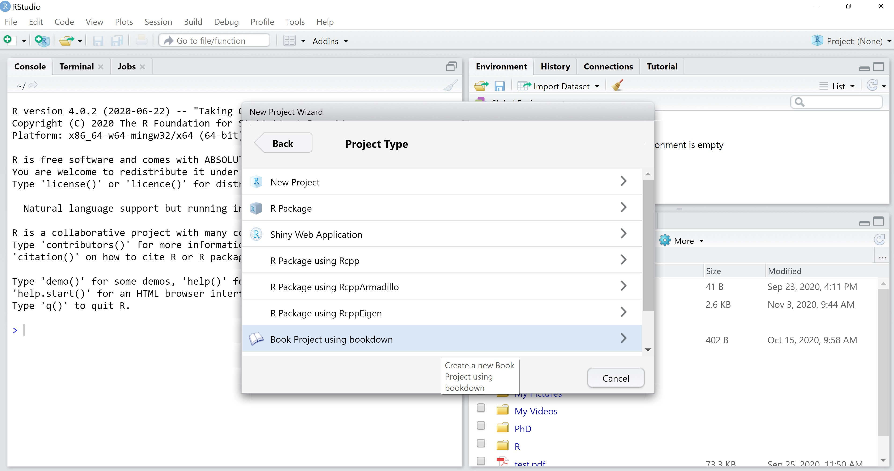
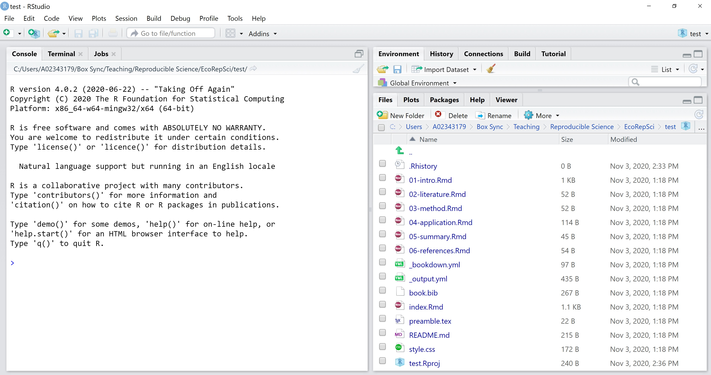
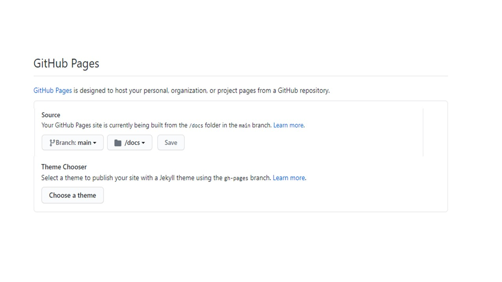
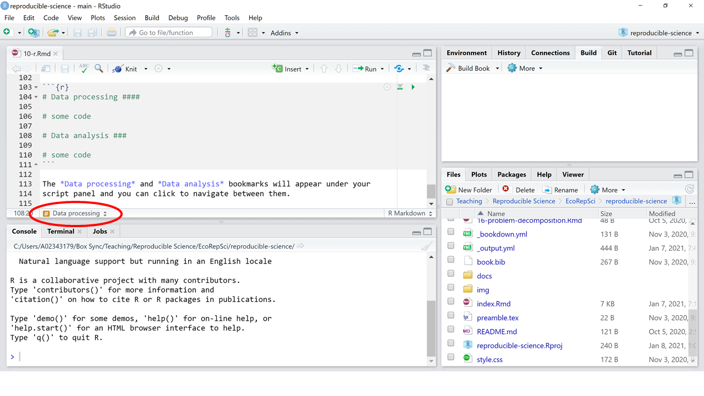

--- 
title: "Reproducible Data Science"
author: 
  - Simona Picardi^[University of Idaho, spicardi@uidaho.edu]
date: "2024-08-20"
site: bookdown::bookdown_site
documentclass: book
bibliography: [book.bib]
biblio-style: apalike
link-citations: yes
description: "WLF 553: Reproducible Data Science"
---

# Overview {-}

```{r art1, fig.cap="Artwork by Allison Horst", fig.align='center', out.width='80%', echo = FALSE}
knitr::include_graphics("img/environmental-data-science-r4ds-general.png")
```

This digital book contains the material for the Graduate Course WLF 553 Reproducible Data Science that I teach at the University of Idaho. The aim of the course is to provide students with practical skills to manage and process their data throughout their life cycle, from the moment they are entered into a computer to the moment they are used in a publication, document, presentation, etc. The content is organized in the following Chapters:

* Chapter \@ref(project-organization), Project Organization
* Chapter \@ref(version-control-git), Version Control with Git
* Chapter \@ref(github), Collaborative Science with GitHub
* Chapter \@ref(spreadsheets), Best Practices in the Use of Spreadsheets 
* Chapter \@ref(relational-databases), Relational Databases
* Chapter \@ref(sql), Basics of SQL Language 
* Chapter \@ref(rsqlite), Linking Databases and R with RSQLite 
* Chapter \@ref(rmarkdown), Dynamic Documents with RMarkdown
* Chapter \@ref(github-pages), Automatically Generated Websites with GitHub Pages
* Chapter \@ref(intro-to-r), Introduction to R
* Chapter \@ref(troubleshooting), Troubleshooting in R
* Chapter \@ref(renv), Working Environments in R
* Chapter \@ref(tidyverse), Data Wrangling with tidyverse
* Chapter \@ref(ggplot2), Data Visualization with ggplot2
* Chapter \@ref(lubridate), Dates and Times in R
* Chapter \@ref(geospatial), Introduction to Geospatial Data in R

## Software Requirements and Installation Instructions

Required software is listed below along with installation instructions for
different operating systems. 

### Git

Git is a distributed version control system. It is free and open source. To
install Git, follow instructions for your operating system below. Also, make sure you create a GitHub account on https://github.com/.

#### Windows

Download from the Git website: go to https://git-scm.com/download/win and the 
download will start automatically.

#### Mac OS

On Mavericks (10.9) or above, when you try to run a Git command from the 
Terminal for the first time, the installation will start automatically if you 
don't already have Git installed. Type the following in the terminal:

```{bash, eval = FALSE}

$ git --version

```

And follow the instructions on the installation wizard. 

#### Linux

In the command line:

```{bash, eval = FALSE}

$ sudo apt install git-all

```

### Spreadsheet Editor

Most people will already have Excel installed on their computer. However, any
spreadsheet editor will work for the purpose of this course. If you don't have 
access to an Office License, LibreOffice or OpenOffice are free, perfectly viable alternatives to Excel. Download the installer for your operating system:

* LibreOffice: https://www.libreoffice.org/download/download/ 
* OpenOffice: https://www.openoffice.org/download/

### SQLite

SQLite is a lightweight relational database management system. To install it, 
follow these steps:

1. Go to https://www.sqlite.org/download.html and find your operating system in 
the list. You are looking for a category called "Precompiled Binaries". For 
example, if you are on Windows, look for "Precompiled Binaries for Windows". 
From this list, chose the file whose name starts with "sqlite-tools". The 
description will read something like, "A bundle of command-line tools for 
managing SQLite database files, including the command-line shell program, the 
sqldiff.exe program, and the sqlite3_analyzer.exe program"

2. In your file explorer, create a new folder called "sqlite" (e.g., on Windows,
C:\sqlite)

3. Extract the .zip file you downloaded into this new folder.

4. Download SQLiteStudio (this is a GUI, or Graphical User Interface, that we 
are going to use to run our SQL commands) here: https://github.com/pawelsalawa/sqlitestudio/releases. Download the file whose
name starts with "Install" and choose the .exe extension if you're working on 
Windows, .dmg if you're on Mac OS, and the one without extension if you're on 
Linux. 

If these instructions weren't clear, you can find more details (with screenshots) 
at this link: https://www.sqlitetutorial.net/download-install-sqlite/ 

### R

R is a free software environment for statistical computing and graphics. Note 
that installing or updating R is a separate, independent process from installing
or updating RStudio! If you already have R installed, make sure you have the 
latest available version. Follow installation or update instructions for your 
operating system below.

#### Windows

Download the latest version of R at https://cran.r-project.org/bin/windows/base/

#### Mac OS

Download the latest version of R at https://cran.r-project.org/bin/macosx/

#### Linux

These instructions are for Ubuntu 18.04. If you are running a different version 
of Debian/Ubuntu, there are some small adjustments to make (see below). In the command 
line, add the GPG Key:

```{bash, eval = FALSE}

$ sudo apt-key adv --keyserver keyserver.ubuntu.com --recv-keys E298A3A825C0D65DFD57CBB651716619E084DAB9

```

Add the R repository (here is where you have to replace the appropriate release 
name if you're working with a different version of Ubuntu; you can find the 
complete list here: https://cloud.r-project.org/bin/linux/ubuntu/):


```{bash, eval = FALSE}

sudo add-apt-repository 'deb https://cloud.r-project.org/bin/linux/ubuntu bionic-cran40/'

```

Update package lists:

```{bash, eval = FALSE}

$ sudo apt update
```

Install R:

```{bash, eval = FALSE}

$ sudo apt install r-base

```

### RStudio 

RStudio is a free Integrated Development Environment (IDE) for R. Note that 
installing or updating RStudio is a separate, independent process from 
installing or updating R! If you already have RStudio installed, make sure you 
have the latest available version. Otherwise, go ahead and download it from 
here: https://rstudio.com/products/rstudio/download/#download (choose the 
appropriate version for your operating system.)

### Required R Packages

Throughout the course, we will be using the following R packages: RSQLite, 
rmarkdown, bookdown, renv, tidyverse, lubridate, raster, and sf. All these 
packages are on CRAN and can be installed (along with their dependencies) by 
running the following code in R:

```{r, eval=FALSE}

install.packages(c("RSQLite",
                   "rmarkdown",
                   "bookdown",
                   "renv",
                   "tidyverse",
                   "lubridate",
                   "raster",
                   "sf"), dependencies = TRUE)

```

<!--chapter:end:index.Rmd-->

# Project Organization {#project-organization}

## Directory structure

When starting a new project, it is worthwhile to spend some time thinking about how to best organize its content. This means asking questions such as:

* What are my project inputs?
* What types of outputs do I expect to come out of this project?
* How does this project relate to other projects I am working on? 

Answering these questions can help us decide on a directory structure to house our project files. For example, say that we are working on a research project that entails data cleaning, analysis, and writing of a manuscript. One way to go about it is to have a root project directory that contains subfolders for data, analysis code, results, and the manuscript file/s. We can call this a "project-based directory layout." Alternatively, if we have multiple projects underway, we can split our files by activity rather than by projects and have a "data" folder, an "analyses" folder, a "manuscripts" folder, etc., all with a subfolder for each project. We can call this an "activity-based directory layout."

```{r proj-based, fig.cap="Project-based directory organization", fig.align='center', out.width='50%', echo = FALSE}
knitr::include_graphics("img/project-based-directory-organization.jpg")
```
  
```{r act-based, fig.cap="Activity-based directory organization", fig.align='center', out.width='50%', echo = FALSE}

```

How you define a project is largely up to you. It could be all the work you do on a given dataset, or all the work you do for a thesis or dissertation, or each manuscript could be its own project even if it uses the same dataset as a different project. 

With so many options, how do we choose? Ultimately, the way you structure your project directories will have a big impact on the efficiency and reproducibility of your work, so there are some criteria to keep in mind. 

### Overlap 

The first thing to consider is the overlap in data and code files between a project and other past/current projects. If two projects don't share any data, it's probably best to manage them separately. If two projects share a large amount of data, it might make more sense to manage them together as one. If you are writing functions to use across several different projects, they should probably be in their own project.  

### Minimizing duplication

The reason why it's important to account for overlap is because you want to minimize duplication as much as you can. Duplication of both data and code files is dangerous because it's easy to lose track of modifications you have made to a file saved in one place but not in the other place. As you keep making changes, the two files will have the same name but different content, which generates confusion. Duplication is also inefficient because it occupies precious space on your computer. 

### Self-containedness

A fundamental quality of reproducible projects is that they are self-contained, meaning that ideally you could zip up the entire project directory and send it to a friend and they should be able to run your code and reproduce your results without changing anything. This means everything the project needs to work, from A to Z -- data, functions, code -- is contained in its root directory. 

### Tradeoffs

The self-containedness criterion is sometimes in contradiction with minimizing duplication: if two projects share one or more data files, you can either violate the duplication criterion by making sure each project contains all the necessary data for the sake of self-containedness; or you can choose to sacrifice self-containedness to avoid file duplication and save space on your computer. The answer will depend on whether you anticipate the project to be widely shared or mostly for your personal use, how large the shared data files are, etc. 
  
The bottom line is that there is no one-size-fits-all solution for project organization. Most importantly, the structure you choose needs to be functional for your needs. Putting thought into it is a great place to start. 

## Golden rules

Whichever directory structure you choose for a project, there are some universal rules to keep in mind for how to organize files within it. 

1. First and foremost, **raw data should never be changed**. Save it into a "data" folder and treat it as immutable. You can even set it as read-only to make sure there is no room for accidents. 

2. The processed, clean version of your data will go into a dedicated "processed_data" folder. 

3. Anything that can be generated from code goes into its own folder. This includes basically everything but the raw data and the code itself. You can have an "output" folder, or separate folders for output files and figures (e.g., "output" and "figures") 

4. If there are text documents, put them in their own folder (e.g., "docs")

5. Code also has its own folder. If you write a lot of functions, it can be helpful to have a "funs" folder to store those and a "src" (for 'source') folder to save processing/analysis code. 

6. If processing/analysis scripts are meant to be used in a certain order, you can number them (more on this in a minute). Sometimes the pipeline is not linear but branched, so numbering may not always make sense. Function scripts should not be numbered. 

7. Modularize your code: instead of having a giant script to run your entire analysis from data cleaning to final figures, break up your workflow into several short, single-purpose scripts with well-defined inputs and outputs. 

## Be flexible

It can be challenging to anticipate the structure of a project that is just about to start (especially the first time you start thinking through optimal directory structures). It helps to be flexible and allow some room for adjustments. For example, you can start with a basic directory structure where you have a "data" folder, a "code" folder, and an "output" folder, and then you may decide to split the "code" folder into "src" and "funs", or to further split the "output" folder into "output" and "figures", etc. Sometimes these changes can break your code and become frustrating, but these problems are easy to fix.

Similarly, it can be challenging to have the long-term vision to know where it's best to break a script and start a new one. It's easy to tunnel vision into an analysis and keep adding lines and lines of code without thinking about break points that make sense. One good way to deal with this is to reserve some time at the end of your coding session to look at your script and notice if there are any intermediate products that you can save and use as input of the next step of the workflow. Then you can make the necessary adjustments in terms of code compartmentalization, paths to input and output files, etc.
  
In the words of Wilson et al. (2017, see references below), "consistency and predictability are more important than hairsplitting" when organizing the directory structure for your projects. Besides a few universal rules, designing the optimal structure often requires consideration of project specifics. Ultimately, the goal is to improve efficiency -- by allowing you to find your files easily, only run the minimal amount of code you need for a task, making it easy for collaborators and future you to wrap your head around the project content -- and reproducibility. 

## Documentation

One very important aspect of reproducibility is good documentation. Each of your projects should always be accompanied by a README file. The README should contain all the information an outsider would need to understand what the project is all about, what are the inputs and outputs, where to find files within the project directory, etc. The README is simply a text file, there's nothing special to it -- you can just create it in your Notepad or other text editor. 

Writing down everything about a project in a README can be tedious, but it pays off ten-fold. It's good to get in the habit of starting a project by creating a README file right after the directory structure is created. Record who the author/s is/are, the date the project was started, and a description of what the project is for. Then, any time a new file is added, specify what it is and where you got it from. For example, "File X.csv was sent by Mary White in an email on 2/1/2019 to my.address @ gmail.com", etc. Be meticulous: what seems obvious today can become a puzzle to solve in a few months. 

## Naming files 

There is a science to choosing good file names, too. Here is a list of file names that are **not** good, for a variety of different reasons:

> data.csv <br/>
> data_cleaned_March-22-2012.csv <br/>
> analysis code.R <br/>
> Green Frogs Manuscript_Final_edits.docx <br/>
> final.docx <br/>

Why are those names bad, and what makes a good file name? Good file names are computer-readable, human-readable, and work well with default ordering. Let's break these three criteria down one by one. 

### Computer-readable file names

What makes a file name computer-readable? First, computer readable files contain no spaces, no punctuation, and no special characters. They are case-consistent, which means that you always stick to the same case pattern, whether that be full lowercase, camel case (ThisIsWhatIMeanByCamelCase), or whatever else. Finally, good file names make deliberate use of text delimiters. Wise use of delimiters makes it easy to look for patterns when you are searching for a specific file. Usually, it's recommended that you use an underscore (_) to delimit metadata units and a dash (-) to delimit words within a metadata unit. For example, here is a good, computer-readable file name:

> 2018-04-26_reproducible-science_slides_lesson-01.pptx

### Human-readable file names

The example file name above is not only computer-readable, it's also human-readable. This means that a human can read the file name and have a pretty good idea of what's in that file. Good file names are informative! You shouldn't be afraid to use long names if that's what it takes to make them descriptive. 

### File names that work well with default ordering

If you sort your files alphabetically in a folder, you want them to be ordered in a way that makes sense. Whether you sort your files by date or by a sequential number, the number always goes first. For dates, use the YMD format, or your files created in April of 1984 and 2020 will be closer than the ones created in March and April 2020. If you are using sequential numbering, add a sensible amount of zeros in front based on how many files of that category you expect to have in the future. If you expect to have more than 10 but not more than 99 files, you can add a single leading zero (e.g., "data_analysis_01.R" instead of "data_analysis_1.R"), whereas if you expect to have between 100 and 999 you can add two (e.g., "Photo_001.jpeg" instead of "Photo_1.jpeg" or "Photo_01.jpeg").

## RStudio Projects 

RStudio Projects are a great tool to help you stay organized. The concept behind RStudio Projects is that each Project is a self-contained unit where inputs, outputs, and code are all in one place. Sounds familiar? RStudio Projects work seamlessly with the directory organization framework we have been talking about. It's a good idea to make sure each of the projects (with a lowercase p) you work on has its own associated RStudio Project (with a capital P). 

```{r rstudio-proj, fig.cap="How to create a new RStudio Project", fig.align='center', echo = FALSE}

```

You may be familiar with the concept of a working directory in R. The working directory is the place where, unless otherwise specified, all of your outputs are saved. All relative paths are also interpreted relative to the working directory (more on relative paths in a minute).  

The cool thing about an RStudio Project is that it automatically makes sure that your project directory is set as the working directory. All the clunkiness of having to set, change, or double check which directory you're working in is forgotten: all you do is open up your Project and then the paths you use to load or save data are already, by default, relative to your project directory. 

## Relative and absolute paths

Paths define the location of files within the file system. There are two ways to point to a file from within a command prompt such as R. The first is to use what is called an absolute path: this describes the full sequence of folders a file is contained in, starting from the root directory of a computer. When you right click on any file on your computer, you can look up its absolute path in the Properties. This is an example of an absolute path:

> C:/Users/MJS/Documents/PhD/Planning/schedule_2021.csv

Relative paths describe the position of a file with respect to a reference directory. In R, that reference directory is your working directory. When you type a relative path to open a file in R, R appends that path to the path of the working directory to get the full absolute path, which it then uses to open the file. For example, if our working directory was "Documents", this would be the relative path to reach the same file as above:

> PhD/Planning/schedule_2021.csv

If our working directory was "Planning", this would be the relative path to the same file:

> schedule_2021.csv

To work across subfolders of our working directory, we can just use relative paths to navigate and locate files. But relative paths also work to navigate across folders that are outside of the working directory, if need be. Using "../" in front of a folder name navigates to the parent of that folder ("parent" means the folder where that is contained). Let's consider the following directory structure:

```{r dir-example, fig.cap="Example directory structure", fig.align='center', echo = FALSE}
knitr::include_graphics("img/directory-tree.png")
```

We can navigate to a file into "PhD/Research" from "Planning" like so:

> ../Research/GreenFrogs/data-cleaning.RProj

The "../" means "the parent directory of the working directory", which is "PhD". We can also stack these to navigate further up the directory tree:

> ../../../../DAJ

The path above navigates all the way up to "Users" and into a different user's directory. 

### Path separators

Something to be mindful of is that the separator between folder names in a path is different on different operating systems. On Windows, it is a backslash ("\"), while on Mac/Linux, it is a slash ("/"). However, R uses the Mac/Linux convention, so always use "/" when typing paths in R. 

### References 

* Wilson G, Bryan J, Cranston K, Kitzes J, Nederbragt L, Teal TK (2017) Good enough practices in scientific computing. PLoS Comput Biol 13(6): e1005510. https://doi.org/10.1371/journal.pcbi.1005510 
* https://speakerdeck.com/jennybc/how-to-name-files
* https://r4ds.had.co.nz/workflow-projects.html

<!--chapter:end:01-project-organization.Rmd-->

# Version Control with Git {#version-control-git}

```{r setup-git, include=FALSE}
knitr::opts_chunk$set(echo = TRUE, eval = FALSE)
```

Git is a version control system. It tracks all the changes you make to your files and allows you to go back to previous versions as far back in time as you need. Git is useful for a variety of reasons. Most of us are familiar with folders that look like this: 

<div style="text-align:center" markdown="1">
{height=50%, width=50%}
</div>

Saving multiple versions of files like this is problematic because, first, it uses space inefficiently (even if files are small, multiple versions add up and end up wasting a lot of room on our computers); second, and perhaps most importantly, it creates confusion and makes our workflow prone to errors. Instead of manually saving edits to a file in a separate copy "just in case", and instead of having to keep track of which is the most recent version, we can put our files under version control and let Git keep track of the changes we make. Git will record a history of changes to each file without duplicating it, and we'll be able to revert to any previous version in the history of that file. Version control allows us to be clean and tidy in our file organization, optimizing use of space without ever fearing to lose any of our work. Once a file is tracked by Git, it is virtually impossible to do anything irreversible to it. 

I haven't mentioned anything yet about the benefits of version control for collaborative work. This is because at its core, Git works locally on your computer. We often tend to think of version control as the way to handle multiple users working on the same file simultaneously, but Git is first and foremost a tool for your own file organization. Git is installed and runs on your machine, not on a network. It is the integration with an external server, be it private or public (GitHub and GitLab, for example, are public server providers), that makes Git a tool for multiple-user applications. This chapter focuses on the local functionalities of Git, while we'll dive into its benefits for collaborative projects in the next Chapter. 

## Command line basics

You can use Git from the command line in the computer's terminal. The command line can be intimidating if you haven't used it before, but using Git only requires basic familiarity with it. Commands are slightly different between operating systems, so I'll assume Windows is the most commonly used and specify the Mac/Linux alternative when applicable. 

When you open up the terminal (or command prompt) on your computer, you'll see a symbol, on many computers it is a "$" or ">", followed by a blinking cursor. That symbol is called the prompt, and it means the terminal is waiting for your input. If you copy-paste any code from this chapter into your terminal, 
**make sure you only copy the part after the prompt** (don't copy the >). 
Also, if Ctrl+V does not work in the terminal, you can right-click to paste.

When you open the terminal, you should automatically be located in the root directory of your file system (or your home directory, if you have a computer with multiple users). The name of the folder you're in appears right before the prompt. For example, this is what my prompt looks like:

```{sh}
C:\Users\Simona>
```

If you are not in your root directory when you first open up the terminal, you can use the following command to navigate to it:

```{sh}
> cd \
```

This command stands for "change directory". The "\\" symbol indicates the root directory. On Mac/Linux, you can navigate to the root directory by simply typing "cd" or:

```{sh}
> cd ~
```

If you want to go to a specific directory other than the root, you can type its path (relative to the folder you're currently in) after "cd". To go from Users\\Simona to Users\\Simona\\Documents:

```{sh}
> cd Documents
```

If you want to go back to the parent of the current directory (the folder that contains it), you can use:

```{sh}
> cd ..
```

To go back to Users from Documents:

```{sh}
> cd ..\..
```

To go back to Documents from Users:

```{sh}
> cd Simona\Documents
```

## Configuring Git

Once Git is installed on our computer, we need to do a few one-time steps to configure it. Let's set up our name and our email address by typing the following in the terminal:

```{sh}
> git config --global user.name "First Last"
> git config --global user.email "first.last@example.com"
```

This will be important when we start using GitHub. If you want to change these options in the future you always can, and if you want to use different options than the global ones within a specific project you can run the commands above removing "--global" while in the project directory (not the root!). 

There are more configuration options you can personalize, but we won't get into that in this chapter. If you want to check what configuration options you have active, you can use:

```{sh}
> git config --list
```

## Getting help

If you need help while using Git, you can use any of the following commands to get the manual page for any of the Git verbs:

```{sh}
> git help <verb>
> git <verb> --help
> man git-<verb>
```

## Creating a repository

Once Git is set up and configured, we are ready to create our first repository. A repository is a directory that is under version control. Let's use the example directory structure from Figure \@ref(fig:dir-example). First, we navigate to the folder where we want to initialize our repository. In our example's case, that is:

```{sh}
> cd Documents\PhD\Research\GreenFrogs
```

Now we will enable Git to start tracking everything inside this folder: 

```{sh}
> git init
```

This command initializes Git. It may appear like nothing changed, but if you allow the option to show hidden files in your file explorer you will notice there is a new subfolder called .git. That folder is where Git will store all of its version control information. You don't have to worry about the content of that folder and you can keep using your files normally like you always would. 

## Tracking files

Creating a repository enables Git to start tracking files within it, but that does not happen automatically. We have to tell Git which files we want to track. We can check what Git is tracking so far by using:

```{sh}
> git status 
```

At the bottom, we'll see a list of untracked files. We need to switch on tracking on those. To begin tracking a new file, we use the verb 'add'. For example, to track a file named "green_frog_diet_data_cleaning.R" we would type:

```{sh}
> git add green_frog_diet_data_cleaning.R
```

This works well if we want to add a specific file. If we want to start tracking the whole content of the folder, we can do:

```{sh}
> git add --all
```

But be careful when using this command: Git is optimized to work with plain text files (for example .txt or R scripts), and it doesn't really understand binary files (which is how Word files are stored, for example). Also, some files typically do not need to be version controlled, such as images; in fact, because they are large files, version controlling images can end up clogging your workflow. Make sure you are always aware of what exactly you're adding when you use 'git add --all'. When in doubt, add files one by one. There are also ways to make this process a little more distraction-proof: in the next step, we'll see how to make sure we only track the files we want.

## Ignoring files

We can set up some rules to exclude from version control files that it would be superfluous or detrimental to track. Writing these down as rules can save us some time and headaches versus having to decide manually every time. We can exclude files from version control within a repository by using .gitignore. This is simply a text file that lists all the rules for files that, by default, we do not want to track. Rules can be based on the file type or patterns in the file name. Generally, there are a few criteria you can consider when deciding what to exclude from version control:

* File encoding (plain-text vs. binary): Git cannot track changes within binary files, so, even though you **can** store these files under version control, you won't be able to use Git to compare different version, so there's really no point in tracking these;
* Code-generated: anything that can be reproduced by running code does not need to be version-controlled;
* Size: files that are too big will slow down the functioning of Git. As a benchmark, you can keep in mind the maximum size limit enforced by GitHub, which is 100 MB -- but if you follow the two criteria above, you will rarely end up with this problem because 100 MB's worth of plain-text files is a whole lot of plain text. 

You can create a text file called ".gitignore" in our repository by using your default text editor (Notepad for Windows, TextEdit for MacOS, etc). The name must be exactly ".gitignore" for Git to recognize it. The file must have no extension (i.e., .txt) so go ahead and delete that (don't worry about any warnings). 

Once .gitignore is created, we can start adding rules. Nothing prevents us from listing files in .gitignore one by one, but this approach is not efficient:

> stacked_barplot_diet_composition.jpg  
> predicted_population_trends.jpg   
> individual_movement_tracks.jpg  
> capture_locations.jpg  
> green_frog_diet_manuscript.docx  
> green_frog_movement_manuscript.docx  
> green_frog_demography_manuscript.docx  

Instead, we can use pattern matching to kill many birds with one stone. What all these files have in common is they are all either .jpg's or .docx's. We can use the wildcard '*' to signify "any character" before the file extension:

> \*.jpg  
> \*.docx  

This will exclude any .jpg or .docx file from being tracked by Git in this repository. Since the images are conveniently located all together in one folder, we can also just do this:

> figures/

We should also add the following rules to ignore the user-specific R project files:

> \*.Rhistory   
> /.Rproj.user/  

We can add as many rules as we like, then save the .gitignore text file when we're done. Now, if we didn't forget to include anything that needed to be ignored, we can safely add all our files in one go:

```{sh}
> git add --all
```

## The 3 states

Once files are tracked by Git, they can be in one of three states: modified, staged, or committed. A modified file includes edits that have not been recorded in Git yet; when we stage a modified file, we mark it as ready to be committed; when we commit that staged file, the current version gets stored in the history of that file. 

Git works with snapshots called "commits", which are records of what the repository looked like at a certain point in time. By committing a file, we freeze that version of the file forever in its history and we will be able to go back to it. Then, if we edit the file again, we'll have to tell Git when we're ready to make a new commit by moving that file to the staging area. Note that the same command 'git add' is used both to start tracking a previously untracked file and to add a modified file to the staging area. 

Now we are ready to do our first commit. We use the following command: 

```{sh}
> git commit -m "First commit"
```

Each commit should be accompanied by a message, added with the flag -m. The message should describe the changes made to the file/s since the previous commit. It is a good habit to write detailed commit messages, so that when we need to go back and recover a previous version of a file, we can read the history of commits and easily find the version we are looking for. 

## Un-staging files

It happens to the best of us. We forgot to add a certain rule to .gitignore and when we go ahead and get ready to commit our files we realized we just staged a file we didn't want to stage. No worries, there is a way to fix that. The following command un-stages files and saves us from having to commit them:

```{sh}
> git rm --cached filename
```

You can use pattern matching here as well, but you'll need to put a backslash in front of the wildcard:

```{sh}
> git rm --cached \*.jpg
```

## Recovering a previous version of a file

Git works like a time machine, allowing us to recover any previous version of a tracked file. It does so by saving snapshots of what the file looked like at each commit. So, each commit represent a point in time that we can access to retrieve the version that existed at that time. We can take a look at the commit history using:

```{sh}
> git log
```

Here's where current me will be grateful to past me for writing descriptive commit messages. If the commit messages do a good job of describing what changes I made to a file, it will be easy to recognize which commit is the one I want to go back to. 

The string of numbers and letters following the word 'commit' in the log is called the hash and it uniquely identifies each commit. We can revert to the version of a file from a specific commit by using the hash as follows:

```{sh}
> git checkout 9c5d9a3f52b7d43c1c0a06a94b11df5c3051ca27 -- filename.ext
```

## Removing Git

If for any reason you ever want to remove Git tracking from a repository (going back to a regular folder without version control) you can use the following command:

```{sh}
> rm -rf .git
```

## Git everyday

This chapter walked you through commands to configure git, initialize repositories, stage and un-stage files, commit changes, and revert to previous versions of a file. In practice, you may use some of these commands only once (e.g., to configure your email address when you first install Git) or when you start a new repository. In your everyday use of Git, the most important commands you need to remember are those to add and commit your changes. For everything else, feel free to refer back to this manual or other resources on the internet. 

## References

* The Carpentries lesson on Version Control with Git: http://swcarpentry.github.io/git-novice/
* Pro Git book by Scott Chacon and Ben Straub: https://git-scm.com/book/en/v2

<!--chapter:end:02-git.Rmd-->

# Collaborative Science with GitHub {#github}

```{r setup-github, include=FALSE}
knitr::opts_chunk$set(echo = TRUE, eval = FALSE)
```

So far, we have gained a good understanding of how Git works locally on our computer. Now we are going to see how to work with remote repositories and use Git to collaborate with others. A remote repository is a copy of a repository that is stored elsewhere than your local copy, such as a web server or a private network server. In most cases, when collaborating, you'll have a copy of a repository on your machine (the local repository) and a copy on a server that is accessible to others (the remote repository). The remote repository can be hosted on GitHub. 

There are two ways to set up your local and remote repositories to interact. One is to set up the local first and link it with a remote later. The second one is to create the remote first and "clone it" on your computer to get a local copy. If you're starting a brand new repository you can go either way, but the first approach is what you would do if you wanted to link a repository that already exists on your local machine to a GitHub repository.

## Adding a remote to a local repository

Starting from an existing Git repository on your computer, you can link this to its GitHub counterpart by adding a remote URL. To set up a URL, go on the GitHub website, click on the '+' sign in the top-right corner and select 'New Repository'. 

```{r github01, fig.cap="Create new GitHub repository", fig.align='center', out.width='100%', echo = FALSE, eval = TRUE}
knitr::include_graphics("img/github-01.PNG")
```

You can choose any name for your repository, but I find it intuitive to give it the same name as the folder where my local Git repository is. Since the remote repository will need to be connected to a local one, it needs to be completely empty: if there are conflicts in the content of the two repositories to begin with, Git won't be able to link them. Therefore, do not add a README, a .gitignore file, or a license.

```{r github02, fig.cap="Create new GitHub repository", fig.align='center', out.width='100%', echo = FALSE, eval = TRUE}

```

To connect the local and remote repositories, you can copy the URL of the remote repository and paste it in the following command in the terminal:

```{sh}
> git remote add origin https://github.com/picardis/myrepo.git
```

'Origin' is the conventional name given to a remote repository. You could use any other name, but since GitHub uses 'origin' as the default name when creating a repository from the website, using this convention will make things easier later. You'd need a very good reason to use a different name. 

To check that the remote was added correctly you can view the list of remotes associated with your local repository:

```{sh}
> git remote -v
```

We'll talk about branches later in this chapter, and we'll see that a repository can have multiple branches. At a minimum, each repository includes one main branch, which is created by default when you create your repository. By default, this branch is called `master`. Starting in 2020, GitHub has started to switch to using `main` instead of `master` to remove unnecessary references to slavery. We like this change,
because Black Lives Matter. So we'll go ahead and rename the `master` branch to `main`:

```{sh}
> git branch -M main
```

## Pushing to a remote repository

Now it's time to transfer an exact copy of the files in the local repository to the remote one. This action is called 'pushing'. The first time you push, it's a good idea to specify which branch Git should use as the default remote for the local main branch in the future. We do this by adding the flag '-u' (for upstream), followed by the name of the remote and the name of the local branch that you want to link up:

```{sh}
> git push -u origin main
```

This command is identical to the following:

```{sh}
> git push --set-upstream origin main
```

You only have to set the upstream the first time you push a certain branch. After the upstream is set up, you will be able to just push changes to the remote repository by doing:

```{sh}
> git push
```

You will be prompted to enter your GitHub password for the push to go through.

Once you push, all the files you committed are transferred and your two repositories will mirror each other. To keep the remote repository synchronized with the local, any time you commit changes to tracked files you will also need to push them. That adds a new step to our workflow: add/stage, commit, push. 

## Cloning a repository

The other way to get a local-remote repository pair set up is to create a GitHub repository first and clone it on your computer. In this case, it doesn't matter whether the remote repository is empty or not, so you can add a README. Cloning a repository is also useful if you are collaborating on a project with someone on their repository. You and your collaborator/s can all have a copy of the same repository on each of your computers by cloning a shared remote repository, which will then be synchronized with changes made by anyone on the team. The person who created the repository will need to add the others as collaborators so that they're able to clone it. 

To clone a repository, open the terminal and navigate to the folder where you want to download it. Then use the following command:

```{sh}
$ git clone https://github.com/picardis/myrepo.git
```

The repository will be copied to your computer into the folder you specified.

## Synchronizing changes among collaborators

The inverse of pushing is pulling, which transfers files and changes from the remote repository to the local one:

```{sh}
$ git pull 
```

When you are working with collaborators on a shared GitHub repository, you will periodically need to pull from it to make sure your local copy is synchronized with changes somebody else might have made. You certainly need to pull before you push your own changes, because Git won't allow you to push if the remote repository has changes that you don't have on your local copy. If the two repositories are already up-to-date and you try to pull, nothing will happen because there are no changes on the remote repository that aren't already in the local. 

If a collaborator makes a change that is in conflict with what we committed to our own local repository, when we try to pull we are going to encounter a merge conflict. Merge conflicts occur when two collaborators work on the same file at the same time. GitHub does not know how to automatically reconcile changes to the same file, and it will throw an error that we'll need to resolve manually. 

## Resolving conflicts

Having to deal with merge conflicts is eventually very likely when working on collaborative projects, but they can be handled and resolved without too much pain. 

If two collaborators edit the same file at the same time without pulling each other's changes first, when one tries to push their changes to the remote they will get an error message that looks like this: 

```{sh}
To https://github.com/picardis/myrepo.git
 ! [rejected]        master -> master (fetch first)
error: failed to push some refs to 'https://github.com/picardis/myrepo.git'
hint: Updates were rejected because the remote contains work that you do
hint: not have locally. This is usually caused by another repository pushing
hint: to the same ref. You may want to first integrate the remote changes
hint: (e.g., 'git pull ...') before pushing again.
hint: See the 'Note about fast-forwards' in 'git push --help' for details.
```

Git is rejecting the push because it found some updates in the remote repository that have not been incorporated in the local copy. To solve this, the person who got the error will need to pull the most recent changes, merge them into their current copy, and then push the resulting file. 

After pulling, if we open the file where the conflict is, we'll find that Git did not erase one person's changes in favor of the other's; instead, it marked the lines where conflicting changes occur. The beginning and end of the problematic chunk are highlighted, and the two versions are separated by '=' signs.

Now it is up to us to reconcile these changes however we consider appropriate. We could keep our own changes, keep the changes made by our collaborator, write something new to replace both, or delete the change entirely. Once the conflict is removed and the file is saved, we can proceed as usual by staging the file, committing it, and pushing it. Now, when any of the other collaborators pulls from the repository again, they will get the merged version of this file.

In some cases, collaborators will make simultaneous changes to a file that are mutually exclusive -- for example, one person will delete a line of code while another person will edit that same line. However, changes don't need to be mutually exclusive for a merge conflict to happen: any time two users edit the same line of the same file at the same time (for example, two users may both add a new argument to the same function), Git is going to play it safe and call a merge conflict regardless of whether the changes contradict each other or not. Conflict resolution requires the user to verify whether the changes affect each other and if they can both stay or not.

## Avoiding conflicts

Merge conflicts need to be manually resolved by a person, which is time-consuming. More importantly, the person who resolves a merge conflicts is making a judgement call on what is the best way of fixing the situation. Having to introduce subjective judgement calls is perhaps the weakest spot of the entire collaborative version control workflow. Preventing conflicts from happening in the first place is better than having to fix them. There are a few things that can help prevent merge conflicts:

* Pull often: decreases probability that your working version is not up-to-date;
* Make small and frequent commits: decreases probability that your recent changes are not in other people's working version; 
* Organize your code in small modules: decreases probability of two users working on the same file;
* Working on branches or forks... more on this in the next sections. 

## Working with branches

By default, a new repository contains a single branch: the main branch. However, we can create new branches within a repository. A branch is like a parallel universe where any changes we make on the files only exist on that branch and do not affect the main branch. Branches allow you to freely experiment with editing files and code without affecting the original project until you're ready to merge them.

The command to create a branch is:

```{sh}
> git branch my-branch
```

To start working on the new branch, we switch to it with the following command:

```{sh}
> git checkout my-branch
```

Or we could also create the branch and switch to it all in one:

```{sh}
> git checkout -b my-branch
```

Where "b" stands for branch. To verify which branch we're on, we can use 'git log' (we've used this same command before to look at the commit history):

```{sh}
> git log 
```

The word 'HEAD' in the output of `git log` is called a pointer; it tells us which branch we're currently working on. On creation, a new branch shares the commit history of the main branch up until the moment the branch was created. After that, the two commit histories are allowed to diverge. Any changes we commit to a branch will be only effective on the that branch and not affect the others. This takes off all the pressure of making changes to your code that could potentially break your workflow downstream. Once you've had a chance to verify that the changes work the way you want them to, you can merge the branches back into one.

To merge changes made in a branch into the main branch we use:

```{sh}
> git merge my-branch
```

And then we can delete the 'my-branch' branch which is no longer needed:

```{sh}
$ git branch -d my-branch
```

If there are conflicting changes on the two branches we are trying to merge, Git will halt the process and issue a merge conflict similar to what we have seen before.

## Forking a repository 

Forking a repository means creating a copy of an existing repository where you can make changes without affecting the original repository. You can technically fork your own repository, but forking is mostly used to get a copy of somebody else's repository. For example, if you want to contribute to a project that was created by a person you don't know, or if you want to build off of their code because it does something similar to what you need to do, you can fork their repository and work on it without their copy being affected. 

The cool thing about forking is that, if the owner makes changes to their repository, you can pull those changes to your fork so that your copy of the repository stays in sync with the original. Also, you can contribute your own changes by submitting them to the original repository through pull requests. This is the main difference between forking and cloning somebody else's repository: by cloning, you won't be able to update your copy to include new changes made in the original and you won't be able to contribute back unless you're added as a collaborator. 

Unlike all the other functionalities we have seen so far, which are Git commands, forking is a GitHub functionality. There is no built-in Git function to fork a repository from the command line. To fork a repository, go to the web page of that repository and click "Fork" in the top-right corner. This will create a copy of the repository on your GitHub account. 

```{r github03, fig.cap="Fork GitHub repository", fig.align='center', out.width='100%', echo = FALSE, eval = TRUE}
knitr::include_graphics("img/github-03.PNG")
```

Now, if you also want a local copy of this repository on your computer, you can clone your fork. For example, if I forked octocat's Spoon-Knife repository onto my GitHub account, I could then clone it onto my computer like so:

```{sh}
> git clone https://github.com/picardis/Spoon-Knife
```

To keep my fork up-to-date with the original repository, I can configure it as follows: 

```{sh}
$ git remote add upstream https://github.com/octocat/Spoon-Knife.git
```

Now I will be able to pull from the original repository and keep my local copy synchronized. I won't be able to push because I do not have collaborator privileges on this repository. 

## Pull requests

Pull requests are the way to ask that the edits you made in a fork (or a branch) get merged into the original repository (or main branch). To ask the owner of a repository to view and potentially integrate the changes you made in your own forked version, you submit a pull request. Similarly, to let your collaborators know about the edits you made and let them review them before they get merged, you submit a pull request. There is a key difference here: while as an external agent you have no other choice but submitting a pull request to merge a fork into a repository, as a collaborator you could simply merge your edits if you wanted to. If you are working on your own repository by yourself, there is no need to go through pull requests to merge a branch. But if you are collaborating with people, it is still good and courteous practice to use pull requests as a heads-up before you merge your changes, so that others on the project can review and approve them.

The most straightforward way to submit a pull request is from the GitHub website. To start a pull request, you must have some changes committed to the repository or branch where you want to merge them. Then you can go to the repository page on GitHub and click on the 'Pull requests' tab, then click 'New pull request'. Choose your target branch, enter a title and description, and then click 'Send pull request'. Once the pull request is open, everyone can write comments on it, see all the commits it includes, and look at the changes it proposes within files. 

```{r github04, fig.cap="Pull request", fig.align='center', out.width='100%', echo = FALSE, eval = TRUE}

```

Once everyone is happy with the proposed changes, you are ready to merge the pull request. If there are no merge conflicts, you will see a 'Merge pull request' button. 

## References

* GitHub Community Forum: https://github.community/ 

<!--chapter:end:03-github.Rmd-->

# Best Practices in the Use of Spreadsheets {#spreadsheets}

So you think you know everything about spreadsheets... think again! While probably all of us have used spreadsheets before, it's easy to misuse them without even knowing you are doing it. This Chapter gives an overview of best practices and common mistakes to avoid. 

## What are spreadsheets good for?

Spreadsheets are good tools for data entry. Even though you could technically run some data analyses within your spreadsheet program, that doesn't mean you should! The main downside to doing data processing and analysis in a spreadsheet is that it entails a lot of pointing and clicking. This makes your analysis difficult to reproduce. If you need to re-run your analysis or re-process some data, you have to do it manually all over again. Also, if you go back to your completed analysis after a while (for example to write the methods of your paper) and you don't remember what you did, there is no record of it left. This is why this course introduces spreadsheets exclusively as a tool for data entry.

## Human-readable vs. computer-readable data

Most of the problematic practices outlined in this Chapter can be summarized into a single concept: using spreadsheets to convey information in a way that is readable for humans but not for computers. While a human brain is capable of extracting information from context, such as spatial layout, colors, footnotes, etc., a computer is very literal and does not understand any of that. To make good use of spreadsheets, we need to put ourselves in the computer's mind. All the computer understands from a spreadsheet is the information encoded in rows and columns. So, the number one rule to remember when using spreadsheets is to make your data "tidy".

## Tidy data {#tidydata}

```{r art2, fig.cap="Artwork by Allison Horst", fig.align='center', out.width='80%', echo = FALSE, eval = TRUE}
knitr::include_graphics("img/tidydata.jpg")
```

The fundamental definition of tidy data is quite simple: **one variable per column and one observation per row**. Variables are the things we are measuring (e.g., temperature, distance, height.) Observations are repeated measurements of a variable on different experimental units. Structuring your data following this rule will put you in a great position for processing and analyzing your data in an automated way. First, using a standard approach to formatting data, where the *structure* of a table reflects the *meaning* of its content (i.e., where a column always means a variable and a row always means an observation) removes any ambiguity for yourself and for the computer. Second, this specific approach works very well with programming languages, like R, that support vector calculations (i.e., calculations on entire columns or tables at a time, instead of single elements only.)

## Problematic practices 

In practice, what are some common habits that contradict the principles of tidy data? Here are some examples.

### Multiple variables in a single column

Putting information for two separate variables into one column contradicts the "one column per variable" principle. A classic example of this is merging age class and sex into one -- for example "adult female", "juvenile male", etc. If, for instance, later on we wanted to filter based on age only, we would have to first separate the information within the column and then apply a filter. It is much more straightforward to combine information than to split it, so the structure of our data should always follow a reductionist approach where each table unit (cell) contains a single data unit (value).

```{r ss1, fig.cap=" ", fig.align='center', out.width='100%', echo = FALSE, eval = TRUE}

```

### Rows for variables, columns for observation

While the choice of using rows for observations and columns for variables may seem arbitrary -- after all, why can't it be the other way around? -- consider this: the most commonly used data structure in R, the data frame, is a collection of vectors stored as columns. A property of vectors is that they contain data of a single type (for instance, you can't have both numbers and characters in the same vector, they either have to be all numbers or all characters). Now imagine a situation where a dataset includes weight measurements of individual green frogs captured in different ponds: for each frog, we'd have a weight value (a number) and the name of the pond where it was captured (a character string). If each frog gets a row, we get a column for weight (all numbers) and a column for pond (all characters). If each frog gets a column and weight and pond go in different rows, each column would contain a number and a character, which is not compatible with R. This is valid not only for R, but for other vector-based programming languages too. The tidy data format makes sure your data integrates well with your analysis software which means less work for you getting the data cleaned and ready.

```{r ss2, fig.cap=" ", fig.align='center', out.width='100%', echo = FALSE, eval = TRUE}
knitr::include_graphics("img/spreadsheets_02.png")
```

### Multiple tables in a single spreadsheet

Creating multiple tables in a single spreadsheet is problematic because, while a human can see the layout (empty cells to visually separate different tables, borders, etc.) and interpret the tables as separate, the computer doesn't have eyes and won't understand that these are separate. Two values on the same row will be interpreted as belonging to the same experimental unit. Having multiple tables within a single spreadsheet draws false associations between values in the data. Starting from this format will invariably require some manual steps to get the data into a format the computer will read. Not good for reproducibility!

```{r ss3, fig.cap=" ", fig.align='center', out.width='100%', echo = FALSE, eval = TRUE}

```

### Multiple sheets

This one may seem innocuous, but actually it can be problematic as well. For starters, you can't load multiple sheets into R at the same time (by multiple sheets, I mean the tabs at the bottom). If you're only using base R functions, you can't even load a .xslx file (although you can using packages such as `readxl`), so you're going to have to save your spreadsheets as .csv before importing. When saving as .csv, you'll only be able to save one sheet at a time. If you're not aware of this, you end up losing track of the data that was in the other sheets. Even if you are aware, it just makes it more work for you to save each of the sheets separately. 

Using multiple sheets becomes even more of a problem when you are saving the same type of information into separate sheets, like for example the same type of data collected during different surveys or years. This contradicts another principle of tidy data, which is **each type of observational unit forms a table**. There's no reason to split a table into multiple ones if they all contain the same type of observational unit (e.g., morphometric measurements of frogs from different ponds). Instead, you can just add an extra column for the survey number or year. This way you avoid inadvertently introducing inconsistencies in format when entering data, and you save yourself the work of having to merge multiple sheets into one when you start processing and analyzing.

```{r ss4, fig.cap=" ", fig.align='center', out.width='100%', echo = FALSE, eval = TRUE}

```

### Using formatting to convey information 

Anything that has to do with visual formatting is not computer-readable. This includes borders, merging cells, colors, etc. When you load the data into an analysis software, all the graphical features are lost and all that is left is... rows and columns. Resisting the temptation to merge cells, and instead repeating the value across all rows/columns that it applies to, is making your data computer-friendly. Resisting the urge to color-code your data, and instead adding an additional column to encode the information you want to convey with the different colors, is making your data computer-friendly. Columns are cheap and there's no such thing as too many of them.

```{r ss5, fig.cap=" ", fig.align='center', out.width='100%', echo = FALSE, eval = TRUE}

```

### Putting units in cells

Ideally, each measurement of a variable should be recorded in the same units. In this case, you can add the unit to the column name. But even if a column includes measurements in different units, these units should never go after the values in the cells. Adding units will make your processing/analysis software read that column as a character rather than as a numeric variable. Instead, if you need to specify which unit each measurement was taken in, add a new column called "*variable*_unit" and report it there. Remember, columns are cheap!

```{r ss6, fig.cap=" ", fig.align='center', out.width='100%', echo = FALSE, eval = TRUE}

```

### Using problematic column names

Problematic column names are a lot like the problematic file names from Chapter \@ref(project-organization). They are non-descriptive, they contain spaces or special characters -- in short, they are human-readable but not computer-readable. Whether you separate words in column names using camel case or underscores, avoid using spaces. It's a good idea to include units in the column names, e.g., "weight_g", "distance_km", etc. Also, just like for file names, be consistent in your capitalization pattern and choice of delimiters.

```{r ss7, fig.cap=" ", fig.align='center', out.width='100%', echo = FALSE, eval = TRUE}
knitr::include_graphics("img/spreadsheets_07.png")
```

### Conflating zeros and missing values

Conflating zero measurements with missing values by using a zero or a blank cell as interchangeable is a problem, because there's a big difference between something you didn't measure and something that you did measure and it was zero. Any blank cell will be interpreted as missing data by your processing/analysis software, so if something is zero it needs to be actually entered as a zero, not just left blank. Similarly, never use zero as your value for missing data. These are two separate meanings that need to be encoded with different values.

### Using problematic null values

Many common ways to encode missing values are problematic because processing/analysis software does not interpret them correctly. For example, "999" or "-999" is a common choice to signify missing values. However, computers are very literal, and those are numbers. You may end up accidentally including those numbers in your calculations without realizing because your software did not recognize them as missing values. Similarly, like we said, "0" is indistinguishable from a true zero and should never be used to signify "missing data". Worded options, such as "Unknown", "Missing", or "No data" should be avoided because including a character value into a column that is otherwise numeric will cause the entire column to be read as character by R, and you won't be able to do math on the numbers. Using the native missing value encoding from your most used programming language (e.g., NA for R, NULL for SQL, etc.) is a good option, although it can also be interpreted as text in some instances. The recommended way to go is to simply leave missing values blank. The downside to this is that, while you're entering data, it can be tricky to remember which cells you left blank because the data is missing and which ones are blank because you haven't filled them yet. Also, if you accidentally enter a space in an empty cell, it will look like it's blank when it actually is not. 

#### Inconsistent value formatting

A very common problem arises when having to filter/tally/organize data based on a criterion that was recorded inconsistently in the data. I find this to be especially common for columns containing character-type variables. For example, if the person entering data used "F" or "Female" or "f" interchangeably in the "sex" column, it will be difficult later on to know how many female individuals are in the dataset. Similarly, if the column "observer" contains the name of the same person written in multiple different ways (e.g., "Mary Brown", "Mary Jean Brown", "M. Brown", "MJ Brown"), these won't be recognized as the same person unless these inconsistencies are fixed later on.

## Document, document, document!

If you follow all the guidelines outlined in this Chapter, chances are you will be able to automate all of your data processing without having to do anything manually, because the data will be in a computer-readable format to begin with. However, if you do end up having to do some manual processing, make sure you thoroughly document every step. Like we discussed in Chapter \@ref(project-organization), never edit your raw data; save processed/cleaned versions as new files; and describe all the steps you took to get from the raw data to the clean data in your README file.

## References

* https://datacarpentry.org/spreadsheet-ecology-lesson
* Wickham, Hadley. "Tidy data." Journal of Statistical Software 59.10 (2014): 1-23.
* White, Ethan P., et al. "Nine simple ways to make it easier to (re) use your data." Ideas in Ecology and Evolution 6.2 (2013).

<!--chapter:end:04-spreadsheets.Rmd-->

# Relational Databases {#relational-databases}

## What is a relational database?

A relational database is a collection of interrelated tables. The relationships between tables represent actual relationships between data entities. The relationships between data entities always exist in real life, no matter our choice of data management system; but they are only made explicit to the computer when the data are stored in a relational database. 

For example, say that we collected data in the field for green frogs where, the first time an individual is captured, we record its sex, take some biometric measurements, and assign it an ID. Then, the animals are recaptured periodically to take new biometric measurements. We'd store our data in two spreadsheets, one that has a list of all the frogs we've ever captured with their ID and sex. The second spreadsheet has all the biometric measurements, and each frog ID may appear more than once. The two spreadsheets are related because they both contain information about the same individuals: the first one contains one-time information, and the second one contains repeated records for each individual. However, the computer does not know about this relationship, only we do. By using a relational database we translate real-world relationships between data entities into structural relationships between our data tables.

## Why bothering with relational databases? 

You may ask, why should we care to enforce structural relationships between tables? Isn't it enough to just _know_ how things are related? Well, the first advantage of relational databases is that they force us to think critically about the real-life relationships between data entities, which we often take for granted and we might overlook. Many problems with data inconsistencies directly stem from not having a robust logical structure to our data organization. 

Enforcing a logical data structure goes hand in hand with quality control and assurance. By designing a mental map of what the different pieces of information look like and how they relate to one another, we can easily spot conditions that need to be verified in order for the data to make sense. If any of those conditions aren't verified, something isn't right. For example, imagine having a table of capture and mortality dates for the frogs in addition to biometric measurements. It is logically impossible for any of the biometrics measurements of an individual to be taken outside of the interval between first capture and death. If we store our data in spreadsheets, we may not even notice if there's a record supposedly taken before an individual was captured or after it died. But if we make the relationship between the two tables explicit, the computer will recognize impossible situations like these for us.

Another advantage of relational databases is that they allow for optimal data storage by avoiding redundancy of information across tables. There is no need to repeat the same data across multiple tables because the relationships between tables allow us to cross-link data across them. For example, there is no need to repeat the sex and capture date of an individual frog for each biometrics measurement we take of that individual. As long as we can relate the two tables based on the individual ID, we can always retrieve and combine information across them. This improves accuracy by avoiding duplication and it reduces the space our data occupies on our computer. 

There are several more advantages to using relational databases, including fast (like, extremely fast) processing over large amounts of data. If the database is stored on an external server, that also helps managing data across collaborators within a project by having a centralized repository that everybody can connect to and use, which means everyone always has the same and most up-to-date version of the data. It's also possible to set up user profiles with different privileges, like read-and-write or read-only. Storing the database on an external server also means that data processing and computation don't happen on your local computer and thus they don't take up your memory, which is often limited. Finally, concepts of relational database management are key to understanding data manipulation in other languages. 

## Database components 

The core unit of a relational database is a table: a two-dimensional structure composed by rows (or records), and columns (or fields). Each row is an observation and each column is a variable (sounds familiar? We talked about tidy data in \@ref(tidydata))

Tables relate to one another through foreign keys. A foreign key is a variable that is shared between two tables. For instance, in the frogs example above, the individual ID is the variable relating each biometric measurement to the static features of each individual (sex, first capture date, mortality date.) Foreign keys are what makes relational databases "relational". A table can have one or more foreign keys, each relating it to another table. 

In addition to foreign keys, each table in a relational database also has a primary key. A primary key is a unique identifier for each record in the table. Sometimes one variable lends itself well to being a primary key, for example the individual ID would be a suitable primary key for the table of static individual information, because each individual appears only once and thus the ID is a unique identifier of rows. However, the individual ID would *not* be a suitable primary key for the table of biometric measurements, because IDs are repeated and therefore not unique. When there isn't a suitable variable to serve as a primary key, we can simply add a serial number that uniquely identifies each record.

## Database design and architecture

The structure of a database should reflect real-world structure in the data. The way we split data into tables and the relationships we enforce between them should mirror the real way data entities relate to one another. Designing a database has little to do with software and coding and everything to do with thinking about the real structure in our data and how can we best represent it using the building blocks of a database.

In general, tables should we split based on the sampling unit of the data they contain. For example, data on individual frogs and data on the ponds where the frogs came from should be stored in separate tables. One table has the frog as its unit and one has the pond. These two tables could then be put in relation based on the pond each frog was caught in.

Two tables may still deserve to be split even if they refer to the same real-world sampling unit. The example we made at the beginning where we have a table of individual ID and sex and a table of individual biometric measurements is a good illustration for this. In both of those tables, the sampling unit is an individual frog, but the first table contains static information that does not change through time, whereas the second table contains dynamic information, which translates into repeated measures for each individual. Instead of keeping these data together into a single table and repeating the static information at each of the repeated individual records, it is much more efficient to split the static and dynamic information. We can always put the two tables in relation based on the frog ID. 

A database should also be designed so that each column only contains atomic values, which means values that cannot be further divided. This means, for example, separating first and last name into two columns instead of a "full name" column (not talking about frogs here.) It also means lists of several items are not allowed within one cell. Whenever we find ourselves in a situation where we need to enter a list of items inside a single cell, it means that the structure of the current table is not optimized and we need to rethink it. For example, let's say that we are collecting data on frog diet. Each diet sample may contain multiple food items, e.g., a fly, an ant, a beetle, a cricket. If our diet table uses the diet sample as a unit (one sample per row), we'll end up with a list of multiple entries in the "food item" column, which would no longer be atomic. A good alternative would be to use the food item as the unit of the table instead. We can have one food item per row and repeat the ID of the diet sample for each item that was found in that sample.

## Data types

Data types define what kind of data is stored in each column of a table. Different database systems recognize different sets of data types, but the most fundamental are common to many. These include character strings, numerical values (and special cases of these, such as integers), boolean values (`TRUE` or `FALSE`), etc. Because each column in a table has a data type associated to it, it means that you can't mix data types inside the same column. You can't, for example, use both "5" (for 5-year-old) and "adult" in an "age" column. 

## A first look at our practice database

In the next chapter, we are going to take a deep dive into SQL, the most used
programming language for relational databases. We are going to learn how to 
write queries to retrieve data and how to build the database itself. The 
database we'll practice with includes imaginary data on dragons. Let's take a 
look at the content and structure:

```{r db-diagram, fig.cap="Diagram of the dragons database", fig.align='center', out.width='80%', echo = FALSE, eval = TRUE}
knitr::include_graphics("img/database_diagram.png")
```

The database is composed of 9 tables. The *dragons* table includes individual 
information on the sample individuals. The *captures* table contains information
on when and where each dragon was captured, and it's linked to the *capture sites*
table which stores the coordinates of each capture site. The *morphometrics* 
table contains body measurements and the *diet* table contains information on 
diet samples. Both of these are linked to the *dragons* table based on 
individual IDs. We also tracked some of these dragons, so we have a *tags* table
which lists all the different GPS units we deployed within the project. The 
*deployments* table tells us which dragon was wearing each tag at any given time,
and therefore it's linked to both the *dragons* and the *tags* table through the
dragon IDs and the tag IDs, respectively. A *raw GPS data* table contains 
telemetry data in its raw form, i.e., as it comes out of the tags, and it's 
therefore linked to the *tags* table via the tag ID. Finally, a *processed GPS data*
table associates the tracking data to the dragons. Primary keys are in italics 
and foreign keys are in bold. Connectors link tables with one another based on 
their foreign keys. 

<!--chapter:end:05-relational-databases.Rmd-->

# Basics of SQL Language {#sql}

```{r setup-db, include=FALSE}
knitr::opts_chunk$set(echo = TRUE, eval = FALSE)
```

```{r dbi, echo = FALSE, eval = TRUE}
library(DBI)
```

```{r conn, echo = FALSE, eval = TRUE}
dragons_db <- dbConnect(RSQLite::SQLite(), "data/dragons.db")
```

## The SQL language

The acronym SQL stands for Structured Query Language. It is the most used 
language worldwide for relational database management systems. Whenever you 
interact with a database in your daily life (for example, any time you browse an 
online shopping website, or any time you look up something on StackOverflow!), 
there's a good chance it was written in SQL. 

SQL is a language that is used and understood by different database management
systems, such as Oracle, PostgreSQL, MySQL, or SQLite. While all these programs
share many similarities, which one of these you'll end up using depends on
the specifics of what you need it for. For the purposes of this class, we'll be
using SQLite. SQLite provides all the core functionalities you'll need to get 
familiar with databases while being lightweight in terms of setup (easy to 
install and to configure). At the end of this chapter, we'll talk about why you
may want to make a different choice in the future, but for now we'll stick with
SQLite. 

Each database management program uses a slightly different dialect of SQL. The 
language is the same, but there may be some slight differences in the syntax 
between different programs. I'll point out throughout the chapter when we 
encounter syntax that is specific to the SQLite dialect. 

## Writing SQL queries

The nice thing about SQL is that it sounds a lot like human language. An SQL
statement, or query, always begins with a verb that describes the action we want 
to do. A semicolon at the end of the query lets SQL know that we are done 
talking. For example:

```{sql}
SELECT dragon_id FROM dragons;
```

```{r q1, echo = FALSE, eval = TRUE}
dbGetQuery(dragons_db, "SELECT dragon_id FROM dragons")
```

The verb `SELECT` is one we'll be using over and over again. Any time you want
to select data you also have to specify which table you want it from, so the 
`SELECT` clause is always followed by a `FROM` clause. In this case, we asked 
to see the column `dragon_id` from the `dragons` table. Sounds like English, 
right?

If we want to see multiple columns, we can list them separated by commas:

```{sql}
SELECT dragon_id, sex 
FROM dragons;
```

```{r q2, echo = FALSE, eval = TRUE}
dbGetQuery(dragons_db, "SELECT dragon_id, sex FROM dragons;")
```

And if we want to see the whole table (not specific columns), we can use a 
wildcard:

```{sql}
SELECT * 
FROM dragons;
```

```{r q3, echo = FALSE, eval = TRUE}
dbGetQuery(dragons_db, "SELECT * FROM dragons;")
```

### Limiting results

If the whole table is too big and we only want to take a look at the first, say,
10 rows, we can add a `LIMIT` clause:

```{sql}
SELECT * 
FROM dragons 
LIMIT 10;
```

```{r q4, echo = FALSE, eval = TRUE}
dbGetQuery(dragons_db, "SELECT * FROM dragons LIMIT 10;")
```

### Sorting results

One thing to remember with SQL is that the data returned by a `SELECT` statement
does not necessarily return the data in any specific order unless we tell it to.
You can never assume the output is already sorted. To be explicit about how you
want the data ordered, you can add an `ORDER BY` clause:

```{sql}
SELECT * 
FROM dragons 
ORDER BY species
LIMIT 10;
```

```{r q5, echo = FALSE, eval = TRUE}
dbGetQuery(dragons_db, "SELECT * FROM dragons ORDER BY species LIMIT 10;")
```

The default ordering will be ascending. If we want descending ordering instead,
we can specify that as follows:

```{sql}
SELECT * 
FROM dragons 
ORDER BY species DESC
LIMIT 10;
```

```{r q6, echo = FALSE, eval = TRUE}
dbGetQuery(dragons_db, "SELECT * FROM dragons ORDER BY species DESC LIMIT 10;")
```

### Finding unique values

Say that we wanted to know what species of dragons are in the database. We can
ask for unique values as follows:

```{sql}
SELECT DISTINCT species 
FROM dragons;
```

```{r q7, echo = FALSE, eval = TRUE}
dbGetQuery(dragons_db, "SELECT DISTINCT species FROM dragons;")
```

### Filtering 

We can filter data based on any logical condition using a `WHERE` clause. For
instance, say that we we only want Norwegian Ridgebacks:

```{sql}
SELECT * 
FROM dragons
WHERE species = 'Norwegian Ridgeback'
LIMIT 10;
```

```{r q8, echo = FALSE, eval = TRUE}
dbGetQuery(dragons_db, "SELECT * FROM dragons WHERE species = 'Norwegian Ridgeback' LIMIT 10;")
```

We can specify multiple conditions at once. For example, if we want only female
Norwegian Ridgebacks:

```{sql}
SELECT * 
FROM dragons
WHERE species = 'Norwegian Ridgeback' AND sex = 'F'
LIMIT 10;
```

```{r q9, echo = FALSE, eval = TRUE}
dbGetQuery(dragons_db, "SELECT * FROM dragons WHERE species = 'Norwegian Ridgeback' AND sex = 'F' LIMIT 10;")
```

In the example above, both conditions have to be satisfied at once -- dragons
have to be Norwegian Ridgeback **and** females to appear in the results. What if
we want to return data where **at least** one of two conditions is satisfied? 
The following query will return dragons that are either Norwegian Ridgebacks or
Peruvian Vipertooths:

```{sql}
SELECT * 
FROM dragons
WHERE species = 'Norwegian Ridgeback' OR species = 'Peruvian Vipertooth'
LIMIT 10;
```

```{r q10, echo = FALSE, eval = TRUE}
dbGetQuery(dragons_db, "SELECT * FROM dragons WHERE species = 'Norwegian Ridgeback' OR species = 'Peruvian Vipertooth' LIMIT 10;")
```

A more concise way to write the same query would be:

```{sql}
SELECT * 
FROM dragons
WHERE species IN ('Norwegian Ridgeback', 'Peruvian Vipertooth')
LIMIT 10;
```

```{r q11, echo = FALSE, eval = TRUE}
dbGetQuery(dragons_db, "SELECT * FROM dragons WHERE species IN ('Norwegian Ridgeback', 'Peruvian Vipertooth') LIMIT 10;")
```

Logical conditions also include "greater than", "less than", "not equal to". 
For instance, we can exclude Norwegian Ridgeback like so:

```{sql}
SELECT * 
FROM dragons
WHERE species != 'Norwegian Ridgeback'
LIMIT 10;
```

```{r q12, echo = FALSE, eval = TRUE}
dbGetQuery(dragons_db, "SELECT * FROM dragons WHERE species != 'Norwegian Ridgeback' LIMIT 10;")
```

Let's see some examples with numbers using the morphometrics table. The 
following query returns any dragons with wingspan greater than 8 meters 
(incidentally, you can include comments in SQL is by using a double dash):

```{sql}
SELECT * 
FROM morphometrics
WHERE wingspan_cm > 800 -- 800 cm is 8 meters
LIMIT 10;
```

```{r q13, echo = FALSE, eval = TRUE}
dbGetQuery(dragons_db, "SELECT * FROM morphometrics WHERE wingspan_cm > 800 LIMIT 10;")
```

We can also sort the output of the filter:

```{sql}
SELECT * 
FROM morphometrics
WHERE wingspan_cm > 800 
ORDER BY wingspan_cm DESC
LIMIT 10;
```

```{r q14, echo = FALSE, eval = TRUE}
dbGetQuery(dragons_db, "SELECT * FROM morphometrics WHERE wingspan_cm > 800 ORDER BY wingspan_cm DESC LIMIT 10;")
```

### Calculations

The morphometric measurements are in centimeters, but we often define our 
filtering conditions using meters in our minds (see above, "wingspan greater 
than 8 meters"). Instead of converting the condition into centimeters, wouldn't
it be easier to have SQLite transform the data in meters and then evaluate the
condition? We can do this calculation on the fly:

```{sql}
SELECT * 
FROM morphometrics
WHERE wingspan_cm/100 > 8
LIMIT 10;
```

```{r q15, echo = FALSE, eval = TRUE}
dbGetQuery(dragons_db, "SELECT * FROM morphometrics WHERE wingspan_cm/100 > 8 LIMIT 10;")
```

### Aggregate functions

Summary statistics are calculated using aggregate functions in SQL. Counting, 
summing, calculating the mean, minimum, maximum values are all examples of 
aggregate functions. Let's see how they work.

If we want to know how many Norwegian Ridgebacks are in the database, we can 
use:

```{sql}
SELECT COUNT(*) 
FROM dragons
WHERE species = 'Norwegian Ridgeback';
```

```{r q16, echo = FALSE, eval = TRUE}
dbGetQuery(dragons_db, "SELECT COUNT(*) FROM dragons WHERE species = 'Norwegian Ridgeback';")
```

The dragons table has no repeated IDs, so we shouldn't have counted anybody 
twice. However, let's double check if that's true by specifying that we want
to only count distinct IDs:

```{sql}
SELECT COUNT(DISTINCT dragon_id) 
FROM dragons
WHERE species = 'Norwegian Ridgeback';
```

```{r q17, echo = FALSE, eval = TRUE}
dbGetQuery(dragons_db, "SELECT COUNT(DISTINCT dragon_id) FROM dragons WHERE species = 'Norwegian Ridgeback';")
```

Now let's see how to calculate some summary stats on dragon morphometrics. What
is the mean total body length of dragons in our sample?

```{sql}
SELECT AVG(total_body_length_cm)
FROM morphometrics;
```

```{r q18, echo = FALSE, eval = TRUE}
dbGetQuery(dragons_db, "SELECT AVG(total_body_length_cm) FROM morphometrics;")
```

We can also calculate several different things at once:

```{sql}
SELECT AVG(total_body_length_cm), MIN(total_body_length_cm), MAX(total_body_length_cm)
FROM morphometrics;
```

```{r q19, echo = FALSE, eval = TRUE}
dbGetQuery(dragons_db, "SELECT AVG(total_body_length_cm), MIN(total_body_length_cm), MAX(total_body_length_cm) FROM morphometrics;")
```

### Aliases

Aliases are temporary names that we can assign to a column (or a table) during
the execution of a query. For example, we can use an alias to rename the output
of our mean body length calculation:

```{sql}
SELECT AVG(total_body_length_cm) AS mean_body_length
FROM morphometrics;
```

```{r q20, echo = FALSE, eval = TRUE}
dbGetQuery(dragons_db, "SELECT AVG(total_body_length_cm) AS mean_body_length FROM morphometrics;")
```

### Grouping

If we want to apply the same calculation to different groups within the data,
we can use the `GROUP BY` clause. `GROUP BY` is used in conjunction with an
aggregate function to return the computed values broken down by group. For 
instance, if we want to count how many dragons we have for each species (and
sort them from the most numerous to the least numerous):

```{sql}
SELECT species, COUNT(*) AS n_dragons
FROM dragons
GROUP BY species
ORDER BY n_dragons DESC;
```

```{r q21, echo = FALSE, eval = TRUE}
dbGetQuery(dragons_db, "SELECT species, COUNT(*) AS n_dragons FROM dragons GROUP BY species ORDER BY n_dragons DESC;")
```

### Filtering based on computed values

If we want to apply any filtering to our results based on calculated values, the
`WHERE` clause is not going to work. Instead, a `HAVING` clause is used in 
combination with an aggregate function and a `GROUP BY`. `HAVING` does the same 
thing as `WHERE` except that it handles logical conditions on computed values. 
For example, say that we want to count how many individuals we have in our 
database and then only keep the species for which we have at least 50 individuals. 
The following query counts how many individual dragons we have for each species:

```{sql}
SELECT COUNT(DISTINCT dragon_id) AS n_dragons, species
FROM dragons
GROUP BY species;
```

```{r q22, echo = FALSE, eval = TRUE}
dbGetQuery(dragons_db, "SELECT COUNT(DISTINCT dragon_id) AS n_dragons, species FROM dragons GROUP BY species;")
```

Because the count is a calculated value (the output of the aggregate function
`COUNT`), if we try to apply a filter using `WHERE` we'll get an error. Instead, we can use `HAVING`:

```{sql}
SELECT COUNT(DISTINCT dragon_id) AS n_dragons, species
FROM dragons
GROUP BY species
HAVING n_dragons > 50;
```

```{r q24, echo = FALSE, eval = TRUE}
dbGetQuery(dragons_db, "SELECT COUNT(DISTINCT dragon_id) AS n_dragons, species FROM dragons GROUP BY species HAVING n_dragons > 50;")
```

### Null values

Missing values in SQL are represented as `NULL`. We can filter (or filter out)
these values using the `IS NULL` operator:

```{sql}
SELECT * 
FROM dragons
WHERE sex IS NULL
LIMIT 10;
```

```{r q25, echo = FALSE, eval = TRUE}
dbGetQuery(dragons_db, "SELECT * FROM dragons WHERE sex IS NULL LIMIT 10;")
```

The query above returns all the dragons for which sex is unknown. If we want to
exclude any individuals for which sex is unknown, then we can add the `NOT` 
operator to our statement:

```{sql}
SELECT * 
FROM dragons
WHERE sex IS NOT NULL
LIMIT 10;
```

```{r q26, echo = FALSE, eval = TRUE}
dbGetQuery(dragons_db, "SELECT * FROM dragons WHERE sex IS NOT NULL LIMIT 10;")
```

### Joins

So far, we have learned how to query data from a single table. But what if we
need to combine information from multiple tables to get the result we want? 
Let's make an example. Say that we want to calculate the average wingspan for 
male versus female dragons. The wingspan measurements are in the morphometrics 
table. However, the morphometrics table does not have a "sex" column. The 
information on sex is in the dragons table. To get our answer, we need to 
combine information from the dragons and morphometrics tables. To do so, we 
introduce SQL joins. 

Joins are the heart of relational database use. Without joins, there is no point
in a relational database because we can't take advantage of the relations 
between tables. Joins exploit the links we established between tables via 
foreign keys to combine information across them. 

There are several types of join. The most common types are left join, inner
join, or full join. To understand this terminology, consider this: 
whenever you are joining two tables, the first table you mention (the one to 
which you're joining) is called the **left** table, whereas the second table 
(the one you're joining to the first) is called the **right** table. With a left
join, you keep all the records in the left table and add information from the 
right table whenever there's a matching row. A full join means that you retain
all rows from both tables, matching them whenever possible. An inner join means
that you only retain the rows that match between the two tables. 

```{r sql-joins, fig.cap="SQL Joins", fig.align='center', out.width='60%', echo = FALSE, eval = TRUE}
knitr::include_graphics("img/sql-joins.png")
```

Let's look at this in practice and it will make more sense. Our database 
contains a deployments table and a morphometrics table. Not all dragons that 
were tracked were also measured. If we do a left join using the deployments as 
the left table, we get in output the whole deployments table (all the dragons 
that were tracked) with the associated morphometric information whenever 
available (for the dragons that were also measured):

```{sql}
SELECT *
FROM deployments -- this is our left table
LEFT JOIN morphometrics -- this is our right table 
ON deployments.dragon_id = morphometrics.dragon_id -- this is the shared column
LIMIT 10;
```

```{r q27, echo = FALSE, eval = TRUE}
dbGetQuery(dragons_db, "SELECT * FROM deployments LEFT JOIN morphometrics ON deployments.dragon_id = morphometrics.dragon_id LIMIT 10;")
```

Since the shared column is named the same in the two tables (`dragon_id`), I had 
to specify which table I was referring to each time in the `ON` clause, or it 
would have been ambiguous. The syntax to do so is `table.column`. Also note that, 
because the dragon ID column appears in both tables and we did not specify which 
table we wanted it from, SQLite is duplicating it. To avoid that, we need to get 
rid of the wildcard and spell out the name of each of the columns we want in 
output (also specifying the table when ambiguous):

```{sql}
SELECT deployments.dragon_id, date, tag_id, start_deployment, end_deployment,
total_body_length_cm, wingspan_cm, tail_length_cm, tarsus_length_cm, claw_length_cm
FROM deployments 
LEFT JOIN morphometrics 
ON deployments.dragon_id = morphometrics.dragon_id 
LIMIT 10;
```

```{r q28, echo = FALSE, eval = TRUE}
dbGetQuery(dragons_db, "SELECT deployments.dragon_id, date, tag_id, start_deployment, end_deployment, total_body_length_cm, wingspan_cm, tail_length_cm, tarsus_length_cm, claw_length_cm FROM deployments LEFT JOIN morphometrics ON deployments.dragon_id = morphometrics.dragon_id LIMIT 10;")
```

If we invert the tables (the morphometrics becomes the left table and the
deployments becomes the right), we get in output the whole morphometric table 
(all the dragons that were measured) with the associated deployment information 
whenever available (for the dragons that were also tracked):

```{sql}
SELECT *
FROM morphometrics -- this is our left table
LEFT JOIN deployments -- this is our right table 
ON morphometrics.dragon_id = deployments.dragon_id 
LIMIT 10;
```

```{r q29, echo = FALSE, eval = TRUE}
dbGetQuery(dragons_db, "SELECT * FROM morphometrics LEFT JOIN deployments ON morphometrics.dragon_id = deployments.dragon_id LIMIT 10;")
```

An inner join only keeps the rows that match between two tables. In this case, 
that means we only get in output data for animals that were both tracked **and**
measured:

```{sql}
SELECT *
FROM morphometrics
INNER JOIN deployments 
ON morphometrics.dragon_id = deployments.dragon_id 
LIMIT 10;
```

```{r q30, echo = FALSE, eval = TRUE}
dbGetQuery(dragons_db, "SELECT * FROM morphometrics INNER JOIN deployments ON morphometrics.dragon_id = deployments.dragon_id LIMIT 10;")
```

A full join keeps all records from both the left and the right table, matching 
them whenever possible. That is, we get in output all the dragons, with blanks 
in the morphometrics table for those that were only tracked and blanks in the
deployments table for those that were only measured. Unfortunately, SQLite does 
not support full joins, so we cannot demonstrate it here, but it's important to 
know that a full join exists and what it does because you'll find yourself using 
it in any other database management program or even in R (see Chapter \@ref(tidyverse)).

### Nested `SELECT` statements

Now that we know how to use joins, we can go back to our challenge of calculating 
the average wingspan for male versus female dragons. What we need to do is add 
the sex column to the morphometrics table. We can do this by looking at the 
dragon ID, which is the column the two tables have in common. So the join clause 
will look like this:

```{sql}
SELECT morphometrics.dragon_id, wingspan_cm, sex
FROM morphometrics -- this is our left table
LEFT JOIN dragons -- this is our left table 
ON morphometrics.dragon_id = dragons.dragon_id -- this is the shared column
LIMIT 10;
```

```{r q31, echo = FALSE, eval = TRUE}
dbGetQuery(dragons_db, "SELECT morphometrics.dragon_id, wingspan_cm, sex FROM morphometrics LEFT JOIN dragons ON morphometrics.dragon_id = dragons.dragon_id LIMIT 10;")
```

By using a left join, we are saying that we want to keep all rows from the left
table (morphometrics) while adding information on sex whenever available. Now we
can compute the average wingspan broken down by sex:

```{sql}
SELECT sex, AVG(wingspan_cm) AS mean_wingspan
FROM (
    SELECT morphometrics.dragon_id, wingspan_cm, sex
    FROM morphometrics 
    LEFT JOIN dragons 
    ON morphometrics.dragon_id = dragons.dragon_id
    )
GROUP BY sex; 
```

```{r q32, echo = FALSE, eval = TRUE}
dbGetQuery(dragons_db, "SELECT sex, AVG(wingspan_cm) AS mean_wingspan FROM (SELECT morphometrics.dragon_id, wingspan_cm, sex FROM morphometrics LEFT JOIN dragons ON morphometrics.dragon_id = dragons.dragon_id) GROUP BY sex;")
```

The one above is a nested query, which means there are two `SELECT` statements
nested within one another. The inner `SELECT` statement (everything between the
parentheses) is treated as if it were a table in the database. SQL will 
execute the query from the inside out, so even though that table physically does
not exist, it gets temporarily created when the inner query is run and is then
used in input to the second query. 

### Order of operations

The fact that SQL will execute nested queries from the inside out is one aspect
of order of operations. But there's also a logic to the order in which SQL 
executes clauses within a query: first, it gathers the data, then it filters it 
and aggregates it as needed, then it computes results, and finally it sorts them 
and truncate them if necessary. Let's look at this step by step:

1. First, SQL executes the `FROM` clause and any
`JOIN` clauses, if present, to determine what tables are being queried. 
2. Then, it will execute the `WHERE` clause to filter the data.
3. Then, it will `GROUP BY` the column/s of interest. 
4. Then it will calculate any derived values based on aggregate functions.
5. Then, it will apply any filters specified by `HAVING`.
6. Now, and only now, it will execute the `SELECT` clause!
7. Once the computations are completed and the output of `SELECT` is ready,
SQL can start refining it. First, it will discard any duplicates if `DISTINCT`
is specified.
8. Then, it will sort the results based on `ORDER BY`.
9. Finally, it will truncate the output if a `LIMIT` is specified. 

If you think about it, all of this makes logical sense. You can't select a 
column if you're not sure what table to look in. You can't compute a per-group
count before defining the groups. You can't order results that you haven't 
computed yet. But then why do we start our queries with `SELECT`? And does the 
order in which we write our queries matter?

The answer to both of those questions is that there is a difference between the 
*logical* order of operations and the *lexical* (or syntactical) order of 
operations, which is how we actually write queries. Even though these don't
correspond, writing a query in any other order than the following is incorrect
(and will return an error):

```{sql}
SELECT 
FROM 
    JOIN 
      ON 
    WHERE 
    GROUP BY 
    HAVING 
    ORDER BY 
    LIMIT;
```

## Building a database

### Creating a new database in SQLite Studio 

We are now going to see how to build a database by recreating the dragons
database we have been practicing on. Let's open up SQLite Studio and, on the
*Database* tab, click "Add a database" (or use Ctrl/Cmd + O as a shortcut). 
Click on the green plus sign, navigate to the folder where you want to save the
database, and choose a file name. Click "Save". Now we need to also choose a 
name to use internally (this name will appear in the drop-down list of databases
within SQLite, but it does not necessarily need to be the same as the filename.) 
Click "OK" and you should see your new database in the list on the left. 

### Creating tables

Now let's open the SQL editor (*Tools* > *SQL editor*). Double check that you 
are working on the correct database (the name of the active database is shown
in the toolbar). We are ready to create our first table! 

To create a table, we need to specify a name for the table, as well as a name 
and a data type for each column. The basic format is as follows: 

```{sql}

CREATE TABLE table_name (
column_1 data_type,
column_2 data_type,
column_3 data_type,
...
)

```

Let's start by creating the dragons table. Remember that each table needs to 
have a primary key, i.e., a column that serves as the unique identifier of each
row. The values in this column need to be unique and cannot be null. In this 
table, we can use the dragon ID as the primary key:

```{sql}

CREATE TABLE dragons (
dragon_id varchar(5),
sex char(1),
age_class varchar(8),
species varchar(50),
PRIMARY KEY (dragon_id)
);

```

Notice that I specified a number of digits for each character variable. Because 
the format of the dragon ID is "D" + number from 1 up to 500 (for now), setting
the ID as a character string with varying size up to 5 digits allows for IDs 
from "D1" to "D9999". So far, we only have 500 individuals, so strictly it would 
have been enough to set the limit to 4 digits only, but it's good to have some 
forethought and allow for growth into the future. At the same time, it seems 
reasonable to assume we won't catch 10 thousand dragons in this project, so 5
digits is a good compromise. In reality, space is rarely limiting to the 
point where 4 or 10 digits makes a difference, so when in doubt err on the side 
of more room for growth.

While dragon ID, age class, and species have a variable number of digits, sex 
always has one (it can be "M" or "F"). So we can make this a `char` instead of
a `varchar` and specify it will have 1 digit. 

### Adding constraints

We can also add some constraints for the purpose of quality assurance. For 
example, because the dragon ID is the primary key, we can't accept null values 
in this column. Sex is always one of "M" or "F" and age is always one of 
"Juvenile", "Subadult", or "Adult". In other SQL dialects you can add these 
after the fact, but in SQLite the only way to add these constraints is at the 
same time as you create the table. We can delete the table and re-create it by 
modifying the above syntax as follows:

```{sql}

DROP TABLE dragons;

CREATE TABLE dragons (
dragon_id varchar(5) NOT NULL,
sex char(1) CHECK (sex IN ('M', 'F')),
age_class varchar(8) CHECK (age_class IN ('Juvenile', 'Subadult', 'Adult')),
species varchar(50),
PRIMARY KEY (dragon_id)
);
```

### Order of table creation

Foreign keys are also specified as constraints. Because it's not possible to 
enforce constraints as an afterthought, we need to plan the order in which we 
add tables carefully. If we try to add a foreign key that refers to a table that
doesn't exist yet, we won't be able to. Let's take another look at the diagram 
of our table relationships:

```{r db-diagram2, fig.cap="Diagram of the dragons database", fig.align='center', out.width='80%', echo = FALSE, eval = TRUE}
knitr::include_graphics("img/database_diagram.png")
```

Any table that has one or more foreign keys needs to be added *after* the 
related table/s. In our case, there are three "root" tables that do not have
any foreign keys: the dragons table, the tags table, and the capture sites 
table. We can add these three first and then all the others. 

The tags table has a `tag_id` field which is unique and can therefore be used as 
a primary key. Note that when you make a column the primary key you automatically
enforce a unique constraint on that column. However, SQLite does not enforce a 
not-null constraint on primary keys like most other SQL dialects. Because SQLite 
doesn't, we have to do it ourselves:

```{sql}

CREATE TABLE tags (
tag_id char(6) NOT NULL PRIMARY KEY,
brand varchar(50),
status varchar(20)
);
```

The capture sites table has a `site` field which contains a 3-letter code that
uniquely identifies the site. We can use that as a primary key. The UTM 
coordinates are numeric values for which we can use the data type called "double
precision", or just "double". There are several possible choices for numeric 
data types. "Double precision" and "float" are both suitable data types for 
storing real numbers, but double precision stores numeric values 
with higher precision than float. Both of these allow for variable decimal
places, whereas the data type "decimal" enforces the same number of decimal 
places across records. The choice between these data types depends on 1. whether
we want the measurements to all have the same number of decimal places or not, 
and 2. how many significant digits do we expect/care about. Double precision can 
store up to 15 significant digits (unlike float which can store up to 8), but it
also occupies double the space (64 bit instead of 32.) For UTM coordinates, the 
Y value has a minimum of 7 digits, and we want to keep decimal places because
we need the highest precision possible on the position of animals in space. 
Therefore, we'll go with double precision: 

```{sql}
CREATE TABLE capture_sites (
site char(3) NOT NULL PRIMARY KEY,
utm_x double,
utm_y double
);

```

Note that I used an alternative syntax to specify the primary key. 
This is equivalent to the one I used above for the dragons table. 

### Populating the tables

Now that we added a few tables, we can start to populate the database by loading 
the data as .csv files. On the *Tools* tab, click "Import."

```{r db-import1, fig.cap=" ", fig.align='center', out.width='80%', echo = FALSE, eval = TRUE}
knitr::include_graphics("img/sqlite_import1.png")
```

Check that the database is correct and then select the table you want to import
data into. For example, let's start with the dragons table:

```{r db-import2, fig.cap=" ", fig.align='center', out.width='80%', echo = FALSE, eval = TRUE}

```

Click *Next*. Now, browse your directory to select the input file. Then check
the box that says "First line represents CSV column names", make sure the field
separator is a comma, and set the *NULL* values to `NA` (which is how they are
encoded in the .csv.) Click *Finish*. 

To check if the table was imported correctly, go back into the query editor and
try to look at the first 10 rows:

```{sql}
SELECT * FROM dragons LIMIT 10;
```

```{r q33, echo = FALSE, eval = TRUE}
dbGetQuery(dragons_db, "SELECT * FROM dragons LIMIT 10;")
```

If everything looks good, we can go ahead and import data in the other two 
tables.

### Autoincrements as primary keys

Sometimes a table does not contain any columns with unique values. This is the 
case for all the tables we have left to add. What do we use as primary key in 
these situations? Adding a column with a serial number that gets automatically
updated is a good option. SQLite has something called auto-increment, which is 
an integer column that automatically increases by 1 each time you add a row to
a table. Because it's incremental, the values of an auto-increment will always
be unique, and because it's automatic, they will never be null. Sounds like a 
perfect candidate for a primary key. 

The problem with using an auto-increment as a primary key arises when you're 
trying to import data from a .csv file. If the column with the auto-increment 
does not already exist in the .csv, SQLite won't let you import the file into 
the table because the number of columns does not match. We don't want to add the
auto-increment into the .csv ourselves because that defeats the purpose of 
having SQLite doing it for us. But if we import the .csv as it is (without 
primary key) and then add the auto-increment column later, we won't be able to
make it the primary key because SQLite won't let us. So, what do we do?

One workaround that people have found to solve this issue is to trick SQLite by
using a temporary table. This is how the process works:

1. Create the table the way we want it, with an auto-increment primary key plus
all the columns we want to import from the .csv;
2. Create a temporary table without primary key that only contains the columns
from the .csv;
3. Import the .csv into the temporary table;
4. Populate the final table by pulling data from the temporary table;
5. Delete the temporary table. 

A little convoluted, but it does the job. Let's demonstrate this on the captures
table. First, we create the table like we want it to look in the end (note that 
I am adding foreign keys; we'll go over that part in the next section):

```{sql}
CREATE TABLE captures (
capture_id INTEGER PRIMARY KEY AUTOINCREMENT,
dragon_id varchar(5),
date text,
site char(3),
FOREIGN KEY(dragon_id) REFERENCES dragons(dragon_id)
FOREIGN KEY(site) REFERENCES capture_sites(site)
);
```

Second, we create a temporary table without the primary key (no need to add 
foreign keys to this one as we are going to delete it anyway):

```{sql}
CREATE TABLE captures_temp (
dragon_id varchar(5),
date text,
site char(3));
```

Now on *Tools* > *Import*, we upload `captures.csv` into `captures_temp`. Then 
we can populate the final table as follows:

```{sql}
INSERT INTO captures(dragon_id, date, site) SELECT * FROM captures_temp;
```

And finally we delete our temporary table:

```{sql}
DROP TABLE captures_temp;
```

We better get familiar with this workflow because we are going to use it for all
the other tables now. 

### Foreign keys

For each of the remaining tables, we will specify one or more foreign keys to 
enforce the relationships between tables. Each foreign key is the primary key of 
another table. See for example what we did above: the captures table we just 
imported contains information on when and where each dragon was captured. This 
means this table needs to have two foreign keys: the `dragon_id` column links it 
to the dragons table and the `site` column links it to the capture sites table. 
Now let's apply the concept to the other tables.

The morphometrics table will have a single foreign key linking it to the dragons
table (the dragon ID). The second column is a date -- SQLite does not have a 
dedicated data type for dates. Instead, we stored this as a character string in 
ISO8601 format ("YYYY-MM-DD HH:MM:SS.SSS"). This time there is no need for 
double precision because we want to only retain up to the third decimal place 
and the numbers are not larger than ~3000, so 8 significant digits is sufficient. 
We'll use float as the data type for the measurements. Because individuals may 
have been measured multiple times, none of the existing columns are unique. This 
means we'll create a serial number to use as the primary key. We'll use the same 
trick as above:

```{sql}
CREATE TABLE morphometrics (
measurement_id INTEGER PRIMARY KEY AUTOINCREMENT,
dragon_id varchar(5),
date text,
total_body_length_cm float,
wingspan_cm float,
tail_length_cm float,
tarsus_length_cm float,
claw_length_cm float,
FOREIGN KEY (dragon_id) REFERENCES dragons(dragon_id)
);

CREATE TABLE morphometrics_temp (
dragon_id varchar(5),
date text,
total_body_length_cm float,
wingspan_cm float,
tail_length_cm float,
tarsus_length_cm float,
claw_length_cm float
);

```

Now on *Tools* > *Import*, we upload `morphometrics.csv` into 
`morphometrics_temp`. Then we populate the final table:

```{sql}
INSERT INTO morphometrics(dragon_id, date, total_body_length_cm, wingspan_cm,
tail_length_cm, tarsus_length_cm, claw_length_cm) 
SELECT * FROM morphometrics_temp;
```

And delete our temporary table:

```{sql}
DROP TABLE morphometrics_temp;
```

The diet table contains repeated sample IDs and repeated item IDs within each
sample. We'll need a serial number here too because none of the columns are
unique. The item ID is an integer so we are going to use a new numeric data type
for it. The foreign key will be, again, the dragon ID referring to the dragons 
table:

```{sql}
CREATE TABLE diet (
diet_id INTEGER PRIMARY KEY AUTOINCREMENT,
dragon_id varchar(5),
sample_id varchar(8),
date text,
item_id integer,
item varchar(50),
FOREIGN KEY (dragon_id) REFERENCES dragons(dragon_id)
);

CREATE TABLE diet_temp (
dragon_id varchar(5),
sample_id varchar(8),
date text,
item_id integer,
item varchar(50)
);
```

Upload `diet.csv` into `diet_temp`.

```{sql}
INSERT INTO diet(dragon_id, sample_id, date, item_id, item) 
SELECT * FROM diet_temp;

DROP TABLE diet_temp;
```

The deployments table assigns a tag to each individual within a certain period
of time. The `dragon_id` column will be the foreign key that links it to the 
dragons table, and the `tag_id` column will link it to the tags table. The start
and end deployment dates will be stored as ISO8601 text. Again, we'll need a 
serial number to use as a primary key:

```{sql}

CREATE TABLE deployments (
deployment_id INTEGER PRIMARY KEY AUTOINCREMENT,
dragon_id varchar(5),
tag_id char(6),
start_deployment text,
end_deployment text,
FOREIGN KEY(dragon_id) REFERENCES dragons(dragon_id)
FOREIGN KEY(tag_id) REFERENCES tags(tag_id)
);

CREATE TABLE deployments_temp (
dragon_id varchar(5),
tag_id char(6),
start_deployment text,
end_deployment text
);
```

Upload `deployments.csv` into `deployments_temp`.

```{sql}
INSERT INTO deployments(dragon_id, tag_id, start_deployment, end_deployment) 
SELECT * FROM deployments_temp;

DROP TABLE deployments_temp;
```

Now we can input the telemetry data. This table contains the raw tracking data 
as we download it from the tags. We'll need a serial number to uniquely identify
each record, and we'll add the tag ID as the foreign key to the tags table:

```{sql}
CREATE TABLE gps_data_raw (
gps_id INTEGER PRIMARY KEY AUTOINCREMENT,
tag_id char(6),
timestamp text, 
utm_x double,
utm_y double,
FOREIGN KEY(tag_id) REFERENCES tags(tag_id)
);

CREATE TABLE gps_data_raw_temp (
tag_id char(6),
timestamp text, 
utm_x double,
utm_y double
);
```

Upload `telemetry_raw.csv` into `gps_data_raw_temp`.

```{sql}
INSERT INTO gps_data_raw(tag_id, timestamp, utm_x, utm_y) 
SELECT * FROM gps_data_raw_temp;

DROP TABLE gps_data_raw_temp;
```

### Crossing existing information to derive new tables

The raw GPS data table does not give us any information about which animal each 
location corresponds to; all we know is the tag ID. Each tag does not correspond
to an individual, because some tags are reused on multiple dragons. So how do 
we make these data usable? How do we know who is who? To associate each location 
to the correct animal, we need to know who was wearing the tag at the time that 
location was taken. There is a very elegant solution to our problem, as we can 
pull the range of dates an individual was wearing a certain tag from the 
deployments table, cross those dates with the dates in the raw GPS data, and 
create an updated telemetry table where each location is assigned to the correct 
individual. No manual work involved. Are you ready for some magic?! First, we
create the table structure:

```{sql}

CREATE TABLE gps_data (
loc_id INTEGER PRIMARY KEY,
tag_id char(6),
dragon_id varchar(5),
timestamp text,
utm_x double,
utm_y double,
FOREIGN KEY (tag_id) REFERENCES tags(tag_id)
FOREIGN KEY (dragon_id) REFERENCES dragons(dragon_id)
);

```

And then we populate it by pulling information from the raw GPS and deployment
tables. Locations are assigned to the individual that was wearing the tag at the
time based on the `WHERE` clause:

```{sql}
INSERT INTO gps_data (
tag_id, dragon_id, timestamp, utm_x, utm_y)
SELECT
deployments.tag_id,
deployments.dragon_id,
gps_data_raw.timestamp,
gps_data_raw.utm_x,
gps_data_raw.utm_y
FROM deployments LEFT JOIN gps_data_raw USING (tag_id)
WHERE gps_data_raw.tag_id = deployments.tag_id AND
(
    (
    (strftime(gps_data_raw.timestamp) >= strftime(deployments.start_deployment)) AND
    (strftime(gps_data_raw.timestamp) <= strftime(deployments.end_deployment))
    )
OR 
    (
    (gps_data_raw.timestamp >= deployments.start_deployment) AND
    (deployments.end_deployment IS NULL)
    )
);

```

Note that, because we populated this table with data from other existing tables,
we ended up using `INSERT INTO` anyway and there was no need to use our trick 
with a temporary table. 

It should now be apparent that keeping the deployments table correctly filled 
out with no gaps or errors is of vital importance for the integrity of the whole
telemetry database. Having the database set up this way means we never have to 
manually assign locations to animals, which would for sure lead to errors, but 
it also means that any analysis downstream hinges on keeping the deployments 
table up-to-date with new captures, tag retrievals, and deaths. This is just one 
example of how databases can save us time and ensure data integrity with minimal 
routine effort, but only if the data is curated with care in the first place. 

<!--chapter:end:06-sql.Rmd-->

---
output: html_document
editor_options: 
  chunk_output_type: console
---
# Interfacing Databases in R with RSQLite {#rsqlite}

## The RSQLite package

RSQLite is an R package that provides an interface with SQLite such that you can
interact with the database from within R. Everything we have done so far on the database can be done from R without ever opening SQLite Studio. You could 
actually do all of those things without even having SQLite installed on your
computer, because the R package itself contains SQLite. 

In turn, RSQLite relies on another R package called DBI (which stands for 
database interface). DBI is a package that provides generic functions for 
interfacing databases with R, and RSQLite makes adjustments that are specific
to SQLite. So, first things first, we are going to load the DBI package:

```{r dbi2, eval = TRUE, echo = TRUE}
library(DBI)
```

## Establising a database connection

We start by connecting to a database, either an existing one or one we create 
new. The `dbConnect` function takes as input a file path for the database. If
the path exists, it will connect to the existing database; if it does not, it 
will create it. We also specify that the type of database connection is SQLite:

```{r conn2, eval = TRUE, echo = TRUE}
dragons_db <- dbConnect(RSQLite::SQLite(), "data/dragons.db")
```

```{r delete, echo = FALSE, eval = FALSE}
dbExecute(dragons_db, 'DROP TABLE dragons')
dbExecute(dragons_db, 'DROP TABLE morphometrics')
dbExecute(dragons_db, 'DROP TABLE diet')
dbExecute(dragons_db, 'DROP TABLE gps_data_raw')
dbExecute(dragons_db, 'DROP TABLE gps_data')
dbExecute(dragons_db, 'DROP TABLE captures')
dbExecute(dragons_db, 'DROP TABLE deployments')
dbExecute(dragons_db, 'DROP TABLE capture_sites')
dbExecute(dragons_db, 'DROP TABLE tags')
```

## Sending queries to the database

Now that the connection is established, we can start sending queries to the 
database. Any time we perform actions that affect the database (creating or
deleting tables, inserting data, etc.) we use the function `dbExecute`. This
function takes as input a database connection and the SQL code that we want to
run (as a character string). For example, we can copy-paste the code we used in
Chapter \@ref(sql) to create the dragons table: 

```{r create-drag, eval = FALSE, echo = TRUE}
dbExecute(dragons_db, "CREATE TABLE dragons (
dragon_id varchar(5) NOT NULL,
sex char(1) CHECK (sex IN ('M', 'F')),
age_class varchar(8) CHECK (age_class IN ('Juvenile', 'Subadult', 'Adult')),
species varchar(50),
PRIMARY KEY (dragon_id)
);")
```

Now, instead of manually importing the data by pointing and clicking, we can 
load the data from .csv files into R and insert it into the newly created table. 

```{r drag-csv, eval = TRUE, echo = TRUE}
dragons <- read.csv("data/dragons.csv", 
                   stringsAsFactors = FALSE) 

names(dragons)
```

Note that the column names in the .csv differ slightly from the column names we
assigned when creating the dragons table. This is a problem because RSQLite 
won't recognize the columns and won't be able to insert the data. We can prevent
this by changing any names that do not match so that they match the database:

```{r drag-names, echo = TRUE, eval = FALSE}

names(dragons)[1] <- "dragon_id"

```

Now we can enter the data from the .csv into the dragons table. The function
`dbWriteTable` takes as input the database connection, the name of the table we
want to fill (in quotes), and the name of the data frame we want to input. Note 
that I'm using `append = TRUE` because otherwise RSQLite will overwrite the 
current table with whatever is in the .csv, and any constraints we have enforced (primary key, foreign key, etc.) will be lost:

```{r write-drag, eval = FALSE, echo = TRUE}

dbWriteTable(dragons_db, "dragons", dragons, append = TRUE)

```

Now we can send a query to the database to check that the data were inserted 
correctly. Because this is a query that retrieves data, not a query that 
modifies the database, we use `dbGetQuery` instead of `dbExecute`:

```{r select-drag, eval = TRUE, echo = TRUE}
dbGetQuery(dragons_db, "SELECT * FROM dragons LIMIT 10;")
```

Now we can repeat this process with the other tables: 

```{r create-tags, eval = FALSE, echo = TRUE}
dbExecute(dragons_db, "CREATE TABLE tags (
tag_id char(6) NOT NULL PRIMARY KEY,
brand varchar(50),
status varchar(20)
);")
```

```{r tags-csv, eval = FALSE, echo = TRUE}
tags <- read.csv("data/tags.csv")

dbWriteTable(dragons_db, "tags", tags, append = TRUE)

```

```{r select-tags, eval = TRUE, echo = TRUE}
dbGetQuery(dragons_db, "SELECT * FROM tags LIMIT 10;")
```

```{r create-capsites, eval = FALSE, echo = TRUE}
dbExecute(dragons_db, "CREATE TABLE capture_sites (
site char(3) NOT NULL PRIMARY KEY,
utm_x double,
utm_y double
);")
```

```{r write-capsites,  eval = FALSE, echo = TRUE}
capture_sites <- read.csv("data/capture_sites.csv")

names(capture_sites)[2:3] <- c("utm_x", "utm_y")

dbWriteTable(dragons_db, "capture_sites", capture_sites, append = TRUE)

```

```{r select-capsites, eval = TRUE, echo = TRUE}
dbGetQuery(dragons_db, "SELECT * FROM capture_sites;")
```

Remember how in SQLite we had to find a workaround to add auto-incremental 
primary keys? Well, using RSQLite to build the database instead means we do not
need that trick anymore. We can just add the auto-incremental serial number to 
the data and append it to the table while keeping all the structure and the 
constraints we have enforced. Let's try this with the captures table. First, we 
create the table:

```{r create-cap, eval = FALSE, echo = TRUE}
dbExecute(dragons_db, "CREATE TABLE captures (
capture_id INTEGER PRIMARY KEY AUTOINCREMENT,
dragon_id varchar(5),
date text,
site char(3),
FOREIGN KEY(dragon_id) REFERENCES dragons(dragon_id)
FOREIGN KEY(site) REFERENCES capture_sites(site)
);")
```

Then we read in the .csv file and add a column called `capture_id` with the 
serial number we'll use as primary key:

```{r pkey-cap, eval = TRUE, echo = TRUE}
captures <- read.csv("data/captures.csv") 

captures$capture_id <- 1:nrow(captures)

head(captures)

```

Not only the column names need to match the names in the database table, but the
order has to match too. So we re-order the columns:

```{r mod-cap, eval = FALSE, echo = TRUE}
captures <- captures[, c("capture_id", "dragon", "capture_date", "capture_site")]

```

We fix the names so they match: 

```{r name-cap, eval = FALSE, echo = TRUE}
names(captures)[2:4] <- c("dragon_id", "date", "site")

```

And we append the data frame to the database table: 

```{r write-cap, eval = FALSE, echo = TRUE}
dbWriteTable(dragons_db, "captures", captures, append = TRUE)

```

Let's check that everything worked: 

```{r select-cap,  eval = TRUE, echo = TRUE}
dbGetQuery(dragons_db, "SELECT * FROM captures LIMIT 10;")
```

Now we can repeat this process with the remaining tables:

```{r write-morph, eval = FALSE, echo = TRUE}
dbExecute(dragons_db, "CREATE TABLE morphometrics (
measurement_id INTEGER PRIMARY KEY AUTOINCREMENT,
dragon_id varchar(5),
date text,
total_body_length_cm float,
wingspan_cm float,
tail_length_cm float,
tarsus_length_cm float,
claw_length_cm float,
FOREIGN KEY (dragon_id) REFERENCES dragons(dragon_id)
);")
```

```{r csv-morph, eval = FALSE, echo = TRUE}

# Load csv file
morphometrics <- read.csv("data/morphometrics.csv") 

# Add auto-incremental number
morphometrics$measurement_id <- 1:nrow(morphometrics)

# Re-order columns
morphometrics <- morphometrics[, c("measurement_id", "dragon", "date",
                                   "total_body_length_cm", "wingspan_cm",
                                   "tail_length_cm", "tarsus_length_cm", 
                                   "claw_length_cm")]

# Change column names to match
names(morphometrics)[2] <- "dragon_id"

# Append to database table
dbWriteTable(dragons_db, "morphometrics", morphometrics, append = TRUE)

```

```{r select-morph, eval = TRUE, echo = TRUE}
dbGetQuery(dragons_db, "SELECT * FROM morphometrics LIMIT 10;")
```

```{r create-diet, eval = FALSE, echo = TRUE}
dbExecute(dragons_db, "CREATE TABLE diet (
diet_id INTEGER PRIMARY KEY AUTOINCREMENT,
dragon_id varchar(5),
sample_id varchar(8),
date text,
item_id integer,
item varchar(50),
FOREIGN KEY (dragon_id) REFERENCES dragons(dragon_id)
);")
```

```{r csv-diet, eval = FALSE, echo = TRUE}
diet <- read.csv("data/diet.csv") 

diet$diet_id <- 1:nrow(diet)

diet <- diet[, c("diet_id", "dragon", "sample_id", "sample_dates", "item_id",
                 "item")]

names(diet)[c(2, 4)] <- c("dragon_id", "date")

dbWriteTable(dragons_db, "diet", diet, append = TRUE)

```

```{r select-diet, eval = TRUE, echo = TRUE}
dbGetQuery(dragons_db, "SELECT * FROM diet LIMIT 10;")
```

```{r create-deploy, eval = FALSE, echo = TRUE}
dbExecute(dragons_db, "CREATE TABLE deployments (
deployment_id INTEGER PRIMARY KEY AUTOINCREMENT,
dragon_id varchar(5),
tag_id char(6),
start_deployment text,
end_deployment text,
FOREIGN KEY(dragon_id) REFERENCES dragons(dragon_id)
FOREIGN KEY(tag_id) REFERENCES tags(tag_id)
);")
```

```{r csv-deploy, eval = FALSE, echo = TRUE}
deployments <- read.csv("data/deployments.csv") 

deployments$deployment_id <- 1:nrow(deployments)

deployments <- deployments[, c("deployment_id", "dragon", "tag", 
                               "start_deploy", "end_deploy")]

names(deployments)[2:5] <- c("dragon_id", "tag_id", "start_deployment", "end_deployment")

dbWriteTable(dragons_db, "deployments", deployments, append = TRUE)

```

```{r select-deploy, eval = TRUE, echo = TRUE}
dbGetQuery(dragons_db, "SELECT * FROM deployments LIMIT 10;")
```

```{r create-gps-raw, eval = FALSE, echo = TRUE}
dbExecute(dragons_db, "CREATE TABLE gps_data_raw (
gps_id INTEGER PRIMARY KEY AUTOINCREMENT,
tag_id char(6),
timestamp text, 
utm_x double,
utm_y double,
FOREIGN KEY(tag_id) REFERENCES tags(tag_id)
);")
```

```{r csv-gps, eval = FALSE, echo = TRUE}
gps_data_raw <- read.csv("data/telemetry_raw.csv") 

gps_data_raw$gps_id <- 1:nrow(gps_data_raw)

gps_data_raw <- gps_data_raw[, c("gps_id", "tag", "timestamp", "x", "y")]

names(gps_data_raw)[c(2, 4, 5)] <- c("tag_id", "utm_x", "utm_y")

dbWriteTable(dragons_db, "gps_data_raw", gps_data_raw, append = TRUE)

```

```{r select-raw, eval = TRUE, echo = TRUE}
dbGetQuery(dragons_db, "SELECT * FROM gps_data_raw LIMIT 10;")
```

Now we are ready to generate the `gps_data` table based on information from 
existing tables. We can create and populate the table in 2 steps using 
`dbExecute`:

```{r create-gps, eval = FALSE, echo = TRUE}
dbExecute(dragons_db, "CREATE TABLE gps_data (
loc_id INTEGER PRIMARY KEY,
tag_id char(6),
dragon_id varchar(5),
timestamp text,
utm_x double,
utm_y double,
FOREIGN KEY (tag_id) REFERENCES tags(tag_id)
FOREIGN KEY (dragon_id) REFERENCES dragons(dragon_id)
);")
```

```{r insert-gps, eval = FALSE, echo = TRUE}
dbExecute(dragons_db, "INSERT INTO gps_data (
tag_id, dragon_id, timestamp, utm_x, utm_y)
SELECT
deployments.tag_id,
deployments.dragon_id,
gps_data_raw.timestamp,
gps_data_raw.utm_x,
gps_data_raw.utm_y
FROM deployments LEFT JOIN gps_data_raw USING (tag_id)
WHERE gps_data_raw.tag_id = deployments.tag_id AND
(
    (
    (strftime(gps_data_raw.timestamp) >= strftime(deployments.start_deployment)) AND
    (strftime(gps_data_raw.timestamp) <= strftime(deployments.end_deployment))
    )
OR 
    (
    (gps_data_raw.timestamp >= deployments.start_deployment) AND
    (deployments.end_deployment IS NULL)
    )
);")
```

```{r select-locs, eval = TRUE, echo = TRUE}
dbGetQuery(dragons_db, "SELECT * FROM gps_data LIMIT 10;")
```

## A note on reproducibility

When considering the utility of interfacing a database with R, evaluating the 
benefits in terms of reproducibility is an important criterion. As far as the 
code to create the database, we could have saved a SQL script in the SQLite
query editor and that would have been comparable to saving it as an R script.
However, by loading the data into the database in R we eliminated the need for
any pointing and clicking. We were able to fully build and populate the database
using a single R script. This gives a major advantage in terms of reproducibility.
Moreover, using R as an interface for the database means we can seamlessly 
transition from querying the data to processing it and analyzing it within the
same programming framework, all while taking advantages of database-specific 
functionalities that R does not provide on its own. 

<!--chapter:end:07-rsqlite.Rmd-->

# Dynamic Documents with RMarkdown {#rmarkdown}

## What is a dynamic document? 

This Chapter is an introduction to creating dynamic documents in R using the
`rmarkdown` package. But what do I mean by *dynamic document*? In this context,
a dynamic document is a file that combines code, the output of that code, and 
narrative writing all in one. As a matter of fact, you are reading a dynamic
document right now: this whole book is written in RMarkdown!   

```{r art3, fig.cap="Artwork by Allison Horst", fig.align='center', out.width='80%', echo = FALSE, eval = TRUE}
knitr::include_graphics("img/rmarkdown_wizards.png")
```

In a dynamic document, the code is executed within the document in real
time and it produces "living" figures, tables, models, etc. that are updated any
time the code itself or the underlying data is updated. We can combine text and 
code to reproduce any graphical output we want to display in our finished 
document without having to do anything manually, and the document gets 
automatically updated any time there is a change upstream in the code or the 
input data. Because of this, dynamic documents are also reproducible. 

## Markdown and RMarkdown

Markdown is a system that translates plain text into HTML (the standard language 
for creating web pages). RMarkdown is a variant of Markdown specifically created 
for R that combines Markdown with code and allows you to export dynamic 
documents in a variety of formats ranging from PDF documents to presentation 
slides to web pages. The advantages of preparing documents in RMarkdown are 
numerous:

1. Your text and code are consolidated in the same place rather than in separate 
documents;
2. You don't need to save code-generated images and then insert them into a 
different document;
3. You don't have to re-save all your plots and manually replace them if you 
change something in the data or the code; 
4. You can forget about all the headaches of having to figure out page breaks or
figure placement;
5. You can put all your documents under version control, not just your code.

The file format for RMarkdown is `.Rmd`. This is the format of the dynamic 
document that includes code chunks and narrative text. The process of exporting
this document into a publishable format (such as .pdf, .html, etc.) is called 
**knitting**. The knitting consists of two steps that happen under the hood. First,
the R package `knitr` will take the `.Rmd` file, run the R code that is 
contained in it, and convert it into an `.md` file. The `.md` file is then 
passed on to Pandoc, which is a universal document converter. Pandoc will handle 
the conversion to the final file format. 

## Installing RMarkdown

To get started with RMarkdown documents, we need to make sure we have the 
necessary R packages installed:

```{r, eval = FALSE, echo = TRUE}
install.packages("rmarkdown") 
install.packages("knitr")
```

## Writing an RMarkdown document

### Creating the document

In RStudio, we create a new RMarkdown document by clicking on the *File* tab
and selecting *New File* > *R Markdown*. 

```{r rmarkdown1, fig.cap="Create a new RMarkdown file", fig.align='center', out.width='100%', eval = TRUE, echo = FALSE}
knitr::include_graphics("img/rmarkdown1.png")
```

A window will pop up asking us what do we want the default format of our 
document to be. If you are putting together a document to be displayed as a web
page, you will select HTML. Even if you want to produce a PDF or other type of 
document, it's still a good idea to select HTML here, because you can easily
switch from HTML to PDF or others but not the other way around. 

```{r rmarkdown2, fig.cap="Create a new RMarkdown file", fig.align='center', out.width='100%', eval = TRUE, echo = FALSE}

```

### YAML headers

Once you click OK, RStudio will create a new document that automatically 
contains a YAML header. YAML stands for "YAML Ain't Markup Language" and it
encodes the metadata of the document. This is what it looks like: 

````markdown
---
title: "Untitled"
author: "Simona Picardi"
date: "2/18/2021"
output: html_document
---
````

The author and date were automatically added in, as well as the default output
format (HTML). We can go ahead and edit the title, or anything else that is in
quotes if we want the date to be different our our name to appear differently 
(or add more names). The content of the YAML header will appear on top of our 
document. 

### Code chunks

Under the YAML header, the template document contains what is called a code 
chunk: 

````
```{r setup, include=FALSE}`r ''`
knitr::opts_chunk$set(echo = TRUE)
```
````
A code chunk is recognized by RMarkdown as containing code. Inside the curly
brackets, we specify the language the code is written in (RStudio defaults to R,
but we can change this to a different programming language -- RMarkdown 
understands SQL, python, css, and many others.) Then comes the name of the code 
chunk. This one was automatically named "setup" by RStudio, but we can give it
any other name. The important thing is that we can never repeat the same name
for a code chunk within the same document. After the comma we can include
options that will determine how the code chunk behaves. In this case, the code
chunk has the option `include=FALSE`, which means neither the code or its result
will be displayed in the finished document. Other frequently used `TRUE/FALSE` 
options are:

* `eval`: when set to `FALSE`, the code will not be run when knitting the 
document (default is `TRUE`);
* `echo`: when set to `FALSE`, the code will not show up in the document but
it will be run under the hood and its results will be displayed (default is
`TRUE`);
* `warning`: this option controls whether warning messages are displayed 
(default is `TRUE`);
* `error`: this option controls whether error messages are displayed (default is
`FALSE`). 

By playing with `eval` and `echo` we can control whether our code is run and 
displayed or any combination of these. For example, `eval = FALSE, echo = TRUE`
means our code chunk won't be run but it will show up in the document (this
is great for a tutorial where you want to show someone how to install a package,
but you don't want to reinstall it yourself every time you knit the document); 
`eval = TRUE, echo = TRUE` means our code chunk will be displayed as well as run,
and its results will be displayed too (this is great for teaching purposes, when
you want to show how to write code to produce a certain result); 
`eval = TRUE, echo = FALSE` means the code will be run but it will not be 
visible in the final document (this is great for including a graph in the final
document, where the code that produced the graph is not the point.)  
  
To insert a new code chunk in your document, you can click on the green "+C" in
your RStudio script toolbar (ore use the shortcut Ctrl + Alt + I).

### Inline code

Besides code chunks, you can also embed code within the text using the syntax
`` `r '\x60r my_code\x60'` ``. The code will be run and the results displayed in
its place. For example, if I want to know what 2 + 2 is, I can type 
`` `r '\x60r 2 + 2\x60'` `` in the document and the results displayed will be
`r 2+2`.  
   
To quote code verbatim (which means without interpreting it or executing it, 
just displaying it), omit the "r" between the two grave symbols. I also like to 
use the same syntax whenever I mention R functions or any other R-specific words, 
so it looks like this: `function`. That makes it clear to the reader that I'm 
using the word to refer to something that exists in R (a function, an object, a package) and not to the common meaning of that word.

### Text formatting

Anything that is not inside a code chunk or inline code is interpreted by 
RMarkdown as text. There are many different formatting styles that you can
achieve with RMarkdown syntax. You can use *italics* by wrapping text in 
asterisks, **bold** with double asterisks, and ~~strikethrough~~ with double
tilde. You can add block quotes using a > at the beginning of a line:

> This is a block quote.

Or equations:

$$E = mc^{2}$$

The headers in this book are formatted using RMarkdown, and so are bullet lists.
Headers are lines that start with one or more hashtags, with the number of 
hashtags determining the size of the header (one hashtags for main headers, two
for sections, three for subsections, etc.)
For an overview of how to format text I recommend consulting the [RMarkdown cheatsheet](https://github.com/rstudio/cheatsheets/raw/master/rmarkdown-2.0.pdf).
Wonder how I just embedded that link? Just type the words you want to
hyperlink in brackets followed by the link in parentheses: ````[]()````. 

### Embedding images

Sometimes you may want to add an image in an RMarkdown document that is not 
code-generated (for example, a photo). There are several ways to do that. One is
to use the syntax ```````` (this needs to be in a 
new line). Another option is to use the `include_graphics` function from `knitr`.
You can create a new code chunk where you want the image to appear:

````markdown
```{r image, fig.cap="this is a caption", fig.align='center', out.width='100%'}`r ''`
knitr::include_graphics("img/my_image.png")
```
```` 

Note the chunk options: `fig.cap` allows you to add a caption under the figure,
`fig.align` allows you to tweak the alignment of the image with respect to the
page, and you can control the size with `out.width`. 

### Adding a table of contents

You can add a table of contents to your document by adding an option for it in 
the YAML header: 

````markdown
---
title: "Untitled"
author: "Simona Picardi"
date: "2/18/2021"
output: 
  html_document:
    toc: true
    toc_depth: 2
---
````
The option `toc: true` activates the table of contents. You can then list 
additional options to tweak the appearance of the table of contents. For 
example, `toc_depth` controls how many header levels are visible in the table of
contents (default is 3, which means headers that range from `#`-`###`). Another
option is `toc_float`, which means the table of content will float on the side
of the page even as we scroll down. 

### Knitting the document

When you are done composing your document and you want to see the rendered 
version, it's time to knit. You can click *Knit* on the RStudio script toolbar
and the process will start. 

```{r rmarkdown3, fig.cap="Knitting an RMarkdown file", fig.align='center', out.width='100%', eval = TRUE, echo = FALSE}
knitr::include_graphics("img/rmarkdown3.png")
```

You will see the progress status in the console. If
there are any formatting mistakes, you will get an error that points you to the
line where the problem is. A very common reason why knitting may fail is if you
forgot to give the code chunks different names, so watch out for that! Once the
knitting is complete, you'll find an HTML file in your working directory with
the same name as the `.Rmd` file. Double click on it, and your rendered document
will open in a browser window. 

### The sky is the limit!

This is a brief overview on how to get started with RMarkdown, but the sky is 
the limit when it comes to possibilities for customization of RMarkdown 
documents. You can add tables, footnotes, and even a bibliography to your
document which can be automatically synchronized with your reference management
system. You can choose among several different themes for your rendered document
or you could even make your own theme. Here are some great resources if you want
to learn more about these and other functionalities of RMarkdown:

* [The RStudio tutorial to RMarkdown](https://rmarkdown.rstudio.com/lesson-1.html)
* [R Markdown: The Definitive Guide](https://bookdown.org/yihui/rmarkdown/)
* [Creating Dynamic Documents with RMarkdown and Knitr](https://rstudio-pubs-static.s3.amazonaws.com/180546_e2d5bf84795745ebb5cd3be3dab71fca.html#1_welcome)

<!--chapter:end:08-rmarkdown.Rmd-->

---
output:
  pdf_document: default
  html_document: default
---
# Automatically Generated Websites with GitHub Pages {#github-pages}

We have seen how to knit RMarkdown documents into HTML, which is the standard format for web pages. From this to publishing your HTML documents as an actual website is a short step, thanks to GitHub Pages. GitHub Pages lets you turn your GitHub repositories into websites for free. Because it is GitHub, you can manage all the content of your website from RStudio and have it under version control, which means your website is reproducible. Sign us up, amirite?! Here, we are going to see how to create a web book using the R package `bookdown` and GitHub Pages.

## Bookdown

The R package `bookdown` is built on top of RMarkdown, so it uses the same syntax we have learned so far for writing documents. On top of it, `bookdown` lets you have multi-page output, cross-referencing between different pages, and it uses the GitBook style to create beautiful, professional-looking digital books. In fact, the book you are reading right now is built with `bookdown`!

### Creating a book

Once you have `bookdown` installed, you can create your first book by opening RStudio and creating a new Project. Select "New Directory", and then "Book Project using bookdown".




When you create the Project, `bookdown` automatically generates all the files you need for your book to function. These include:

* A .Rproj file, which is your RStudio Project;
* A README file;
* An index.Rmd file, which is the first section of your book and by default will be the home page if you publish it as a website;
* A series of numbered chapters as .Rmd files;
* Two .yml files, _bookdown.yml and _output.yml, which contain metadata (stuff like the file name of the book, the word used to refer to chapters within the book, etc;)
* A style.css file, which defines the style and appearance of the book;
* A preamble.tex file, with more customization options;
* A book.bib file, which contains the bibliography.



In practice, you can ignore most of these files unless you want to customize the appearance and functioning of your book. If all you want to do is edit the content, all you need to care about are the .Rmd files. The other files are necessary for the book to work properly, but you can simply leave them where they are and not worry about them.

To knit the book, go to the "Build" tab in RStudio, open the "Build Book" dropdown menu, and choose "bookdown::gitbook" as the output format. This format is compatible with GitHub Pages and will allow us to publish our book as a website. When we do this, `bookdown` will knit each .Rmd file into HTML format and save them into a new folder called "_book".


## Publishing a book with GitHub Pages

To publish the book online using GitHub Pages, we are going to initialize a Git repository in our Project folder, link it up with a GitHub repository, and enable Pages. To enable Pages, we need to tell GitHub where to go find the .html files that compose our book. We have two options: we can put these files into a dedicated branch called "gh-pages", or we can have them in a folder called "docs" on the main branch. The second option allows for a slightly simpler workflow, so we'll go with that. 

### Step 1: Set up compatibility with GitHub Pages

By default, `bookdown` puts the .html files it generates when knitting the book into the "_book" folder. Instead, we want these to be in a "docs" folder. We can go ahead and delete the _book folder with all its content (everything in this folder is generated when knitting the files so we can delete it without fear.) Then, we tell `bookdown` that it should save all the .html files into a folder called "docs" instead of the default "_book". We do this by opening the _bookdown.yml file and adding this line to the bottom of it: output_dir: "docs".

We also need to create a file called .nojekyll in the "docs" folder. You can do this by typing `touch .nojekyll` in your command line (make sure you're in the Project folder), or you can simply use the notepad to create a new empty file, name it ".nojekyll", and save it in "docs". Make sure there's no file extension (e.g., .txt) at the end of the filename. Notepad will complain and warn you that terrible things will happen if you remove the file extension, but actually they won't. The reason why we need to create this ".nojekyll" file is because GitHub Pages will assume that your website is built using Jekyll, a static website builder, unless you tell it otherwise. Our website does not use Jekyll, so we tell GitHub that.

### Step 2: Set up Git repository

It's time to put our book under version control. To do so, we open a terminal into our Project folder and we initialize a repository:

```{bash, eval = FALSE}

git init

```

After we create our .gitignore file, we can add and commit our files:

```{bash, eval = FALSE}

git add --all
git commit -m "First commit"

```

Let's also rename our main branch:

```{bash, eval = FALSE}

git branch -M main

```

### Step 3: Link Git repository to remote GitHub repository

Now, we create an empty GitHub repository to link with our local one. Because we are setting this as the upstream for an existing repository, it *must* be completely empty, so make sure you are not creating a README file or anything (uncheck all those boxes). Also, make sure you choose the option for a *Public* repository. GitHub Pages are not available for private repositories. 

Back in the terminal, we link this newly created remote repository to our local copy (make sure you replace the URL below with the correct one):

```{bash, eval = FALSE}

git remote add origin https://github.com/username/my-repo

```

And we push our files to it:

```{bash, eval = FALSE}

git push -u origin main

```

### Step 4: Enable GitHub Pages

The final step is to enable GitHub Pages on our repository. On GitHub, go to the repository Settings. Scroll down to the "GitHub Pages" section. Change the source to the docs folder in the main branch and save:



The site will be published within a few minutes at the address in the green box that just appeared on your screen. 

## Maintaining the website

Once the website is live, it will be automatically updated any time we push updates to the .html files in the docs folder. Remember that modifying the .Rmd files is not enough for the website to update: we also need to knit the book so that `bookdown` will update the .html files. This is also a great reminder that you can play around with edits without them showing up on the website if you're not ready to broadcast them: until you knit the book and push to the remote, the website won't be updated.

## References

* https://bookdown.org/yihui/bookdown/

<!--chapter:end:09-github-pages.Rmd-->

---
output: html_document
editor_options: 
  chunk_output_type: console
---
# Introduction to R {#intro-to-r}

## Getting started

Some of you may already be familiar with R, so we are going to go over some 
basics and then breeze through the fundamentals of R programming to get to the 
more advanced stuff.  
  
```{r lover, fig.cap="Artwork by Allison Horst", fig.align='center', out.width='80%', echo = FALSE, eval = TRUE}
knitr::include_graphics("img/heartyr.gif")
```

Let's start with some definitions: R is both a programming language and a 
software. However, the R software is just an R command line and it has no 
additional interface. RStudio is an Integrated Development Environment (IDE)
that facilitates working with R by providing an interface that makes it easy to
save code script, keeping track of your working environment, looking up your 
directory structure, and visualize your plots while you're coding. We'll be 
using RStudio throughout the remainder of this course. Remember what we said in
Chapter \@ref(project-organization) about RStudio Projects -- make sure you are
always working within a Project and you're aware of your working directory!  

You can check what Project you are working on on the top-right corner of your
RStudio window. When you open up a Project, the working directory will show up
in the *Files* tab in the bottom-right panel. This is also the panel where your
plots appear and where you can look up help files for R functions. The top-left 
panel is where you will type your code to then save it in a script. The 
bottom-left panel is the console and it is where you will see results and run 
any line of code that you do not need to save. The top-right panel has several 
tabs but by default it shows your R environment, that is, all the objects and 
functions that exist in your session at any given time.  

When you want to run code from your script, you can send it to the console to
execute by pressing *Ctrl* (or *Cmd*) *+ Enter*. If nothing in the script is 
highlighted, the command that gets run is the one where your cursor is. If 
something is highlighted, that will be the only piece of code that gets run 
(this will turn out to be very useful).  

The `>` prompt means R is ready to execute a command. If a `+` sign shows up
instead, it means the code you tried to run is incomplete (in many cases,
this means you're missing a closing parenthesis). You can press *Esc* to abort the
command when this happens and you're not sure what's missing. 

## Basics of R programming

### Assigning objects

The `<-` operator is called an *assignment* operator. Whatever is on the right of 
the arrow is going to be assigned to the name on the left, and the object will
show up in your *Environment* tab on the top-right. A shortcut for the assignment
operator is *Alt + -*. 

```{r baser1, echo = TRUE, eval = TRUE}
x <- 2
```

You can name an object anything you want, but the name
cannot start with a number. Also, R is case-sensitive, so make sure you are 
consistent with uppercase/lowercase. Back in the day someone would have told you
to choose names that are short so you save yourself some typing, but RStudio
has an autocomplete option that makes this not a problem at all, so I say: above 
all, choose names that are descriptive because that will make your code much 
more readable and easy to understand! 

### Adding comments 

One of the recommendations you are going to hear most often is, "always comment
your code". Indeed, it is very important to make sure your scripts contain
enough information that a reader unfamiliar with your code (a colleague, or 
yourself in a few weeks) can understand what's going on and what each piece is
doing. You can add comments using a hashtag. Anything on a line after the `#` 
will not be treated as code. 

```{r baser2, echo = TRUE, eval = TRUE}
x <- 2 # This is a comment
```

### Headers and description

Even when I'm not writing an RMarkdown file and I'm just working with a .R file,
I like to start my scripts with a header that says who the author is, what the
script is about, when it was created, and when it was last modified. Something
like this:

```{r baser3, echo = TRUE, eval = FALSE}
# # # # # # # # # # #
# Simona Picardi
# Getting started with R
# Created January 8th, 2020
# Last modified January 25th, 2020
# # # # # # # # # # # 
```

After the header, I like to add a general description providing some context of
what the script does and where it fits in with related ones. For example, you 
may want to describe what project the script is part of, what is it for, what 
are the inputs and outputs, etc. 

### Navigating through the script

Often you'll find yourself writing scripts that are many many lines long. If you
are looking for a specific piece within a large script, you could spend a long
time crossing your eyes trying to find it. Because nobody likes their eyes to
bleed, it's much more convenient to add bookmarks to your script so that you can
easily jump to the section you're looking for. You can add a bookmark using four
hastags like so:

```{r baser4, echo = TRUE, eval = FALSE}
# Data processing ####

# some code

# Data analysis ####

# some code
```

The *Data processing* and *Data analysis* bookmarks will appear under your 
script panel and you can click to navigate between them. 

```{r r-bookmarks, fig.cap="Bookmarks in RStudio help you efficiently navigate your script", fig.align='center', out.width='80%', echo = FALSE, eval = TRUE}

```

### Functions and their arguments

A function is an executable scripts that takes a well-defined input and returns
a certain desired output. The inputs of a function are called *arguments*. For
example, the function `round` takes as input an argument called `x` which is 
the number you want to round:

```{r baser5, echo = TRUE, eval = TRUE}
round(x = 10.46)
```

The function takes also a `digits` argument, although it is optional: if we
don't specify it will just use the default value. You can check what the default 
is by looking at the help file for the function:

```{r baser6, echo = TRUE, eval = FALSE}
?round
```

The default is 0 decimal digits, so unless we specify something different the 
function will round to the closest integer. Arguments that are optional are also called *options*. It's important to be aware of what default values are assigned 
to optional arguments when we don't manually specify them. Another thing to be 
aware of is that function interpret their inputs positionally unless the 
arguments are explicitly spelled out. So for example, running `round(10.465, 1)`
is the same as running `round(x = 10.465, digits = 1)`. If we shuffle the order
of the inputs and do `round(1, 10.465)` the function won't understand that x is 
10.465 and not 1. But if we spell out which input is which, the order no longer
matters: `round(digits = 1, x = 10.465)` works just fine. 

### Writing functions

Now that we learned about the anatomy of a function, we can write our own. A 
function is like a recipe where the arguments are the ingredients and the 
function code is the procedure. At the end, you get your baked goods. The 
syntax to write a function is `function(arguments){code}`. First, we define what
inputs the function should take (i.e., we pick names for the arguments). Then,
inside the curly braces, we describe what the function does with those inputs. 
For example, let's write a function to add two numbers together:

```{r baser7, echo = TRUE, eval = TRUE}
# We'll call this function 'add'. 
add <- function(x, y) { # It takes as input two arguments named `x` and `y`
  return(x + y) # and it returns x + y
}

add(4, 5)
```

We can then assign this value to an object:

```{r baser8, echo = TRUE, eval = TRUE}
(z <- add(4, 5)) # by wrapping the assignment statement in parentheses I also automatically print it to the console

```

We can also write functions that, instead of returning a value that can be 
assigned to an object, print something in the console without returning anything:

```{r baser9, echo = TRUE, eval = TRUE}
print_words <- function(x, y) {
  print(paste(x, y))
}

x <- "Hello"
y <- "world!"

print_words(x, y)
```

```{r baser10, echo = TRUE, eval = TRUE}
x <- "Hello"
y <- "Simona!"

print_words(x, y)
```

### Data types 

Data in R can be of several types. The four most common ones are `character`,
`numeric`, `integer`, and `logical`. There's also `complex` and `raw`, but we
won't talk about those here. Character data consists of strings of text and it
is defined using quotes:

```{r baser11, echo = TRUE, eval = TRUE}
x <- "some text"

class(x)
```

Numbers and integers are pretty self-explanatory. Logical data is boolean `TRUE`/
`FALSE`:

```{r baser12, echo = TRUE, eval = TRUE}
x <- TRUE

class(x)
```

### Vectors

A vector (or atomic vector) is the most basic data structure in R. It is a 
collection of items of the same data type. You can concatenate different elements 
into a vector using `c`:

```{r baser13, echo = TRUE, eval = TRUE}
x <- c(1, 4, 27, 5, 32) # this is a numeric vector
class(x)

y <- c("A", "B", "C") # this is a character vector
class(y)
```

As a matter of fact, a vector that only has one element is still a vector! So
`x <- 43` is a vector with 1 element (that is, a vector of `length` = 1).  
  
You can't have elements of different data types within the same vector. 
If we try to mix data types inside a vector, R will fall back to the data type
that is most inclusive and interpret all the elements in the vector as belonging
to that data type. For example, if we do:

```{r baser14, echo = TRUE, eval = TRUE}
x <- c(1, "B", 3, 4)
class(x)
```

R interpreted the whole vector as character because there's no way to turn "B"
into a number, but you can read numbers as text strings. If instead we do:

```{r baser15, echo = TRUE, eval = TRUE}
x <- c(FALSE, 1)
class(x)
```

R interprets the whole vector as numeric because `TRUE` and `FALSE` are encoded
as 1 and 0, respectively. So R converted the logical element into a number and 
now the entire vector is numeric. If we mix logical and character, character 
will win because there is no way to turn a text string into `TRUE` or `FALSE`,
but `TRUE` and `FALSE` are literally words so it's easy to read them as text:

```{r baser16, echo = TRUE, eval = TRUE}
x <- c("test", "FALSE")
class(x)
```

Anything in quotes is always interpreted as character, no matter what:

```{r baser17, echo = TRUE, eval = TRUE}
class("1")
class("TRUE")
```

So, in the hierarchy of data types, `character` is the most general because you
can always turn something into a character; `numeric` follows because you can
read all other data types (`integer` and `logical`) as numbers; and `logical` is
the least general because you cannot turn any of the others into logical. The 
process of converting an object of one type into another type is called 
*coercing*. You may run into this term in error messages so it's good to know 
what it means so you can diagnose problems. 

### Factors

Categorical data is represented in R using *factors*. A factor is stored as a 
vector of labels called *levels* but, under the hood, each level gets assigned 
an integer (or index value). R uses the integer component of a factor to do its 
job but it displays the level to you so that it's descriptive and meaningful. 
This weird nature of factors is often a source of confusion. For example, if we 
have the following factor,

```{r baser18, echo = TRUE, eval = TRUE}
years <- factor(c(2017, 2018, 2019, 2020, 2021))
```

and we want to convert the years back into numeric, we would maybe try:

```{r baser19, echo = TRUE, eval = TRUE}
as.numeric(years)
```

The result is not what we expected. This is because R converted the index values 
into numbers, not the factor levels. To specify that we want to convert the 
factor levels into numbers, not the underlying vector of integers, we have to be
explicit about it:

```{r baser20, echo = TRUE, eval = TRUE}
as.numeric(levels(years))
```

### Data frames

R stores tabular data in data frames. A data frame is a data structure composed
by rows and columns, where each column is a vector (and therefore contains
elements of the same type). Different columns in a data frame can contain data 
of different type but they must all be the same length or they won't line up. 
More often than not, you'll create data frames by importing external files (such
as .csv) or by connecting to a SQL database, in which case the output of a query
is returned as a data frame by RSQLite (see Chapter \@ref(rsqlite)). But you can
also manually create a data frame:

```{r baser21, echo = TRUE, eval = TRUE}
df <- data.frame(numbers = c(1, 2, 3),
                 letters = c("A", "B", "C"),
                 colors = factor(c("blue", "red", "green")))

str(df)
```

Using `str` to look at the structure of the data frame, we can confirm that it
contains three columns: a numeric vector, a character vector, and a factor.   

You can select columns of a data frame by name using a `$`:

```{r baser22, echo = TRUE, eval = TRUE}
df$colors
```

### Dimensions

One thing that it's important to be aware of is the dimensions of the objects we
work with. A vector is a one-dimensional data structure. If we wanted to make 
an analogy with geometry, a vector is like a line. There is no scalar in R
because a single element is still a vector (of length 1). A data frame is like a 
plane because it has two dimensions (rows and columns). This is important to understand because it determines how we subset data. For example, let's look at the dimensions of the data frame we just created:

```{r baser23, echo = TRUE, eval = TRUE}
dim(df)
```

This is a 3x3 object (3 rows and 3 columns), and therefore it has 2 dimensions.
A vector, on the other hand, only has a length (its one dimension):

```{r baser24, echo = TRUE, eval = TRUE}
length(x)
```

Matrices are also 2-dimensional objects like data frames, but they differ from 
data frames because they can only contain elements of the same data types, while
columns in a data frame can be of different data types. For example:

```{r baser25, echo = TRUE, eval = TRUE}
(mat <- matrix(data = 1:25, nrow = 5, ncol = 5))

```

Arrays are objects that can have more than 2 dimensions. For example, an array
with 3 dimension is like a 3D matrix, where the first dimension is the number of
rows, the second is the number of columns, and the third is the number of 
matrices that compose the array. For example:

```{r baser26, echo = TRUE, eval = TRUE}
(arr <- array(data = 1:24, dim = c(2, 4, 3)))

```

This array has 3 dimensions:

```{r baser27, echo = TRUE, eval = TRUE}
dim(arr)
```

### Subsetting

Knowing how many dimensions an object has makes it straightforward to write
syntax to subset it. For example, to subset the following vector to only include
the first two elements:

```{r baser28, echo = TRUE, eval = TRUE}
test <- c("blue", "red", "green")
```

We can specify which elements we want to subset in brackets:

```{r baser29, echo = TRUE, eval = TRUE}
test[c(1, 2)]

# A better way to write this:
test[1:2] # using : automatically returns a vector of integers from the number on the left to the one on the right
```

The numbers in square brackets provide the indexes of the elements we want to 
keep. For an object that has more than one dimension, we need to specify 2 sets
of indexes, one for each dimension. In the case of a data frame, these would be
rows and columns:

```{r baser30, echo = TRUE, eval = TRUE}
df
```

```{r baser31, echo = TRUE, eval = TRUE}
df[1, 2] # subset the first row of the second column

```

```{r baser32, echo = TRUE, eval = TRUE}
df[1, ] # subset the entire first row
```

```{r baser33, echo = TRUE, eval = TRUE}
df[, 2] # subset the entire second column
```

Note that when we subset a column, the output is a vector (all elements are of
the same type). But when we subset a row, the output is still a data frame 
(elements need not be of the same type):

```{r baser34, echo = TRUE, eval = TRUE}
class(df[, 2])
class(df[1, ])
```

If you want to exclude a row or a column instead of keeping it, you can use a `-`
in front of the index:

```{r baser35, echo = TRUE, eval = TRUE}
df[, -1]
```

```{r baser36, echo = TRUE, eval = TRUE}
df[-2, ]
```

We can subset a matrix with positional indexes the same way we would subset a
data frame:
  
```{r baser37, echo = TRUE, eval = TRUE}
mat[1, 2]
```

To subset rows, columns, or matrices within a 3-dimensional array we need to use 
3 indexes instead of 2, like we've been doing for matrices and data frames. For 
example, to subset the first row:

```{r baser38, echo = TRUE, eval = TRUE}
arr[1, , ]
```

To subset the first column:

```{r baser39, echo = TRUE, eval = TRUE}
arr[, 1, ]
```

To subset the first matrix:

```{r baser40, echo = TRUE, eval = TRUE}
arr[, , 1]
```

### Logical conditions

Logical conditions are statements that can be answered with `TRUE` or `FALSE`. 
For example, is 10 greater than 5?

```{r baser41, echo = TRUE, eval = TRUE}
10 > 5
```

Is 2 + 2 = 3?

```{r baser42, echo = TRUE, eval = TRUE}
2 + 2 == 3
```

Is `df` a data frame?

```{r baser43, echo = TRUE, eval = TRUE}
class(df) == "data.frame"
```

Logical conditions are very useful for conditional subsetting. More often than
wanting to subset a specific row or column of a data frame, we may want to 
subset rows based on a condition. For example, if we only want rows where the 
color is blue:

```{r baser44, echo = TRUE, eval = TRUE}
df[df$colors == "blue", ]
```

Instead of putting a numeric index where we tell R which rows we want, we used a
logical condition. R will evaluate that logical condition and only keep the rows
for which it's true. Let's decompose that:

```{r baser45, echo = TRUE, eval = TRUE}
df$colors == "blue"
```

When you plug in the above statement in place of the subsetting index, R will
return the rows that satisfy the condition (the ones that return `TRUE`):

```{r baser46, echo = TRUE, eval = TRUE}
df[df$colors == "blue", ]
```

Note that a double equal `==` will evaluate a logical condition, while a single
equal sign `=` is equivalent to an assignment operator `<-`. These are not the 
same thing!

To exclude a column or a row when using conditional subsetting, we can't use `-`
like we did when we were using indexes. Instead, logical conditions are denied
with `!`:

```{r baser47, echo = TRUE, eval = TRUE}
df[!df$colors == "blue", ]

```

In the example above, we write the logical condition *"color is equal to blue"* 
and then we deny it by putting `!` in front of it. We can also directly write
the logical condition *"color is NOT equal to blue"*:

```{r baser48, echo = TRUE, eval = TRUE}
df[df$colors != "blue", ]
```

So far, we have seen four logical operators: `>`, `<`, `==`, `!=`. Another one
you'll be finding yourself using a lot is `%in%`, which tests whether a value is
within a list of values:

```{r baser49, echo = TRUE, eval = TRUE}
df[df$colors %in% c("red", "blue"), ]
```

### Lists 

Lists are the most flexible data structure in R. They can contain elements of
different data type and size. For example:

```{r baser50, echo = TRUE, eval = TRUE}
# This list contains numeric vectors of different length
(list1 <- list(1, 1:2, 1:10))
```

```{r baser51, echo = TRUE, eval = TRUE}
# This list contains vectors of different data types
(list2 <- list(1:5, c("cat", "dog", "lion", "giraffe")))
```

```{r baser52, echo = TRUE, eval = TRUE}
# This list contains a numeric vector, a character vector, a matrix, and a function
(list3 <- list(1:10, c("A", "B"), matrix(0, 4, 4), function(x) {x + 1}))

```

We can name the elements of a list:

```{r baser53, echo = TRUE, eval = TRUE}
names(list3) <- c("numbers", "letters", "matrix", "function")

list3
```

We can subset lists by using double brackets. For example, to extract the second
element of `list3` we would do:

```{r baser54, echo = TRUE, eval = TRUE}
list3[[2]]
```

This returns the character vector with the letters A and B. Using a single 
bracket instead of a double bracket will return a list with the element/s we
called for:

```{r baser55, echo = TRUE, eval = TRUE}
list3[2]
```

Imagine the single bracket as returning the bin where the object is and the 
double bracket as returning the actual content of the bin. 

### Control structures

Control structures allow you to "activate" or "de-activate" your code based on 
circumstances you can define as you need. Think of them as switches that 
modulate the operations you do on your data.  

The most commonly used control structure in R is the combination of `if` and 
`else`. By using `if`, you can specify a logical condition and the code that you
want to run if that condition is verified. The syntax is as follows:

```{r if, echo = TRUE, eval = FALSE}
if (condition) {# do something}
```

If `condition` returns `TRUE`, the code in the curly braces will be executed, 
otherwise it won't. If you want to specify what to do in case the condition is
`FALSE`, you can pair the `if` with an `else`:

```{r else, echo = TRUE, eval = FALSE}
if (condition) {# do something
} else {
    # do something else
  }
```

Other control structures include `break`, which stops a loop when a condition
is met, and `next`, which skips one iteration of a loop. Loops themselves are
control structures, but we'll talk about them in the next section. 

### Repeating operations 

Many times in R you will find yourself having to repeat the same operation over
a set of values/rows. There are multiple ways to do so: vectorized operations, 
loops, and `apply` functions.

#### Vectorization

Unlike many other programming languages, R supports vectorization, which means
some operations can be carried out in parallel across R objects. Without
knowing, we've already made some examples of vectorized calculations in R. For
instance, applying a logical comparison to all elements of a vector:

```{r baser56, echo = TRUE, eval = TRUE}
vec <- 1:10

vec > 4
```

The sum of two vectors can also be vectorized:

```{r baser57, echo = TRUE, eval = TRUE}
x <- 1:5
y <- 6:10

x + y
```

In languages that don't use vectorization, you would have to write a loop to 
sum each element of `x` to the corresponding element of `y`. Vectorization makes
many operations very fast and it also makes your code more readable because all
you have to type is `x + y` instead of `for (i in 1:length(x)) {for (j in 1:length(y)) {sum(x[i], y[j])}}`...  

A pitfall that it's important to be aware of when doing vectorized calculations
is vector recycling. In the example above, the two vectors `x` and `y` have the
same length: they are each composed of five elements. If we try to do a 
vectorized calculation on two vectors that aren't the same length, R will 
recycle values from the shortest vector when it runs out, leading to unexpected
results:

```{r baser58, echo = TRUE, eval = TRUE}
x <- 1:6
y <- 7:10

x + y
```

The vector `y` has only 4 elements. So for the first 4 values we got what we 
expected: 1 + 7, 2 + 8, 3 + 9, 4 + 10. From the fifth value onwards, R kept 
going with the values of `x` but started over with `y` and returned 5 + 7, 
6 + 8. The output was accompanied by a warning message. Whenever you see this 
warning message, it means there's an instance of vector recycling going on in 
your code.

#### Loops

The first thing to know about loops is when you should or shouldn't use a loop.
Loops can be inefficient when compared to vectorized alternatives, so whenever
you can do what you need by using a vectorized operation, do that instead of a 
loop.   

The second thing to know about loops is that there are multiple types of them 
(`for`, `while`, `repeat`). These mostly differ in the way you tell the loop how
many times it should repeat the operation. Most of the time you'll find yourself
using `for` loops, so we'll go over those in detail.  
  
A `for` loop is written by specifying how many times we want to repeat an 
operation and what is the operation we want to repeat:

```{r for, echo = TRUE, eval = FALSE}
for (i in n_times) {
  # do something
  }
```

This can be as simple as printing the numbers from 1 to 10:

```{r baser59, echo = TRUE, eval = TRUE}
for (i in 1:10) {
  print(i)
}
```

Or it can be more complicated, such as multiple consecutive operations:

```{r baser60, echo = TRUE, eval = TRUE}
for (i in 1:10) {
  x <- i * 2
  y <- x^2
  print(x + y)
}
```

The two examples above print the results to the console. If you want to store
the results, you start by defining an object that will store the values as you 
compute them:

```{r baser61, echo = TRUE, eval = TRUE}
res <- c()

for (i in 1:10) {
  x <- i * 2
  y <- x^2
  res[i] <- x + y
}
```

#### The `apply` family

Functions from the `apply` family include `apply`, `sapply`, `tapply`, `mapply`,
`vapply`, `lapply`. All of these functions work similarly to a loop by applying
the same operation to a certain piece of input data. However, they differ from
one another in the data structure they take in input and those they return in 
output.  

The most basic member of the family is the `apply` function. This takes as input
a matrix or array and it can return a vector, an array, or a list according to
what we're asking it to do. The function takes three arguments:

* `X` is the matrix or array that we're doing calculations on;
* `MARGIN` specifies whether we want to apply the operation across rows (if set
to 1) or columns (if set to 2);
* `FUN` is the function we want to apply.   

For example, remember our matrix?

```{r baser62, echo = TRUE, eval = TRUE}
mat
```

We can use `apply` to get a row-wise sum:

```{r baser63, echo = TRUE, eval = TRUE}
apply(mat, 1, sum)
```

All other members of the `apply` family are a variation on this basic theme.   
  
One other member of the `apply` family that you will find extremely useful is 
`lapply`. This function applies an operation to each element of a list. Given
the flexibility lists give in terms of what they can contain, using `lapply` 
opens up a world of possibilities in terms of what kind of operations we can
automate. Here is a basic example that illustrates how to use `lapply`:

```{r baser64, echo = TRUE, eval = TRUE}
(l <- list(1:10, 2:20, 3:30))
```

Notice that this list contains 3 elements of different length. This means they
could not be rows or columns in the same matrix or data frame, and we couldn't 
just use `apply` to repeat an operation on each of them. But because we're using
a list and `lapply`, we can. If we want to get the sum of values within each
element of the list:

```{r baser65, echo = TRUE, eval = TRUE}
lapply(l, sum)
```

Or if we want to apply a custom function:

```{r baser66, echo = TRUE, eval = TRUE}
lapply(l, function(x) {mean(x + 2 * 456)})
```

## References

* https://bookdown.org/rdpeng/rprogdatascience/
* https://swcarpentry.github.io/r-novice-inflammation/
* https://datacarpentry.org/R-ecology-lesson/index.html

<!--chapter:end:10-r.Rmd-->

---
output: html_document
editor_options: 
  chunk_output_type: console
---
# Troubleshooting in R {#troubleshooting}

Troubleshooting is a fundamental programming skill. There is no way to become
fluent in a programming language without learning how to troubleshoot errors,
which are every programmer's daily bread, no matter the skill level. In this 
Chapter, we'll go over the basics of troubleshooting: how to read and interpret 
error messages, how to take advantage of resources that can help, and how to
troubleshoot loops and functions.  

One thing that I have found useful in my growth as a programmer was to get 
myself out of the mindset that the computer must be wrong (which, to be fair,
sometimes seems like the only possible explanation) and accept the fact that, if
I am getting an error or if the results aren't what they are supposed to be, it
is almost certainly because of user error. While this can seem like a heavy load
to bear, it actually is liberating because it means that **you can fix it**. 
It's not out of your control and if you carefully analyze what you wrote you
will succeed in finding the problem and correcting it.

## How to interpret error messages

Error messages can be terrifying -- nobody likes to see a tide of red invading
their R console -- but they can be an important ally in diagnosing problems in
your code. Some error messages (the good ones) are clear and point you to the
problem quite explicitly. Others are cryptic, but they are so typical of 
certain situations that they end up working as pretty good hints of what is 
wrong. The worst kind of error is the undescriptive, rare one that gives you no 
real clue where the problem is.  
  
Also, all that is red is not an error. Making sure you check whether what you
got in output is a warning or an actual error message is important, not because
warning messages can necessarily be ignored, but because a warning means the 
code went through, it just may not have done what you thought it would do. 
Unlike with an error message, where the code stopped and didn't produce an 
output, when you get a warning you can actually double check the output and
make sure everything makes sense. 

### Locating the problematic piece of code

RStudio helps you identify which line generated the error by placing little red
marks on the left of your script next to the line numbers. However, these can 
also be misleading because they can appear far downstream of where the original
problem is. Also, these marks only warn you of syntax errors: missing commas,
missing parentheses or quotes, etc. They cannot warn you about improper use of 
a function or wrong data dimensions.   
  
The best way to isolate a problematic piece of code is to step through the 
script line by line until the error occurs. Then, there can either be a problem
in that line itself or there can be a mistake in the lines that lead up to that
and produced the objects that went as input into that line. So, the first thing 
to do before you try to dig deeper in the error message is checking that what 
went in input into that line actually looks like it's supposed to.

### Isolating the error

In general, isolating the problem is the first step in troubleshooting. We've 
talked about running the code line by line to identify which line is problematic,
but even within the same line it's useful to run each piece of code that can be
run independently to check that it's giving the expected output. For example,
if I am running the following code:

```{r trb1, eval = TRUE, echo = TRUE}
df <- data.frame(numbers = 1:5,
                 letters = c("A", "B", "C", "D", "E"),
                 animals = c("cat", "dog", "lion", "cheetah", "giraffe"))
```

I can run each piece to look at it and double check it:

```{r trb2, eval = TRUE, echo = TRUE}
1:5
```

```{r trb3, eval = TRUE, echo = TRUE}
c("A", "B", "C", "D", "E")
```

```{r trb4, eval = TRUE, echo = TRUE, error = TRUE}
c("cat", "dog", "lion", "cheetah", "giraffe")
```

### Deciphering error messages

If the input looks good, it's time to start deciphering the error message. Here 
are some examples of common errors and what they usually mean (not literally,
but what type of mistake do they usually result from):

```{r trb5, eval = TRUE, echo = TRUE, error = TRUE}
test <- 1:10
sum(tets)
```

An object can be "not found" when you misspelled its name or when you didn't run
your code in the correct order and you haven't created it yet. This is also an 
error message that you'll often see when you try to run a whole script and some
problem occurs in the middle: as R tries to keep going after the first error, 
chances are it will have to look for some objects that do not exist because the
previous code failed. So, make sure you start troubleshooting from the first
error that occurred upstream. 

Here's another evergreen:

```{r trb6, eval = TRUE, echo = TRUE, error = TRUE}
df <- data.frame(numbers = 1:5,
                 letters = c("A", "B", "C", "D", "E"))

df$animals <- c("cat", "dog", "lion", "giraffe")
```

Whenever you see an error of the form `replacement has... data has...` you know
that you're trying to plug in the wrong number of values into an object. In this
case, I tried to add a column with four elements to a data frame that has five
rows. Notice that this error is a bit more specific than the previous example
because it gives us an indication of what line failed. This is not particularly
useful in this case where we only ran one line, but when you're troubleshooting 
a function or a larger piece of code that works as one it's useful to know at
which point within it the error occurred.  

Bottom line: use the first component of the error message (the one after 
`Error in`) to identify *where* the error occurred, and use the second component
(the one after the `:`) to understand *what* went wrong. 

### Syntax errors 
  
Perhaps the most classic of error messages is this:

```{r trb7, eval = TRUE, echo = TRUE, error = TRUE}
vec <- c(1, 4, 6, 7, 8))
```

Make sure you take advantage of RStudio's highlighting tool to check if you
closed all the parentheses you opened. If you move your cursor to an opening (or
closing) parenthesis (or bracket), RStudio will highlight the closing (or 
opening) one. 

Another classic:

```{r trb8, eval = TRUE, echo = TRUE, error = TRUE}
df[df$numbers > 4]
```

This is most likely the symptom that we forgot a comma inside the brackets and 
therefore the indexing isn't working correctly. 

### Errors from using package functions

In some situations, you will get an error message that will point you to a line
of code that you haven't written. That is most likely because a function that
you are calling ran into an internal error, and the code you're seeing in the
error message is inside that function. In that case, it's a good idea to focus
on that function and try to figure out why it's not working like expected. This 
mostly happens when using functions from a package other than `base`.  

Another common problem when using functions from packages is that a function can 
exist in two packages, have the same name but take in a completely different set 
of arguments and do different things. If you call one of these functions 
thinking you're calling it from package A and it's coming from package B instead, 
chances are the inputs you gave it do not work. When a function with the same
name exists in more than one package among those you have loaded, R assumes you
are trying to use the function from the package you loaded most recently. This 
is why the order in which you load packages matter. Another (the best) solution
is to use the syntax `package::function` to specify which package you're calling
the function from. This removes any ambiguity. 

## How to look for help

### R documentation

The first thing to check when a function is not working like expected is to 
look up the documentation and double check that you provided all the necessary
input in the right format. You can look up the help file of a function like so:

```{r trb9, eval = FALSE, echo = TRUE}
?mean
```

### Google

Googling error messages is an art. Here are my go-to rules for how to put 
together an effective Google search for an error message:

* Don't just copy-paste the whole error message; first, remove anything that is
specific to your situation. For example, if the error message says,
 
 > Error in data.frame(numbers = 1:5, letters = c("A", "B", "C", "D", "E"),  : 
 > arguments imply differing number of rows: 5, 4`
 
 the content of the data frame is specific to my situation, and so are the 
 numbers at the end. I need to remove those and only include the following in 
 my Google search:
 
 > Error in data.frame arguments imply differing number of rows
 
* Always add "in R" at the end of your search; 
* If you have identified what function the error comes from, add the name of the
function to your search (this does not always help, but it often does);
* If the problematic function comes from a package, add the name of the package
to your search.  

### StackOverflow et al.

The world is so big and there are so many humans on this planet and so many of 
them program that you will struggle to find a problem somebody else hasn't 
already run into and posted about on StackOverflow or similar websites. The 
difficult part is to take advantage of this endless resource in an effective way. 
Even after you have looked up an error message and found a post on StackOverflow 
about it, the specifics of the dataset the other person is using may not be 
exactly identical to yours. This is where thinking outside the box and drawing 
parallels between your case and somebody else's case becomes critical. For 
instance, say that I run the following code and get an error:

```{r trb10, eval = TRUE, echo = TRUE, error = TRUE}
vec <- 1:10

mat <- matrix(NA, 5, 5)

mat[1, ] <- vec
```

If I go and Google the error, [this](https://stackoverflow.com/questions/38738347/why-do-i-get-number-of-items-to-replace-is-not-a-multiple-of-replacement-length) is the first post I find on StackOverflow about it. This person is trying to do a different thing than me:
they are trying to assign new values to a column in a data frame based on another
column. Their problem is that, because they only want to replace the values that
are `NA`, the slots to replace are fewer than the total length of the column.
Therefore, there are too many items for too few spaces. In my case, I am not 
subsetting the target column, so what I'm doing is a bit different. However, 
what both situations have in common is that the number of spaces to be filled 
is not the same as the number of items to fill them with. So now I know that my
problem must be that I have too many (or too few) values to fit in my column. 

```{r debugging, fig.cap="Artwork by Allison Horst", fig.align='center', out.width='80%', echo = FALSE, eval = TRUE}
knitr::include_graphics("img/debugging.jpg")
```

## How to troubleshoot a loop

Consider the following loop:

```{r trb11, eval = TRUE, echo = TRUE, error = TRUE}

my_list <- list(11, 4, TRUE, 98, FALSE, "yellow", 34, FALSE, TRUE, "dog")

for (i in 1:length(my_list)) {
  
  item <- my_list[[i]]
  res <- item + 10

}
```

Something is wrong with this loop because I am getting an error. But how do I 
know where the error happened? The first trick to know is that loops work 
through the indexes you provide as `i` in order (first 1, then 2, and so on, 
until it gets to the end, which in this case is `length(my_list)`). Each time
it runs through an iteration, the loop will assign to `i` the current value; 
thus, `i` is an object in your environment. If one iteration returns an error, 
the loop stops. So the value of `i` after the loop stops will tell you which was
the element that produced the error:

```{r trb12, eval = TRUE, echo = TRUE}
i
```

In this case, the sixth iteration is the one that failed. Now that we know this,
the second trick to know is that we can step through the loop one line at a time 
while having `i = 6` and see where the error occurs:

```{r trb13, eval = TRUE, echo = TRUE, error = TRUE}
i <- 6

item <- my_list[[i]] # this line returns no error

res <- item + 10 # this is the culprit!
```

In this case, the problem was that item 6 of my list is a character string and
I'm asking R to do math on it. I was able to do math on elements 1 through 5
because they were either numbers or logical (which can be coerced to numbers
like we saw in Chapter \@ref(intro-to-r).)  

Note that this is a useful trick to use not only to troubleshoot loops when 
something goes wrong, but also to verify that the loop is functioning correctly 
on a single item before you pull the trigger on the whole thing. You can set 
`i <- 1` and step through the loop line by line to do a test run. 

## How to troubleshoot a function

In Chapter \@ref(intro-to-r) we have seen how to write functions and also how to
use `lapply` to run the same function on a list of objects. Functions can be 
as simple or as complicated as we need them to be, but the more complex they get
the more likely it is it will take some trial and error to get them to work 
correctly. We need some troubleshooting tools!  

Unlike loops, functions do not save any objects to the global environment other
than the final result (wrapped in the `return` statement). In a loop, every 
intermediate product (as well as the index `i`) are saved to the global 
environment at each iteration. Functions, instead, work by creating their own
environment where temporary objects are saved. Then, once the final output is
ready to be returned, the function saves that and only that to the global 
environment. Consider the following function:

```{r trb14, eval = TRUE, echo = TRUE}

fun_test <- function(x) {
  
  y <- x * 2
  z <- y + 10
  return(z)

}

(output <- fun_test(1))

```

The intermediate object `y` is never saved to our global environment. The `z`
object is the one we're returning, and it gets saved to the environment with the
name we give it (`output`). To troubleshoot or verify what's going on inside of
the function, we need to "move" the process into our global environment. This 
means that we need to define an `x` object in our global environment and then
step through the code inside the curly braces manually:

```{r trb15, eval = TRUE, echo = TRUE, error = TRUE}
(x <- 1)
(y <- x * 2)
(z <- y + 10)
```

Now let's make an example with `lapply`. Say that we want to apply our function
to the list we used in the loop above:

```{r trb16, eval = TRUE, echo = TRUE, error = TRUE}
my_list <- list(11, 4, TRUE, 98, FALSE, "yellow", 34, FALSE, TRUE, "dog")

lapply(my_list, fun_test)

```

Here's the error again. This time, we don't get the luxury of looking at the
iteration index to get a hint on where things went wrong. So what we can do
instead is step through the list elements one at a time: 

```{r trb17, eval = TRUE, echo = TRUE}
x <- my_list[[1]] # first we assign the first element of the list to x

# then we step through the code inside the function
(y <- x * 2)
(z <- y + 10)

```

This went smoothly, so that must not have been the problematic item. If we keep
going with the other elements, eventually we find the culprit:

```{r trb18, eval = TRUE, echo = TRUE, error = TRUE}
x <- my_list[[6]] 

(y <- x * 2)
(z <- y + 10)

x
```

And there it is: element #6 is a character string and we get an error because
we are trying to do math on it. 

## Reproducible examples 

In the unlikely event that you run into an error that no human has posted on 
StackOverflow before, you can post a request for help. It is best to do so by
sharing a reproducible example. A reproducible example is a standalone script
that allows someone else to reproduce your problem on their computer. Without 
it, all people can do is read your code and *imagine* what the output of each 
step should look like, and it's hard to diagnose errors that way. To write a 
good reproducible example, you need to provide the following:

* Required packages: it's good practice to load these at the top of your script
so people can quickly see if they need to install anything before running the 
code;
* Data: if you can reproduce your problem using one of the built-in datasets 
available in R, you can use that. Otherwise, you can use the function `dput` to
generate code to recreate your current dataset and then copy-paste it into your
script:

```{r trb19, eval = TRUE, echo = TRUE}
df <- data.frame(numbers = 1:5,
                 letters = c("A", "B", "C", "D", "E"),
                 animals = c("cat", "dog", "lion", "cheetah", "giraffe"))

dput(df)
```

```{r trb20, eval = TRUE, echo = TRUE}
df <- structure(list(numbers = 1:5, 
                     letters = c("A", "B", "C", "D", "E"), 
                     animals = c("cat", "dog", "lion", "cheetah", "giraffe")), 
                class = "data.frame", row.names = c(NA, -5L))
```

* Code: the code that you want to get help with;
* R environment: you can obtain information on your current session environment 
using the `sessionInfo` function. Copy-paste the output as a comment into your 
reproducible example script:

```{r trb21, eval = TRUE, echo = TRUE}
sessionInfo()
```

## The rubber duck

```{r rubber-duck, fig.cap="The rubber duck method consists of explaining code out loud to a rubber duck.", fig.align='center', out.width='50%', echo = FALSE, eval = TRUE}
knitr::include_graphics("img/rubber-duck.png")
```

The rubber duck is a method of debugging code introduced by software engineers. 
It consists of explaining code, line by line, to a rubber duck. If you don't 
have a rubber duck, people have reportedly been successful using their cat, dog,
or other pet instead. While this debugging technique may sound laughable at 
first, it goes to show that verbalizing out loud what the code is supposed to
do in each step (and what it does instead) may force us to recognize connections
and details that were not clear in our mind, to the point that the solution 
becomes apparent. On a similar note, never underestimate the power of reading 
your code aloud. 

<!--chapter:end:11-troubleshooting.Rmd-->

# Dependency Management in R {#renv}

The next two Chapters will be focused on the tidyverse, so we will be 
introducing R packages. This is the first time we'll be using external packages 
in this course, so this seems like a great time to introduce dependency 
management systems. 

## What's the need for dependency management? 

An external R package is any software library that is not included with base R 
(it doesn't just come automatically with the R installation.) Packages are one
of the biggest advantages of using R: there are so many packages available to
allow us to do so many different things without having to code the functions 
ourselves. However, using packages can result in some headaches, too.  
  
Using packages in our code means that the code *depends* on those packages to
run correctly as it was meant to. If someone else wants to run our code, they 
will have to install the necessary packages first. But what happens if the code
was written using a long time ago using an old version of a package, and by
doing `install.packages` that person gets a newer version that does not work the
same way? This can also happen when we try to run our own code a year after we
have written it, after having reinstalled R, or after changing computers. 
Packages are constantly maintained and they can change. Functions can be 
re-written and behave differently than they did when we first wrote the code. 
Sometimes our code can break even if something changes in a package that we
are not loading directly, but that the package we're using depends on.
Even though it's good practice to keep our software up-to-date, updating 
packages can break things and generate a lot of frustration.  
  
These frustrations can be greatly reduced by adopting a dependency management 
system. Dependency management is the process of keeping track of dependencies 
in our code. This means keeping track of which packages we are loading, which 
packages those packages depend on, and which version of each package we are 
using. 

## The `renv` package

The `renv` package is a dependency management system for R. Normally, when you
install an R package, this gets saved in your user library, which is centralized
somewhere in your computer (find out where using `.libPaths()`). Each time you 
load a package in an R session, the package will be loaded from that centralized 
library. The basic concept behind `renv` is to de-centralize this process by 
having Project-specific libraries. This means that you can have different 
RStudio Projects each with their own version of the same package. The library 
and all your package dependencies are a property of an RStudio Project. However,
because `renv` uses a global package cache that is shared across all the 
projects that use `renv`, packages are not physically duplicated (which would be 
very inefficient in terms of space.)     
  
Having Project-specific libraries means that installing a new version of a 
package in one Project won't break any others that may rely on a different
version. It also means that your RStudio Project is truly a portable unit, where
it's easy to get all your dependencies working if you transport the Project on
a different computer. This also helps make your code reproducible because
you can share your project environment alongside the code so that somebody else 
can automatically reproduce it on their computer.  

### Usage 

When you create a new RStudio Project, you can initialize a project-local
environment by using `renv::init()`. This will identify all the packages that
are currently in use and install them into the project library. Initializing
`renv` on a project will save four files to your project directory:

* An `.Rprofile` file, which will activate your environment each time you
open a new project session;
* An `renv.lock` file, which describes the state of your project's library (what packages are loaded and in what version) at some point in time;
* An `renv/activate.R` file which is the script run by `.Rprofile`;
* And an `renv/library` folder which is your local project library.

The first three files should be put under version control. The library itself is
automatically put in `.gitignore` by `renv` (it can't hurt to double check). 
After your project-local environment is set up, you can keep working on your 
project normally.  
  
You can save a snapshot of the project library with `renv::snapshot()`. The 
current status of the library will be saved to `renv.loc`. You can always go 
back to a previous snapshot in time by using `renv::restore()`. 

Note: make sure you don't save any of your `renv` commands in the script, only
run them in the console. In general, you should never leave code to install
any package in your script (or you will re-install packages that you already
have any time you run your whole script at once). Only leave the `library()` 
loading command in your script. All the other `renv` commands should not be 
saved in the script either, because you or your collaborator are likely to 
accidentally modify your environment without realizing. 

Let's go over the workflow you would follow in each of the following situations:

1. You want to start a new RStudio Project and you want to manage your 
dependencies with `renv`;
2. You want to start using `renv` on an existing project;
3. You want to share your project with somebody else making sure they get all the
dependencies they need;
4. Somebody shared a project with you using `renv` and you want to reproduce 
their environment.

#### Case 1

You want to start a new RStudio Project and you want to manage your dependencies 
with `renv`.

* Step 1 of 5: install `renv` (`install.packages("renv")`; no need to load it 
using `library(renv)`);
* Step 2 of 5: initialize your project environment (`renv::init()` in the console); 
* Step 3 of 5: whenever you need to use a package, you will need to reinstall it 
(even if it is already installed in your central user library);
* Step 4 of 5: whenever you write code to use a new package (e.g., `library(tidyverse)`), run `renv::snapshot()` in the console to save the status 
of your current environment in `renv.lock` (save your script first or `renv` 
won't notice you added a new package). If you have installed or updated a 
package that breaks your code, run `renv::restore()` to go back to the previous
snapshot;
* Step 5 of 5: work as you normally would. 

#### Case 2

You want to start using `renv` on an existing project. 

* Step 1 of 1: open your existing project and run `renv::init()`. Then proceed 
as above. 

#### Case 3

You want to share your project with somebody else making sure they get all the
dependencies they need.

* Step 1 of 1: in addition to sharing your code and data, also share your 
`renv.lock` file with your collaborator. 

#### Case 4

Somebody shared a project with you using `renv` and you want to reproduce their 
environment. 

* Step 1 of 4: save your collaborator's files (RStudio Project, code, data, 
`renv.lock` in the same folder);
* Step 2 of 4: open the project and run `renv::init` (this will initialize your
environment);
* Step 3 of 4: run `renv::restore()` (this will look in the `renv.lock` file and 
install any packages you need);
* Step 4 of 4: run the code normally. 

## References

* https://rstudio.github.io/renv/articles/renv.html 
* https://rpubs.com/glennwithtwons/reproducible-r-toolbox

<!--chapter:end:12-renv.Rmd-->

---
output: html_document
editor_options: 
  chunk_output_type: console
---
# Data Wrangling with tidyverse {#tidyverse}

## Welcome to the tidyverse

```{r tidy1, fig.cap="Artwork by Allison Horst", fig.align='center', out.width='80%', echo = FALSE, eval = TRUE}
knitr::include_graphics("img/tidyverse_celestial.png")
```

The tidyverse is a collection of R packages designed to facilitate data science. 
The so-called *core* tidyverse includes the following packages:

* `dplyr` for data manipulation;
* `tidyr` for tidying data;
* `ggplot2` for plotting;
* `readr` for reading in data files of various formats;
* `stringr` for manipulating character strings;
* `tibble` for a re-engineered alternative to data frames;
* `purrr` for functional programming;
* `forcats` for better handling categorical variables. 

While these are distinct packages and can be installed and loaded separately, 
they share common grammar, syntax, and data structures. Most of the functions we 
are going to see in this and the following Chapter are from `dplyr` and 
`ggplot2`, but we'll sprinkle some `tidyr`, `stringr`, and `tibble` here and 
there. On top of the core packages, there are several other *non-core* 
packages that are installed together with the tidyverse but are not 
automatically loaded. These package are specialized on a few niche roles that
users may not always need. 
  
To install the tidyverse, go ahead and run the following line:

```{r tidy2, eval = FALSE, echo = TRUE}
install.packages("tidyverse")
```

Then load the package using:

```{r tidy3, eval = TRUE, echo = TRUE}
library(tidyverse)
```

## Tidyverse functions

To demonstrate the use of tidyverse functions, we are going to work on the 
dragons dataset we used in Chapters \@ref(relational-databases), 
\@ref(sql), and \@ref(rsqlite). Let's load our data in
using RSQLite like we learned in Chapter \@ref(rsqlite):

```{r tidy4, eval = TRUE, echo = TRUE}
library(DBI)

dragons_db <- dbConnect(RSQLite::SQLite(), "data/dragons.db")
```

And let's load all the tables:

```{r tidy5, eval = TRUE, echo = TRUE}
dragons <- dbGetQuery(dragons_db, "SELECT * FROM dragons;")
capture_sites <- dbGetQuery(dragons_db, "SELECT * FROM capture_sites;")
captures <- dbGetQuery(dragons_db, "SELECT * FROM captures;")
morphometrics <- dbGetQuery(dragons_db, "SELECT * FROM morphometrics;")
diet <- dbGetQuery(dragons_db, "SELECT * FROM diet;")
tags <- dbGetQuery(dragons_db, "SELECT * FROM tags;")
deployments <- dbGetQuery(dragons_db, "SELECT * FROM deployments;")
telemetry <- dbGetQuery(dragons_db, "SELECT * FROM gps_data;")
```

### Subsetting columns

Let's start practicing on the morphometrics table.

```{r tidy6, eval = TRUE, echo = TRUE}
class(morphometrics)
head(morphometrics)
```

We can subset columns of interest from a table using the `select` function. The
function takes as arguments 1. the data and 2. the name/s of one or more 
columns that we want to keep:

```{r tidy7, eval = TRUE, echo = TRUE}
body_wing <- select(morphometrics, dragon_id, date, total_body_length_cm, wingspan_cm)

head(body_wing)
```

The `measurement_id` column is the primary key of the morphometrics table. This
was important to have in the database but we may not want to keep that column
now that we are processing the data in R. We could drop that column by 
selecting all the other ones, but that would be a lot of typing. There is a more 
convenient way: we can use `select` to discard columns by adding a `-` in front
of their name:

```{r tidy8, eval = TRUE, echo = TRUE}
no_pkey <- select(morphometrics, -measurement_id)

head(no_pkey)
```

### Subsetting rows with logical conditions

To subset rows of a table based on certain conditions, we can use the `filter`
function. For example, to filter only wingspans larger than 10 m:

```{r tidy9, eval = TRUE, echo = TRUE}
larger_than_10m <- filter(morphometrics, wingspan_cm > 1000)

head(larger_than_10m)
```

### Concatenating operations with pipes

One of the most revolutionary innovations that the tidyverse brings to R is this
operator: `%>%`, the pipe. A pipe is a connector that allows you to concatenate
subsequent actions into one single chunk of code. For instance, if we wanted to
drop the `measurement_id` column from the morphometrics table **and** filter
rows where `wingspan_cm` is larger than 10 m, this is what we would do without 
the pipe:

```{r tidy10, eval = TRUE, echo = TRUE}
no_pkey <- select(morphometrics, -measurement_id)

larger_than_10m <- filter(no_pkey, wingspan_cm > 1000)

```

Instead, we can concatenate the two actions:

```{r tidy11, eval = TRUE, echo = TRUE}
larger_than_10m <- morphometrics %>% 
  select(-measurement_id) %>% 
  filter(wingspan_cm > 1000)

head(larger_than_10m) 
```

The pipe takes the output of the previous line and feeds it as input into the 
next one. Notice that you don't have to repeat the name of the data object,
because the data is whatever the pipe is feeding into the function. There are 
several advantages to using pipes compared to traditional syntax. First, by 
using a pipe in the example above, we avoided saving intermediate objects (e.g., 
`no_pkey`) to the environment: we only saved the final result we wanted. Second,
we typed less. Third, our code is more readable because the syntax of our code
reflects the logical structure of what we are doing. You can read the pipe as 
*then*: take the morphometrics table, *then* drop the measurement ID, *then*
filter records with wingspan larger than 10 m. The shortcut for inserting a pipe
is `Ctrl + Shift + M` on Windows and `Cmd + Shift + M` on Mac.

### Creating new columns

```{r tidyfig2, fig.cap="Artwork by Allison Horst", fig.align='center', out.width='80%', echo = FALSE, eval = TRUE}
knitr::include_graphics("img/dplyr_mutate.png")
```

The filtering we did above was pretty inconvenient because we had to calculate 
the conversion between meters and centimeters in our head before applying the
wingspan filter. It would be easier to convert the column to meters to begin
with. We can create a new column using `mutate`:

```{r tidy12, eval = TRUE, echo = TRUE}
larger_than_10m <- morphometrics %>% 
  select(-measurement_id) %>% 
  mutate(wingspan_m = wingspan_cm/100) %>% 
  filter(wingspan_m > 10)

head(larger_than_10m)

```

### Limiting results

I have been saving each of my queries as an object and then doing `head()` to
show the first 6 rows of the result. Instead, I can save myself some typing and
space in my environment (and make everything look cleaner) by adding another 
pipe at the end with the `slice` function. The `slice` function selects rows
based on position, so if I want to look at the first 6 I can do:

```{r tidy13, eval = TRUE, echo = TRUE}
morphometrics %>% 
  select(-measurement_id) %>% 
  mutate(wingspan_m = wingspan_cm/100) %>% 
  filter(wingspan_m > 10) %>% 
  slice(1:6)

```

More generally, `slice` can be used as the equivalent of selecting rows from a
data frame using indexes like we did in Chapter \@ref(intro-to-r). If I want
row 38 of the morphometrics table, I can do:

```{r tidy14, eval = TRUE, echo = TRUE}
morphometrics %>% 
  slice(38)
```

This works with multiple rows too, and they don't need to be consecutive:

```{r tidy15, eval = TRUE, echo = TRUE}
morphometrics %>% 
  slice(c(38, 12, 84))
```

### Tibbles

Another way to limit the output that gets printed to the console is to use 
tibbles instead of data frames. A tibble is tidyverse's data structure for 
tabular data, so it is the tidyverse equivalent of a data frame. Tibbles 
implement some functionalities that make working with them a bit more foolproof
than working with data frames (e.g., they'll return an error instead of `NULL` 
if you try to access a column that does not exist), but 99% of the time you
won't notice the difference. This is because all tidyverse functions (as well as
some base R ones) work just the same with data frames and tibbles. However, 
tibbles do have an advantage: when printing a tibble to the console, only the
first 10 records will show up, which is convenient because it means you don't
need to use `head()` to prevent your console from being flooded with output. 
Case in point:

```{r tiy16, eval = TRUE, echo = TRUE}
morphometrics %>% 
  as_tibble() %>% 
  select(-measurement_id) %>% 
  mutate(wingspan_m = wingspan_cm/100) %>% 
  filter(wingspan_m > 10) 
```

As you can see, the appearance of a tibble is very similar to the one of a 
data frame. In fact, objects can be of multiple classes in R, and tibbles are
also data frames under the hood!

```{r tidy17, eval = TRUE, echo = TRUE}
class(as_tibble(morphometrics))
```

Converting between tibble and data frame is also super easy, so you can switch
back and forth between them whenever you need:

```{r tidy18, eval = TRUE, echo = TRUE}
morph_tib <- as_tibble(morphometrics)
morph_df <- as.data.frame(morph_tib)
```

This last bit is useful to know especially when you are using other packages 
that were not written using tidyverse and strictly require data frames as input. 

### Joining tables 

In Chapter \@ref(sql), we talked about SQL joins. The concept of a join is not
exclusive to SQL, and in fact the tidyverse has functions that serve the same
exact purpose of SQL joins. Let's get familiar with the one you'll use most
often, `left_join`. As a reminder, a left join keeps all the rows of the left
table (the one you mention first) while attaching information from the right 
table (the second one) whenever available. If no information is available, the
columns coming from the right table will have `NA` but the row will be retained. 
To join two tables, these need to share at least one column. Let's join the 
morphometrics table with the dragons table:

```{r tidy19, eval = TRUE, echo = TRUE}
morphometrics %>% 
  as_tibble() %>% 
  left_join(dragons, by = "dragon_id") 
```

In this case the shared column has the same name in the two tables. If it
doesn't, you can still join based on that column. Let's demonstrate how:

```{r tidy20, eval = TRUE, echo = TRUE}
morphometrics %>% 
  as_tibble() %>% 
  rename(dragon = dragon_id) %>% # now the dragon_id column is called "dragon"
  left_join(dragons, by = c("dragon" = "dragon_id")) 
  
```

So the syntax in the `by` argument when the names are different is 
`column_name_in_left_table = column_name_in_right_table`.

### Changing the order of columns 

Incidentally, I have just shown how to change the name of a column by using
`rename`. We can also change the order in which columns appear in our table
using `relocate`. For example, say that we want to move the age class column
to right after the dragon ID:

```{r tidy22, eval = TRUE, echo = TRUE}
morphometrics %>% 
  as_tibble() %>% 
  left_join(dragons, by = "dragon_id") %>%  
  relocate(age_class, .after = dragon_id)
```

### Calculations by group

Now that we know how to join the morphometrics table to the dragons table we can 
calculate some summary statistics based on different groups. To do so, we use
the function `group_by` together with the function `summarize`. For instance,
let's calculate minimum, maximum, and mean tail length for dragons of different
age classes:

```{r tidy23, eval = TRUE, echo = TRUE}
morphometrics %>% 
  as_tibble() %>% 
  left_join(dragons, by = "dragon_id") %>%  
  group_by(age_class) %>% 
  summarize(min_tail_length_cm = min(tail_length_cm),
            mean_tail_length_cm = mean(tail_length_cm),
            max_tail_length_cm = max(tail_length_cm))
```

We can also use `group_by` to count how many records we have for each group.
Let's say we want to know how many dragons of each species we captured:

```{r tidy24, eval = TRUE, echo = TRUE}
morphometrics %>% 
  as_tibble() %>% 
  left_join(dragons, by = "dragon_id") %>%  
  group_by(species) %>%
  tally()
```

### Sorting results

Let's sort results of our count by species in decreasing order:

```{r tidy25, eval = TRUE, echo = TRUE}
morphometrics %>% 
  as_tibble() %>% 
  left_join(dragons, by = "dragon_id") %>%  
  group_by(species) %>%
  tally() %>% 
  arrange(n)
```

Nope, that didn't do it. The species are sorted from the least to the most 
numerous (the default). We need to specify that we want to sort results in 
descending order:

```{r tidy26, eval = TRUE, echo = TRUE}
morphometrics %>% 
  as_tibble() %>% 
  left_join(dragons, by = "dragon_id") %>%  
  group_by(species) %>%
  tally() %>% 
  arrange(desc(n))
```

### Extracting columns as vectors

Now say that we want to only keep morphometric measurements for dragons of 
species for which we have at least 30 individuals. We need to filter those whose 
species falls within that group. So this task can be divided in two steps: 
first, identify the group and store the result; second, filter the table based 
on records from those groups. Let's see:

```{r tidy27, eval = TRUE, echo = TRUE}
(species_over30 <- dragons %>% 
   group_by(species) %>%
   tally() %>% 
   arrange(desc(n)) %>% 
   filter(n > 30) %>% 
   pull(species))
```

The function `pull` at the end extracts the values in my column of interest and
returns them as a vector. 

```{r tidy28, eval = TRUE, echo = TRUE}
class(species_over30) # this is a character vector
```

If I used select instead, the result would be a tibble:

```{r tidy29, eval = TRUE, echo = TRUE}
dragons %>% 
  group_by(species) %>%
  tally() %>% 
  arrange(desc(n)) %>% 
  filter(n > 30) %>% 
  select(species)

dragons %>% 
  group_by(species) %>%
  tally() %>% 
  arrange(desc(n)) %>% 
  filter(n > 30) %>% 
  select(species) %>% 
  class()
```

Now that we have a vector with the species that we want to retain, we can apply
our filter:

```{r tidy30, eval = TRUE, echo = TRUE}
morphometrics %>% 
  as_tibble() %>% 
  left_join(dragons, by = "dragon_id") %>% 
  filter(species %in% species_over30)
```

### Conditional value assignment

```{r tidyfig3, fig.cap="Artwork by Allison Horst", fig.align='center', out.width='80%', echo = FALSE, eval = TRUE}
knitr::include_graphics("img/dplyr_case_when.png")
```

The last function we are going to look at is `case_when`. This function allows
to do conditional value assignment by vectorizing multiple statements of the 
kind: `if` ... `else` .... Let's look at an example to understand what this 
means. The dragons table includes information on sex and on age class. Say that
we wanted to create a composite variable combining sex and age class, with
possible categories "adult female", "adult male", "juvenile female", etc. We can
gather the information from the two existing column and create a new column 
assigning the appropriate category to each individual using `case_when`:

```{r tidy31, eval = TRUE, echo = TRUE}
morphometrics %>% 
  as_tibble() %>% 
  left_join(dragons, by = "dragon_id") %>% 
  mutate(sex_age_combo = case_when(
    sex == "F" & age_class == "Adult" ~ "Adult Female",
    sex == "M" & age_class == "Adult" ~ "Adult Male",
    sex == "F" & age_class == "Subadult" ~ "Subadult Female",
    sex == "M" & age_class == "Subadult" ~ "Subadult Male",
    sex == "F" & age_class == "Juvenile" ~ "Juvenile Female",
    sex == "M" & age_class == "Juvenile" ~ "Juvenile Female",
    is.na(sex) & age_class == "Adult" ~ "Adult Unknown",
    is.na(sex) & age_class == "Subadult" ~ "Subadult Unknown",
    is.na(sex) & age_class == "Juvenile" ~ "Juvenile Unknown"
    )) %>% 
  select(dragon_id, sex, age_class, sex_age_combo)
```

Let's break down the syntax I used in the `case_when` statement. Each entry has
the form *logical condition* ~ *value to assign*. Let's isolate the left-hand 
side of the first entry:

```{r tidy32, eval = TRUE, echo = TRUE}
head(dragons$sex == "F" & dragons$age_class == "Adult")
```

There can be as many entries as we want, but they should fully cover the
logical domain of the statement. In other words, we need to account for every 
possibility. If, say, we left out the male subadult combination, `case_when` is
going to automatically assign `NA`:

```{r tidy33, eval = TRUE, echo = TRUE}
morphometrics %>% 
  as_tibble() %>% 
  left_join(dragons, by = "dragon_id") %>% 
  mutate(sex_age_combo = case_when(
    sex == "F" & age_class == "Adult" ~ "Adult Female",
    sex == "M" & age_class == "Adult" ~ "Adult Male",
    sex == "F" & age_class == "Subadult" ~ "Subadult Female",
    sex == "F" & age_class == "Juvenile" ~ "Juvenile Female",
    sex == "M" & age_class == "Juvenile" ~ "Juvenile Female",
    is.na(sex) & age_class == "Adult" ~ "Adult Unknown",
    is.na(sex) & age_class == "Subadult" ~ "Subadult Unknown",
    is.na(sex) & age_class == "Juvenile" ~ "Juvenile Unknown"
    )) %>% 
  select(dragon_id, sex, age_class, sex_age_combo)
```

Once we've covered all of the possibilities except one, we can leave the last
one implicit by using `TRUE` on the left-hand side of the last entry of the
`case_when` statement. For example, if an individual does not fall in the first 
six categories it means its sex is unknown. We could lump these all together in
one "Unknown" category: 

```{r tidy34, eval = TRUE, echo = TRUE}
morphometrics %>% 
  as_tibble() %>% 
  left_join(dragons, by = "dragon_id") %>% 
  mutate(sex_age_combo = case_when(
    sex == "F" & age_class == "Adult" ~ "Adult Female",
    sex == "M" & age_class == "Adult" ~ "Adult Male",
    sex == "F" & age_class == "Subadult" ~ "Subadult Female",
    sex == "M" & age_class == "Subadult" ~ "Subadult Male",
    sex == "F" & age_class == "Juvenile" ~ "Juvenile Female",
    sex == "M" & age_class == "Juvenile" ~ "Juvenile Female",
    TRUE ~ "Unknown"
    )) %>% 
  select(dragon_id, sex, age_class, sex_age_combo)
```

Or we could decide that if sex is unknown we just simply assign the value of
`age_class`:

```{r tidy35, eval = TRUE, echo = TRUE}
morphometrics %>% 
  as_tibble() %>% 
  left_join(dragons, by = "dragon_id") %>% 
  mutate(sex_age_combo = case_when(
    sex == "F" & age_class == "Adult" ~ "Adult Female",
    sex == "M" & age_class == "Adult" ~ "Adult Male",
    sex == "F" & age_class == "Subadult" ~ "Subadult Female",
    sex == "M" & age_class == "Subadult" ~ "Subadult Male",
    sex == "F" & age_class == "Juvenile" ~ "Juvenile Female",
    sex == "M" & age_class == "Juvenile" ~ "Juvenile Female",
    TRUE ~ age_class
    )) %>% 
  select(dragon_id, sex, age_class, sex_age_combo)
```

## Style

Tidyverse syntax helps to make code readable, but half of the deal with 
readability has to do with style. Hadley Whickham, the inventor of the tidyverse,
has put together a handy [style guide](https://style.tidyverse.org/) that lists
things to pay attention to when writing code and best practices to adopt. Style
is not so much about making things aesthetically pleasing (although it certainly
does), but about making the code easy for your eyes to navigate through and 
understand. R already uses a type of font for which each character occupies the
same amount of pixels, which makes things align nicely across rows. This makes 
it easy to recognize structure in the code at a glance, and this physical 
structure corresponds to logical structure so it helps you understand how the
pieces fit together. But these qualities are no good if the user doesn't put in
the effort to take advantage of them. Here are my favorite style tips to make 
sure your code looks clean and reads easily:

* Always put spaces after your commas, on both sides of equal signs and other
operators (e.g., do `x <- 1`, not `x<-1`);
* Do not exceed 80 characters per line in your script (you can check how many
characters you've used at the bottom-left corner of the script panel, and recent
versions of RStudio also have a handy gray vertical line that marks the 80 
character limit);
* Be consistent in your variable names: don't use `CamelCase` for some and 
`lowercase_with_underscores` for others. Actually, stick to `lowercase_with_underscores`.
* Start a new line after each pipe `%>%`;
* I like to start a new line even after each column listed in a `select` 
statement, or even after each argument of a function (for sure whenever the code 
would overflow past 80 characters otherwise);
* Tidyverse automatically indents your code when you go to a new line (e.g., 
after a pipe), but if you happen to mess with the alignment while you're editing 
the code, make sure to reindent it and realign it at the end (you don't have to
do it manually, just highlight the chunk of code you want to reindent and go to
*Code* > *Reindent lines* in RStudio, or press `Ctrl` + `I`).

## References

* https://datacarpentry.org/R-ecology-lesson/
* https://style.tidyverse.org/

<!--chapter:end:13-tidyverse.Rmd-->

---
output: html_document
editor_options: 
  chunk_output_type: console
---
# Data Visualization with ggplot2 {#ggplot2}

Data visualization and storytelling is one of the most important parts of the 
scientific process, and arguably the most fun. In this Chapter, we are going to
see how to make beautiful, elegant plots using the core `tidyverse` package
`ggplot2`.

```{r gg0, fig.cap="Artwork by Allison Horst", fig.align='center', out.width='80%', echo = FALSE, eval = TRUE}
knitr::include_graphics("img/ggplot2_masterpiece.png")
```

```{r gg1, eval = TRUE, echo = TRUE}
library(tidyverse)
```

We are going to practice using the dragon dataset again, so let's load it in:

```{r gg2, eval = TRUE, echo = TRUE}
library(DBI)

dragons_db <- dbConnect(RSQLite::SQLite(), "data/dragons.db")

dragons <- dbGetQuery(dragons_db, "SELECT * FROM dragons;")
capture_sites <- dbGetQuery(dragons_db, "SELECT * FROM capture_sites;")
captures <- dbGetQuery(dragons_db, "SELECT * FROM captures;")
morphometrics <- dbGetQuery(dragons_db, "SELECT * FROM morphometrics;")
diet <- dbGetQuery(dragons_db, "SELECT * FROM diet;")
tags <- dbGetQuery(dragons_db, "SELECT * FROM tags;")
deployments <- dbGetQuery(dragons_db, "SELECT * FROM deployments;")
telemetry <- dbGetQuery(dragons_db, "SELECT * FROM gps_data;")
```

## A Grammar of Graphics

What makes data visualization in `ggplot2` different from data visualization
using base R functions? Instead of having to manually combine raw elements like 
points and lines to produce the figure you want, `ggplot2` allows you to use a 
more structured approach so that a handful of commands will produce the plot you 
have in mind with minimal hassle. 
  
The logic of `ggplot` follows the "Grammar of Graphics" framework, which was 
first introduced in [a book by Leland Wilkinson](https://www.springer.com/in/book/9780387245447). This framework 
concisely describes the different components of a graphic. At a minimum, a plot
is composed by data, aesthetics, and geometries: 

* Data: this is the data you want to represent in your plot;
* Aesthetics: these are the variables that are represented on the plot (e.g., 
what goes on the axes, or what is encoded with different symbols and colors);
* Geometries: these are the actual symbols that appear on the plot (points,
lines, etc.)

On top of these fundamental components, there can be additional elements for 
customization.  
  
Another major difference between `ggplot2` and plots in base R is that `ggplot2`
works like a *declarative* language. Declarative means that the code to make the
plot is evaluated and interpreted all at once, not one line at a time like in 
base R, which by contrast is an *imperative* language. We are used to paying
close attention to the order in which we run code in R, because if we run 
commands in the wrong order things won't work, but as we'll see the order in 
which we specify features of our plot is not as rigid in `ggplot2`. 

## Building plots

`ggplot` works in layers. Each layer specifies one or more components of the 
plot, and layers can be added to progressively customize the final result. At a
minimum, a plot has to contain layers for the three fundamental 
components that we've seen above: data, aesthetics, and geometries. Everything
else is optional. Layers are added using a `+` sign. 

### Basic scatterplot 

Let's say that we want to explore the correlation between total body length and
wingspan in dragons. We may want to look at that using a scatterplot. This is 
how to build one in `ggplot2`:

```{r gg3, eval = TRUE, echo = TRUE}
ggplot(data = morphometrics, 
       mapping = aes(x = total_body_length_cm, y = wingspan_cm)) +
  geom_point()
```

Let's break down the syntax of what I just wrote. First, we start with the
function `ggplot`. This function takes as input 1. the data that we want to plot
and 2. the aesthetics for the plot. At a minimum, these include the variables
that we want to plot on the two axes. Here, I specified that I want to plot the
data frame called `morphometrics` and that I want to plot total body length on
the x axis and wingspan on the y axis. Then there's a `+` sign, which means that
we're adding a layer. The next layer describes the geometry we want to plot. A
scatterplot is made of points, so the function to use is `geom_point`. So 
essentially you could read that whole code as, "make a scatterplot with the 
morphometrics table where total body length is on the x axis and wingspan is on 
the y axis."  
  
Note that, if you look at the help file for `geom_point` or any other `geom_`
function, you'll see that the first two arguments are `mapping` and `data`. 
These are the same as the ones we specified in `ggplot`. What's up with that?
The `data` and `mapping` options that we specify in `ggplot` are global plot
settings that will be implicitly assumed for every layer downstream. If we don't
specify anything for these two arguments in the `geom_` function, the geometries
will inherit the global plot settings. But it's possible to override the global
plot settings by specifying different ones in a certain layer, for example if 
we want to overlay two different datasets.

### Basic histogram

What if we wanted to look at the distribution of total body length instead? We
may want to use a histogram for that:

```{r gg4, eval = TRUE, echo = TRUE}
ggplot(data = morphometrics, 
       mapping = aes(x = total_body_length_cm)) +
  geom_histogram()
```

In this case we only have one aesthetic, because the y axis on a histogram is 
the bin frequency (by default, `ggplot2` shows the absolute frequency). We can
choose other options within `geom_histogram`, such as changing the number of
bins:

```{r gg5, eval = TRUE, echo = TRUE}
ggplot(data = morphometrics, 
       mapping = aes(x = total_body_length_cm)) +
  geom_histogram(bins = 100)
```

### Basic density plot

Perhaps a better way to visualize the distribution of a variable is to use a
density plot rather than a histogram. 

```{r gg5b, eval = TRUE, echo = TRUE}
ggplot(data = morphometrics, 
       mapping = aes(x = total_body_length_cm)) +
  geom_density()
```

### Other `geom` functions

The ones above are just four common examples of functions in the `geom` family,
but there are many others that you may find yourself using (and we'll see some 
of these in action throughout the rest of this Chapter and in class):

* `geom_line` for lines connecting observations based on their value (useful for
time series plots and regression lines);
* `geom_path` for lines connecting observations based on the order they appear 
in (useful for movement data);
* `geom_ribbon` for shaded envelopes around lines (useful for representing
confidence intervals);
* `geom_hline` and `geom_vline`, for horizontal and vertical intercepts, 
respectively;
* `geom_boxplot` and `geom_violin` for distributions of continuous variables;
* `geom_pointrange` for point estimates with uncertainty ranges; 
* and many many more...

## Customizing plots

Now that we got the gist of how to build a basic plot in `ggplot2`, let's start
to learn how to make them pretty. 

### Changing axis labels

Let's go back to our scatterplot and fix some 
details. First, let's change the axis labels. There are several ways to do this;
one of them is this:

```{r gg6, eval = TRUE, echo = TRUE}
ggplot(data = morphometrics, 
       mapping = aes(x = total_body_length_cm, y = wingspan_cm)) +
  geom_point() +
  labs(x = "Total body length (cm)", y = "Wingspan (cm)")
```

An alternative way is:

```{r gg7, eval = TRUE, echo = TRUE}
ggplot(data = morphometrics, 
       mapping = aes(x = total_body_length_cm, y = wingspan_cm)) +
  geom_point() +
  xlab("Total body length (cm)") +
  ylab("Wingspan (cm)")
```

### Changing colors

See that cluster of points in the bottom-left of the scatterplot? It seems like 
there's a lot less variation in terms of body measurements in that cluster 
compared to the larger cloud on the right. Could that be because of an age 
effect? Perhaps young dragons are more consistent in their measurements, and as
they reach adulthood their body size varies much more between individuals. 
Let's try to get a clue to verify this hypothesis by coloring the dots on the
scatterplot based on age. We are going to use some of the tools we learned in
Chapter \@ref(tidyverse) to associate age information from the dragons table
to the morphometrics table:

```{r gg8, eval = TRUE, echo = TRUE}
morphometrics %>% 
  left_join(dragons, by = "dragon_id") %>% 
  # note that I am feeding the results of the pipe directly into ggplot:
  # whatever comes out of that pipe is used as the data argument for the plot
ggplot(mapping = aes(x = total_body_length_cm, y = wingspan_cm, color = age_class)) +
  geom_point() +
  labs(x = "Total body length (cm)", y = "Wingspan (cm)")
```

### Modifying legends

Looks like our hypothesis was correct: that cluster of points includes 
measurements for juvenile dragons. Let's make that legend a little prettier:

```{r gg9, eval = TRUE, echo = TRUE}
morphometrics %>% 
  left_join(dragons, by = "dragon_id") %>% 
ggplot(mapping = aes(x = total_body_length_cm, y = wingspan_cm, color = age_class)) +
  geom_point() +
  labs(x = "Total body length (cm)", y = "Wingspan (cm)", color = "Age class")
```

Besides changing the title of the legend, we can also change the labels on each
of the categories that appear in it. For example, if we wanted to add age 
ranges to correspond to each age class:

```{r gg10, eval = TRUE, echo = TRUE}
morphometrics %>% 
  left_join(dragons, by = "dragon_id") %>% 
ggplot(mapping = aes(x = total_body_length_cm, y = wingspan_cm, color = age_class)) +
  geom_point() +
  labs(x = "Total body length (cm)", y = "Wingspan (cm)", color = "Age class") +
  scale_color_discrete(labels = c("Adult (> 3 years)",
                                 "Juvenile (< 1 year)",
                                 "Subadult (2-3 years)"))
```

What if we want to reorder legend items so that they appear in order of age?
That is not something that we can do within the plot itself, it's a change that
needs to be done in the data before we plot. We need to change the order of the 
levels in the factor `age_class`. Once that's done, we need to remember to also
change the order of the labels to reflect the new order:

```{r gg11, eval = TRUE, echo = TRUE}
morphometrics %>% 
  left_join(dragons, by = "dragon_id") %>% 
  mutate(age_class = factor(age_class, levels = c("Juvenile",
                                                  "Subadult",
                                                  "Adult"))) %>% 
ggplot(mapping = aes(x = total_body_length_cm, y = wingspan_cm, color = age_class)) +
  geom_point() +
  labs(x = "Total body length (cm)", y = "Wingspan (cm)", color = "Age class") +
  scale_color_discrete(labels = c("Juvenile (< 1 year)",
                                 "Subadult (2-3 years)",
                                 "Adult (> 3 years)")) 
```

We can also change the position of the legend:

```{r gg11b, eval = TRUE, echo = TRUE}
morphometrics %>% 
  left_join(dragons, by = "dragon_id") %>% 
  mutate(age_class = factor(age_class, levels = c("Juvenile",
                                                  "Subadult",
                                                  "Adult"))) %>% 
ggplot(mapping = aes(x = total_body_length_cm, y = wingspan_cm, color = age_class)) +
  geom_point() +
  labs(x = "Total body length (cm)", y = "Wingspan (cm)", color = "Age class") +
  scale_color_discrete(labels = c("Juvenile (< 1 year)",
                                 "Subadult (2-3 years)",
                                 "Adult (> 3 years)")) +
  theme(legend.position = "bottom")
```

### Themes

The `theme` function that we just used to move the legend to the bottom can do
so much more than just that! It has arguments that allow you to customize the
appearance of your plot in pretty much any way you want. Things like the plot
title and subtitle, the labels that appear on the axes (and you can have two
y axis, one on the right and one on the left, or two x axis, one on the top and
one on the bottom), the numbers or words that appear on axis ticks as well as 
their size and orientation, the length of the ticks themselves, legend size, 
spacing, alignment, the look of the background of the plot...   
  
You can create your own theme by saving it as an object and then adding it to
a plot as a new layer:

```{r gg12, eval = TRUE, echo = TRUE}

# This theme adds a gray box around the legend and 
# alternates the size of the lines in the background grid
my_theme <- theme(legend.background = element_rect(fill = "gray90",
                                                   size = 0.5,
                                                   linetype = "solid",
                                                   color = "black"),
                  panel.grid.major = element_line(color = "white",
                                                  size = 1.5))

morphometrics %>% 
  left_join(dragons, by = "dragon_id") %>% 
  mutate(age_class = factor(age_class, levels = c("Juvenile",
                                                  "Subadult",
                                                  "Adult"))) %>% 
ggplot(mapping = aes(x = total_body_length_cm, y = wingspan_cm, color = age_class)) +
  geom_point() +
  labs(x = "Total body length (cm)", y = "Wingspan (cm)", color = "Age class") +
  scale_color_discrete(labels = c("Juvenile (< 1 year)",
                                 "Subadult (2-3 years)",
                                 "Adult (> 3 years)")) +
  theme(legend.position = "bottom") +
  my_theme
```

Ugly. I know.  
  
If you're not a graphic designer and your plots look as ugly as mine when you 
manipulate the theme yourself, `ggplot2` also offers a variety of pre-set themes.
For example, here is the "minimal" theme:

```{r gg13, eval = TRUE, echo = TRUE}
morphometrics %>% 
  left_join(dragons, by = "dragon_id") %>% 
  mutate(age_class = factor(age_class, levels = c("Juvenile",
                                                  "Subadult",
                                                  "Adult"))) %>% 
ggplot(mapping = aes(x = total_body_length_cm, y = wingspan_cm, color = age_class)) +
  geom_point() +
  labs(x = "Total body length (cm)", y = "Wingspan (cm)", color = "Age class") +
  scale_color_discrete(labels = c("Juvenile (< 1 year)",
                                 "Subadult (2-3 years)",
                                 "Adult (> 3 years)")) +
  theme_minimal() +
  theme(legend.position = "bottom") 
```

Here is the "black and white" theme:

```{r gg14, eval = TRUE, echo = TRUE}
morphometrics %>% 
  left_join(dragons, by = "dragon_id") %>% 
  mutate(age_class = factor(age_class, levels = c("Juvenile",
                                                  "Subadult",
                                                  "Adult"))) %>% 
ggplot(mapping = aes(x = total_body_length_cm, y = wingspan_cm, color = age_class)) +
  geom_point() +
  labs(x = "Total body length (cm)", y = "Wingspan (cm)", color = "Age class") +
  scale_color_discrete(labels = c("Juvenile (< 1 year)",
                                 "Subadult (2-3 years)",
                                 "Adult (> 3 years)")) +
  theme_bw() +
  theme(legend.position = "bottom") 
```

Here is the "void" theme:

```{r gg15, eval = TRUE, echo = TRUE}
morphometrics %>% 
  left_join(dragons, by = "dragon_id") %>% 
  mutate(age_class = factor(age_class, levels = c("Juvenile",
                                                  "Subadult",
                                                  "Adult"))) %>% 
ggplot(mapping = aes(x = total_body_length_cm, y = wingspan_cm, color = age_class)) +
  geom_point() +
  labs(x = "Total body length (cm)", y = "Wingspan (cm)", color = "Age class") +
  scale_color_discrete(labels = c("Juvenile (< 1 year)",
                                 "Subadult (2-3 years)",
                                 "Adult (> 3 years)")) +
  theme_void() +
  theme(legend.position = "bottom") 
```

If you use a pre-set theme, make sure you add that layer before you add any
other tweaks using `theme`, because if you add `theme` first, the pre-set theme
will override whatever settings you specified in `theme`. For instance, if I put
`theme_void` at the end in the previous example, the legend does not get moved
to the bottom:

```{r gg16, eval = TRUE, echo = TRUE}
morphometrics %>% 
  left_join(dragons, by = "dragon_id") %>% 
  mutate(age_class = factor(age_class, levels = c("Juvenile",
                                                  "Subadult",
                                                  "Adult"))) %>% 
ggplot(mapping = aes(x = total_body_length_cm, y = wingspan_cm, color = age_class)) +
  geom_point() +
  labs(x = "Total body length (cm)", y = "Wingspan (cm)", color = "Age class") +
  scale_color_discrete(labels = c("Juvenile (< 1 year)",
                                 "Subadult (2-3 years)",
                                 "Adult (> 3 years)")) +
  theme(legend.position = "bottom") +
  theme_void() 
```

### Adding transparency

We could decide that we want to make the points transparent on this plot so
that we can actually get a better feel for the amount of data points within
very clumpy clusters. We can do that by adding the argument `alpha` in our
geometry layer:

```{r gg16b, eval = TRUE, echo = TRUE}
morphometrics %>% 
  left_join(dragons, by = "dragon_id") %>% 
  mutate(age_class = factor(age_class, levels = c("Juvenile",
                                                  "Subadult",
                                                  "Adult"))) %>% 
ggplot(mapping = aes(x = total_body_length_cm, y = wingspan_cm, color = age_class)) +
  geom_point(alpha = 0.2) +
  labs(x = "Total body length (cm)", y = "Wingspan (cm)", color = "Age class") +
  scale_color_discrete(labels = c("Juvenile (< 1 year)",
                                 "Subadult (2-3 years)",
                                 "Adult (> 3 years)")) +
  theme_bw() +
  theme(legend.position = "bottom") 
```

### Overlaying plots with different aesthetics

From the plot we made, it seems clear that there is a correlation between the
total body length of a dragon and its wingspan. We could actually model that 
correlation using linear regression. And then we may want to overlay the 
regression line to the raw data on our existing plot. Let's see how to do just
that:

```{r gg17, eval = TRUE, echo = TRUE}

# Fit linear regression
(reg <- lm(formula = wingspan_cm ~ total_body_length_cm, 
          data = morphometrics))

# Let's grab the value of the intercept and slope
coefs <- reg$coefficients

# Now we can plot
morphometrics %>% 
  left_join(dragons, by = "dragon_id") %>% 
  mutate(age_class = factor(age_class, levels = c("Juvenile",
                                                  "Subadult",
                                                  "Adult"))) %>% 
ggplot(mapping = aes(x = total_body_length_cm, y = wingspan_cm, color = age_class)) +
  geom_point() +
  geom_abline(aes(slope = coefs[2], intercept = coefs[1])) + 
  labs(x = "Total body length (cm)", y = "Wingspan (cm)", color = "Age class") +
  scale_color_discrete(labels = c("Juvenile (< 1 year)",
                                 "Subadult (2-3 years)",
                                 "Adult (> 3 years)")) +
  theme_bw() +
  theme(legend.position = "bottom") 
```

I added a new layer to the plot with `geom_abline`. Instead of the global
aesthetics (the ones I specify at the beginning in `ggplot`), I need to provide
a slope and an intercept. This is what I meant when I said that sometimes a
certain geometry layer can use different aesthetics than the global ones.
By specifying different aesthetics in that geometry layer, the global aesthetics
get overridden for that layer only.  

### Modifying symbol appearance
  
We can now play around with size, color, and line type of our regression line:

```{r gg18, eval = TRUE, echo = TRUE}
morphometrics %>% 
  left_join(dragons, by = "dragon_id") %>% 
  mutate(age_class = factor(age_class, levels = c("Juvenile",
                                                  "Subadult",
                                                  "Adult"))) %>% 
ggplot(mapping = aes(x = total_body_length_cm, y = wingspan_cm, color = age_class)) +
  geom_point() +
  geom_abline(aes(slope = coefs[2], intercept = coefs[1]), 
              size = 2,
              color = "gray70",
              linetype = "dashed") + 
  labs(x = "Total body length (cm)", y = "Wingspan (cm)", color = "Age class") +
  scale_color_discrete(labels = c("Juvenile (< 1 year)",
                                 "Subadult (2-3 years)",
                                 "Adult (> 3 years)")) +
  theme_bw() +
  theme(legend.position = "bottom") 
```

We can also change the symbols for the point data:

```{r gg19, eval = TRUE, echo = TRUE}
morphometrics %>% 
  left_join(dragons, by = "dragon_id") %>% 
  mutate(age_class = factor(age_class, levels = c("Juvenile",
                                                  "Subadult",
                                                  "Adult"))) %>% 
ggplot(mapping = aes(x = total_body_length_cm, y = wingspan_cm, color = age_class)) +
  geom_point(size = 2, shape = 8) +
  geom_abline(aes(slope = coefs[2], intercept = coefs[1]), 
              size = 2,
              color = "gray70",
              linetype = "dashed") + 
  labs(x = "Total body length (cm)", y = "Wingspan (cm)", color = "Age class") +
  scale_color_discrete(labels = c("Juvenile (< 1 year)",
                                 "Subadult (2-3 years)",
                                 "Adult (> 3 years)")) +
  theme_bw() +
  theme(legend.position = "bottom") 
```

### Fill vs. color

Shapes that are one-dimensional (points and lines) are colored using the 
argument `color` in `ggplot2`. Shapes that are two-dimensional (polygons,
bars in a barplot, ecc.) are colored inside using the argument `fill`, and
around the border with `color`. Let's make an example with some boxplots, which
are two-dimensional. This is what happens if we use `color` instead of `fill`:

```{r gg20, eval = TRUE, echo = TRUE}
morphometrics %>% 
  left_join(dragons, by = "dragon_id") %>% 
  mutate(age_class = factor(age_class, levels = c("Juvenile",
                                                  "Subadult",
                                                  "Adult"))) %>% 
ggplot(mapping = aes(y = wingspan_cm, color = age_class)) +
  geom_boxplot() +
  labs(x = " ", y = "Wingspan (cm)", color = "Age class") +
  scale_color_discrete(labels = c("Juvenile (< 1 year)",
                                 "Subadult (2-3 years)",
                                 "Adult (> 3 years)")) +
  theme_minimal() +
  theme(legend.position = "bottom") 
```

If we use fill, the border of the boxplots will be black and the inside will
be colored (note that we need to change it in three places: the global 
aesthetics, the legend title in `labs`, and the name of the function to add
legend labels becomes `scale_fill_discrete`):

```{r gg21, eval = TRUE, echo = TRUE}
morphometrics %>% 
  left_join(dragons, by = "dragon_id") %>% 
  mutate(age_class = factor(age_class, levels = c("Juvenile",
                                                  "Subadult",
                                                  "Adult"))) %>% 
ggplot(mapping = aes(y = wingspan_cm, fill = age_class)) +
  geom_boxplot() +
  labs(x = " ", y = "Wingspan (cm)", fill = "Age class") +
  scale_fill_discrete(labels = c("Juvenile (< 1 year)",
                                 "Subadult (2-3 years)",
                                 "Adult (> 3 years)")) +
  theme_minimal() +
  theme(legend.position = "bottom") 
```

### Modifying axis values

The values on the x axis don't mean anything in this case because this is a
boxplot. Let's get rid of them in `theme`:

```{r gg22, eval = TRUE, echo = TRUE}
morphometrics %>% 
  left_join(dragons, by = "dragon_id") %>% 
  mutate(age_class = factor(age_class, levels = c("Juvenile",
                                                  "Subadult",
                                                  "Adult"))) %>% 
ggplot(mapping = aes(y = wingspan_cm, fill = age_class)) +
  geom_boxplot() +
  labs(x = " ", y = "Wingspan (cm)", fill = "Age class") +
  scale_fill_discrete(labels = c("Juvenile (< 1 year)",
                                 "Subadult (2-3 years)",
                                 "Adult (> 3 years)")) +
  theme_minimal() +
  theme(legend.position = "bottom",
        axis.text.x = element_blank()) 
```

### Adding an extra dimension with facets

Dragon size might also depend on species. What if we wanted to look at the 
correlation between wingspan and total body length broken down by species as
well as age class? That means we need to add another dimension to our scatterplot
which is already showing 3: the x axis, the y axis, and the different colors.
Facets expand the amount of information we can convey in a plot. Let's see how
they work:

```{r gg23b, eval = TRUE, echo = TRUE}
morphometrics %>% 
  left_join(dragons, by = "dragon_id") %>% 
  mutate(age_class = factor(age_class, levels = c("Juvenile",
                                                  "Subadult",
                                                  "Adult"))) %>% 
ggplot(mapping = aes(x = total_body_length_cm, y = wingspan_cm, color = age_class)) +
  geom_point() +
  facet_wrap(~ species) +
  labs(x = "Total body length (cm)", y = "Wingspan (cm)", color = "Age class") +
  scale_color_discrete(labels = c("Juvenile (< 1 year)",
                                 "Subadult (2-3 years)",
                                 "Adult (> 3 years)")) +
  theme_bw() +
  theme(legend.position = "bottom") 
```

The function I used to break down the plot into facets is `facet_wrap`. This
function takes as input a one-sided formula: `~ variable/s`. What goes on the 
right hand side of the formula is the categorical variable based on which we 
want to break down the plot. These can also be multiple categorical variables,
in which case there will be as many facets as the possible level combinations.  
  
The labels that appear on the facets are verbatim the factor levels that 
appear in the data frame. If we weren't happy with them (say, they are too long,
or they are all lowercase and we want title case) we could change them. Let's
try to replace the full species names with just the initials. We need to define
a labeller, which is a vector associating each label the way it appears in the
current plot with the label that we want instead:

```{r gg23, eval = TRUE, echo = TRUE}
species_labels <- c("Hebridean Black" = "HB",
                    "Romanian Longhorn" = "RL",
                    "Peruvian Vipertooth" = "PV",
                    "Ukrainian Ironbelly" = "UI",
                    "Norwegian Ridgeback" = "NR",
                    "Common Welsh Green" = "CWG",
                    "Swedish Short-Snout" = "SSS",
                    "Chinese Fireball" = "CF",
                    "Hungarian Horntail" = "HH",
                    "Antipodean Opaleye" = "AO")
  
morphometrics %>% 
  left_join(dragons, by = "dragon_id") %>% 
  mutate(age_class = factor(age_class, levels = c("Juvenile",
                                                  "Subadult",
                                                  "Adult"))) %>% 
ggplot(mapping = aes(x = total_body_length_cm, y = wingspan_cm, color = age_class)) +
  geom_point() +
  facet_wrap(~ species, labeller = labeller(species_labels, 
                                            species = species_labels)) +
  labs(x = "Total body length (cm)", y = "Wingspan (cm)", color = "Age class") +
  scale_color_discrete(labels = c("Juvenile (< 1 year)",
                                 "Subadult (2-3 years)",
                                 "Adult (> 3 years)")) +
  theme_bw() +
  theme(legend.position = "bottom") 
```

### Error bars

Let's look at the content of some dragon diet samples, for a change. What do
dragons like to eat most? 

```{r gg24, eval = TRUE, echo = TRUE}
ggplot(diet, aes(x = item)) +
  geom_bar(fill = "orange") + 
  labs(x = " ", y = "Count") +
  theme_bw()
```

Looks like they really like to eat domestic goats, huh? Let's look at that in 
terms of relative frequency rather than count:

```{r gg25, eval = TRUE, echo = TRUE}
ggplot(diet, aes(x = item)) +
  geom_bar(aes(y = ..prop.., group = 1), fill = "orange") + 
  labs(x = " ", y = "Relative frequency") +
  theme_bw()
```

Do different species like to eat different things? 

```{r gg26, eval = TRUE, echo = TRUE}
diet %>% 
  left_join(dragons, by = "dragon_id") %>% 
ggplot(aes(x = item)) +
  geom_bar(aes(y = ..prop.., group = 1), fill = "orange") + 
  facet_wrap(~ species) +
  labs(x = " ", y = "Relative frequency") +
  theme_bw()
```

For each diet item, we can summarize the mean relative frequency in diet samples
across species, calculate a standard deviation, and plot it as an error bar. 
Because we are plotting values that we calculate manually instead of using
`geom_bar` to count **and** plot, we need to use `geom_col` instead:

```{r gg27, eval = TRUE, echo = TRUE}
# This is the count by item for each species
item_count <- diet %>% 
  left_join(dragons, by = "dragon_id") %>% 
  group_by(species, item) %>% 
  tally()

# This is the total number of items per species
tot_items <- diet %>% 
  left_join(dragons, by = "dragon_id") %>% 
  group_by(species) %>% 
  tally()

# Divide to get relative frequency
item_count <- item_count %>% 
  left_join(tot_items, by = "species") %>% 
  mutate(rel_freq = n.x/n.y)

# Calculate mean and sd for each item across species
rf <- item_count %>% 
  group_by(item) %>% 
  summarize(mean_rf = mean(rel_freq), sd_rf = sd(rel_freq))

ggplot(rf, aes(x = item, y = mean_rf)) +
  geom_col(fill = "orange") + 
  geom_errorbar(aes(ymin = mean_rf - sd_rf,
                    ymax = mean_rf + sd_rf),
                width = 0.3) +
  labs(x = " ", y = "Relative frequency") +
  theme_bw()
```

We can also change the color to match the bars so that only the top part of the
error bar is visible:

```{r gg28, eval = TRUE, echo = TRUE}
ggplot(rf, aes(x = item, y = mean_rf)) +
  geom_col(fill = "orange") + 
  geom_errorbar(aes(ymin = mean_rf - sd_rf,
                    ymax = mean_rf + sd_rf),
                width = 0.3,
                color = "orange") +
  labs(x = " ", y = "Relative frequency") +
  theme_bw()
```

We can also represent these as points with error bars:

```{r gg29, eval = TRUE, echo = TRUE}
ggplot(rf, aes(x = item, y = mean_rf)) +
  geom_pointrange(aes(ymin = mean_rf - sd_rf,
                    ymax = mean_rf + sd_rf),
                color = "orange") +
  labs(x = " ", y = "Relative frequency") +
  theme_bw()
```

### Plot model predictions with uncertainty

Oftentimes you'll find yourself wanting to make a plot with predictions from
some kind of linear model, showing the confidence intervals around the mean
estimate. This can be done by combining the `geom_line` function with `geom_ribbon`.
Let's go back to the linear regression model that we ran to quantify the 
correlation between total body length and wingspan. We can get model predictions
for that model, calculate 95% confidence intervals using the standard error,
and make a plot where the model predictions are overlaid to the raw data points:

```{r gg30, eval = TRUE, echo = TRUE}
# Get model predictions for the original values of x
mod_pred <- predict(reg, 
        se.fit = TRUE)

# Calculate 95% CIs from std error
preds <- data.frame(mean = mod_pred$fit,
                    upr = mod_pred$fit + 1.96 * mod_pred$se.fit,
                    lwr = mod_pred$fit - 1.96 * mod_pred$se.fit)

# Plot
morphometrics %>% 
ggplot(mapping = aes(x = total_body_length_cm, y = wingspan_cm)) +
  geom_ribbon(aes(ymin = preds$lwr, ymax = preds$upr), 
              fill = "gray90") +
  geom_line(aes(y = preds$mean), color = "darkmagenta", size = 0.8) + 
  geom_point(color = "darkmagenta", alpha = 0.5) +
  labs(x = "Total body length (cm)", y = "Wingspan (cm)") +
  theme_minimal() 

```

The global aesthetics that I'm using here are those for the raw data. Then in 
`geom_line` I override the y aesthetic by replacing it with the mean model 
prediction for wingspan. `geom_ribbon` does not take as input a y aesthetic 
because it's a range, not a single line, so the required aesthetics here are 
`ymin` and `ymax`. Notice that the order in which I put the layers determines
what goes on the background and what's in the foreground: I wanted the ribbon to
be in the back, the line to be on top of the ribbon (not hidden behind it), and
the points on top (or the ribbon would cover them) with some transparency.

### Plot paths of ordered observations

In our last plot, we used `geom_line` to plot our prediction curve. The 
counterpart of `geom_line` is `geom_path`, which also plots lines but in the
order in which they appear in the data, not based on consecutive values of x. 
This is helpful in some situations, for example to plot movement tracks from
telemetry data. Let's plot the dragon GPS data:

```{r gg31, eval = TRUE, echo = TRUE}
telemetry %>% 
  ggplot(aes(x = utm_x, y = utm_y, color = dragon_id)) +
  geom_path() +
  labs(x = "UTM Easting", y = "UTM Northing") +
  theme_minimal() +
  theme(legend.position = "none")
```

## Colorblind-friendly plots with `viridis`

Making plots accessible and readable to everyone is an important part of 
communicating science. The package `viridis` makes it easy to make your plots 
colorblind-friendly. It includes several different color palettes that have been
carefully engineered so that colorblind people can tell apart all the colors 
and the variation in hue scales linearly with the variation in the underlying
numerical values. `ggplot2` integrates with `viridis` seamlessly so it's easy
to transform your plots using `viridis` color palettes. Let's demonstrate it 
with the telemetry plot we just made:

```{r gg31b, eval = TRUE, echo = TRUE}
telemetry %>% 
  ggplot(aes(x = utm_x, y = utm_y, color = dragon_id)) +
  geom_path() +
  labs(x = "UTM Easting", y = "UTM Northing") +
  scale_color_viridis_d() +
  theme_minimal() +
  theme(legend.position = "none")
```

To change the color palette to viridis, I added another layer to my plot with
the function `scale_color_viridis_d`. The "d" at the end stands for "discrete",
because in this case the colors are assigned based on a categorical variable 
(the dragon ID). If I were using a continuous variable, I would have used the
function `scale_color_viridis_c`. If I wanted to apply the palette to a fill
parameter rather than a color parameter, I would have used the function
`scale_fill_viridis_d`. The one I plotted is the standard viridis palette, but
there are others to choose from (check out the viridis vignette!) For instance,
this one is called `plasma`:

```{r gg32, eval = TRUE, echo = TRUE}
telemetry %>% 
  ggplot(aes(x = utm_x, y = utm_y, color = dragon_id)) +
  geom_path() +
  labs(x = "UTM Easting", y = "UTM Northing") +
  scale_color_viridis_d(option = "plasma") +
  theme_minimal() +
  theme(legend.position = "none")
```

## Arranging multiple plots together with `patchwork`

```{r gg33, fig.cap="Artwork by Allison Horst", fig.align='center', out.width='80%', echo = FALSE, eval = TRUE}
knitr::include_graphics("img/patchwork_1.jpg")
```

The package `patchwork` allows you to combine and arrange multiple plots into
a single plot with several panels. Let's load in the package (after installing
it):

```{r ggpatchwork, eval = TRUE, echo = TRUE}
library(patchwork)
```

The first step to combine different plots is
to save each plot by assigning it its own name. Each will be stored in the 
environment as a `ggplot2` object. For example, let's take our diet barplot,
our regression prediction plot, and our telemetry one. We'll call these `p1`,
`p2`, and `p3`:

```{r gg34, eval = TRUE, echo = TRUE}
p1 <- ggplot(rf, aes(x = item, y = mean_rf)) +
  geom_col(fill = "orange") + 
  geom_errorbar(aes(ymin = mean_rf - sd_rf,
                    ymax = mean_rf + sd_rf),
                width = 0.3,
                color = "orange") +
  labs(x = " ", y = "Relative frequency") +
  theme_minimal()

p2 <- morphometrics %>% 
ggplot(mapping = aes(x = total_body_length_cm, y = wingspan_cm)) +
  geom_ribbon(aes(ymin = preds$lwr, ymax = preds$upr), 
              fill = "gray90") +
  geom_line(aes(y = preds$mean), color = "darkmagenta", size = 0.8) + 
  geom_point(color = "darkmagenta", alpha = 0.5) +
  labs(x = "Total body length (cm)", y = "Wingspan (cm)") +
  theme_minimal() 

p3 <- telemetry %>% 
  ggplot(aes(x = utm_x, y = utm_y, color = dragon_id)) +
  geom_path() +
  labs(x = "UTM Easting", y = "UTM Northing") +
  scale_color_viridis_d(option = "plasma") +
  theme_minimal() +
  theme(legend.position = "none")
```

Now we can decide on the arrangement for these plots. The syntax for arranging 
plots uses combinations of three symbols: `+`, `/`, and `|`. Using `+` is the
simplest option and it can be combined with the `plot_layout` function to tweak
how many rows and columns the plots are arranged on. If no layout is specified, 
plots are aligned in row order:

```{r gg35, eval = TRUE, echo = TRUE}
p1 + p2 + p3 
```

But we can specify that we want them in 2 rows, in which case patchwork will
fill the first row before starting the next:

```{r gg36, eval = TRUE, echo = TRUE}
p1 + p2 + p3 + plot_layout(nrow = 2)
```

If we want the first plot to appear alone on the first row and the last two on
the second row, we can enforce hierarchy with parentheses:

```{r gg37, eval = TRUE, echo = TRUE}
p1 + (p2 + p3) + plot_layout(nrow = 2)
```

The symbol `|` means "side by side" and the symbol `/` means "one on top of
each other". We can combine these to obtain any layout we want:

```{r gg38, eval = TRUE, echo = TRUE}
p1 | p2 / p3

(p1 | p2) / p3

(p1 / p2) | p3

```

## Saving plots

Rule number 1: never, EVER, save a plot by clicking *Export* on the RStudio plot
panel. You will have so little control over the resolution, scale, aspect ratio,
and format of your plot that the result is guaranteed to be disappointing. 
Instead, use `ggsave`! `ggsave` is the `ggplot2` function that allows you to
save your plots controlling and fine-tuning every detail of how they will appear 
in the end. By default, if you don't assign a name to a plot and specify its
name in `ggsave`, it will assume you want to save the last plot you ran. You'll
need to give it a path to the folder where you want the file saved, including
the name you want to give to the file:

```{r gg39, echo = TRUE, eval = FALSE}
ggsave(filename = "img/patchwork1.tiff", 
       device = "tiff", # tiff is the best format for saving publication-quality figures
       width = 14, # define the width of the plot in your units of choice
       height = 8, # define the height of the plot in your units of choice
       units = "in", # define your units of choice ("in" stands for inches)
       dpi = 400) # you can control exactly how many dots per inches your plot has, which comes in handy when the journal guidelines have a specific requirement
```

Saving plots always requires a bit of back and forth: first, you guesstimate
the right width and height, then you save the file, then you open it and look at
it, then you go back to the code with any tweaks until you're happy with it. 

## References 

* https://ggplot2.tidyverse.org/
* https://cran.r-project.org/web/packages/viridis/vignettes/intro-to-viridis.html
* https://patchwork.data-imaginist.com/

<!--chapter:end:14-ggplot2.Rmd-->

---
output: html_document
editor_options: 
  chunk_output_type: console
---
# Dates and Times in R {#lubridate}

## What makes dates and times special

Dates and times can be a headache to work with. They may look just like numbers, but they don't follow regular number rules. Here's just a handful of things that make dates and times different:

* There's no 61 after 60 when working with seconds and minutes;
* There's no 25 after 24 when working with hours; 
* There's no 13 after 12 when working with months; 
* Most years are 365-days long, but some are 366-days long;
* The same time means something different depending on the time zone; 
* The same time means something different between standard and daylight savings time. And daylight savings time starts on a different day each year. 

Keeping track of these rules manually would be a nightmare, especially when working with large datasets. In this Chapter we're going to learn how to reproducibly deal with dates and times in R by treating these data types as the special kind that they are.

## Definitions

Let's start with some definitions that I'll use throughout this Chapter:

* Date: this type of data contains information on day, month, and year;
* Time: this type of data contains information on hour, minute, and second;
* Timestamp: this type of data contains information on both date and time (day, month, year, hour, minute, second); 
* Date-time: a generic term I use to refer to anything that is either a date, a time, or a timestamp.

## Under the hood

As you may remember from Chapter \@ref(spreadsheets), Excel stores dates and times in a spreadsheet as numbers. While what you see may be something of the format "2021-04-15", the actual data stored under the hood is a number: specifically, the number of days between a reference date (which is 12/31/1899 on Windows and 12/31/1903 on Mac) and the date in the spreadsheet. In R, something similar happens. Base R has two basic classes for date/times, called `POSIXct` and `POSIXlt`. `POSIXct` is the number of seconds since 1/1/1970 00:00:00 (this can be negative for dates before that day, so any dates are supported). `POSIXlt` is a named list of vectors representing second, minute, hour, day of the month, months since January, years since 1900, day of the week, day of the year, and a flag defining whether it's daylight savings time or not. For instance:

```{r dates0, eval = TRUE, error = TRUE}

d <- "2021-04-15"

class(d)

```

If I just write out a date in quotes, this is still just a character string.

```{r dates1, eval = TRUE, error = TRUE}

d <- as.POSIXct(d)

class(d)

d

```

But if I convert that character string into POSIXct, now R understands it is a date. What is displayed is the date in my current time zone (which R knows):

```{r dates2, eval = TRUE, error = TRUE}
Sys.timezone()
```

But what's actually hiding under that date is the number of seconds from 1/1/1970. Let's see what happens if I convert my date to `POSIXlt` instead:

```{r dates3, eval = TRUE, error = TRUE}
d <- as.POSIXlt(d)

class(d)

d
```

What's displayed doesn't change, but the way R is storing the information under the hood is different.  

You may have noticed that each time I converted to `POSIXct` or `POSIXlt` R also added the class `POSIXt` to the object. `POSIXt` is a class that inherits some properties from both `POSIXct` and `POSIXlt`, and it makes operations between the two possible.  

Here is how to do the same thing with a date-time string:

```{r dates4, eval = TRUE, error = TRUE}

dt <- "2021-04-15 13:20:00"

as.POSIXct(dt)
as.POSIXlt(dt)

```

Besides `POSIXct` and `POSIXlt`, R also support a data type called `Date`. This is equivalent to Excel's handling of dates, i.e., the number of days since 1/1/1970:

```{r dates5, eval = TRUE, error = TRUE}
d <- "2021-04-15"

as.Date(d)
```

This data type makes no assumptions about time zones. However, it can only support dates, not times:

```{r dates6, eval = TRUE, error = TRUE}
dt <- "2021-04-15 13:20:00"

as.Date(dt)
```

When we convert a date-time string into `Date`, the time information is lost.  

What if our date was in a different format than "2021-04-15"? 

```{r dates7, eval = TRUE, error = TRUE}
as.Date("04/15/2021")
as.POSIXct("04/15/2021")
as.POSIXlt("04/15/2021")

```

None of the functions above work because they can't understand the format of the date. To make this work, we would have to give R a template of how the object is formatted. In our case, the format is "month/day/4-digit year" which is encoded as `%m/%d/%Y`:

```{r dates8, eval = TRUE, error = TRUE}
as.Date("04/15/2021", format = "%m/%d/%Y")
as.POSIXct("04/15/2021", format = "%m/%d/%Y")
as.POSIXlt("04/15/2021", format = "%m/%d/%Y")
```

What happens if we want to do some calculations on dates? For example, we want to know how many days went by between two dates. If our dates are formatted using a different data type, we may get some unexpected results:

```{r dates9, eval = TRUE, error = TRUE}

d1 <- as.POSIXct("2021-04-15")
d2 <- as.POSIXlt("2021-04-16")
d3 <- as.Date("2021-04-17")

d3 - d1
d2 - d3
d3 - d1
d1 - d2
d1 - d3

```

Only one of the calculations above (`d1 - d2`, where we are subtracting a `POSIXlt` from a `POSIXct`) worked and returned the right output. All the other ones returned weird outputs and a warning that the methods are incompatible.   

The ones above are just a few examples to demonstrate how working with dates and times in R can still be complicated even using dedicated data types available within base R. 

## The `lubridate` package

```{r lub, fig.cap="Artwork by Allison Horst", fig.align='center', out.width='80%', echo = FALSE, eval = TRUE}
knitr::include_graphics("img/lubridate_ymd.png")
```

Working with dates and times in R becomes a whole lot easier when using the `lubridate` package. `lubridate` is part of the `tidyverse` and it is meant to make working with dates and time as straightforward as possible. For one, functions in `lubridate` are designed to behave consistently regardless of the underlying object. No need to keep track of what functions we can or cannot use on different date-time objects: the same handful of function work predictably on all of them. Using `lubridate` does not mean foregoing base R's handling of date-time objects: the package works nicely with built-in objects, it just makes them more user-friendly. Let's look at some of the functionalities of lubridate.

```{r dates10, message = FALSE, eval = TRUE, error = TRUE}
library(lubridate)
```

### Parsing dates and times

`lubridate` comes with a suite of different functions to parse (i.e., correctly interpret the components of) dates, times, and timestamp. These functions are:

```{r dates11, eval = FALSE, error = TRUE}

ymd()
mdy()
dmy()

ymd_hms()
mdy_hms()
dmy_hms()

hms()
hm()
ms()

```

Depending on what format our input data is in, all we need to do is pick the correct function to convert our string into a date-time object:

```{r dates12, eval = TRUE, error = TRUE}

# This string follows the format "year, month, day", so we use ymd()
ymd("2021-04-15")

# Separator doesn't matter! And neither do leading zeros.
ymd("2021/4/15")

# This string follows the format "month, day, year", so we use mdy()
mdy("4/15/2021")

```

Note that all of these functions return the same identical output: the output format is always `yyyy-mm-dd` and the output data type is always `Date`. 

```{r dates13, eval = TRUE, error = TRUE}

class(ymd("2021-04-15"))

class(ymd("2021/4/15"))

class(mdy("4/15/2021"))

```

Let's try with some timestamps:

```{r dates14, eval = TRUE, error = TRUE}

# This string follows the format "year, month, day, hour, minute, second", 
# so we use ymd_hms()
ymd_hms("2021-04-15 13:53:00")

# Separator doesn't matter! 
ymd_hms("2021/4/15 13 53 00")

# This string follows the format "month, day, year, hour, minute", so we use mdy_hm()
mdy_hm("4/15/2021 13:53")

```

Again, the output format is always the same and the output class is too (this time it's `POSIXct` because there's a time component in addition to the date):

```{r dates15, eval = TRUE, error = TRUE}

class(ymd_hms("2021-04-15 13:53:00"))

class(ymd_hms("2021/4/15 13 53 00"))

class(mdy_hm("4/15/2021 13:53"))

```

What happens if we use a function that doesn't match the format we are providing in input?

```{r dates16, eval = TRUE, error = TRUE}

ymd("2021-04-15 13:56:00")

```

The output is `NA` and we get a warning that the date failed to parse. That is because `ymd()` is expecting a year, a month, and a day only; instead, we are giving it a full timestamp (year, month, day, hour, minute, second).

```{r dates17, eval = TRUE, error = TRUE}

ymd_hms("04/15/2021 13:56:00")

```

This one failed because `ymd_hms()` is expecting the elements in this order: year, month, day, hour, minute, second, but we are giving it in a different order (month, day, year, hour, minute, second). So, whenever you get the warning, `All formats failed to parse. No formats found.` you'll know that you either passed more components than the function expected, fewer components than the function expected, or you passed them in the wrong order.  

One misconception that I frequently see is that people tend to think that the different functions we've seen (`ymd()`, `mdy()`, `dmy()`, etc.) are used to tell `lubridate` what format we want **in output**; but actually, the output returned is always the same. Those different functions exist so that can choose the appropriate function to match the format of our **input**, so that the string can be parsed correctly. 

### Extracting components of a date-time object

The following functions in `lubridate` let you extract components of a date-time object:

```{r dates18, eval = TRUE, error = TRUE}
dt <- mdy_hms("04/15/2021 13:56:00")

day(dt)
month(dt)
year(dt)

hour(dt)
minute(dt)
second(dt)

```

### Time zones

By default, when we create a new timestamp with `lubridate`, it will be assumed to be in UTC (Coordinated Universal Time):

```{r dates19, eval = TRUE, error = TRUE}

ymd_hms("2021-04-15 13:56:00")

```

What if the timestamp is actually in a different time zone than that? We can use the argument `tz` to specify what time zone the data are in when we create the object. For a list of available time zones, we can look up:

```{r dates20, eval = TRUE, error = TRUE}
OlsonNames()
```

Our time zone is "America/Denver". Let's specify that when creating our object:

```{r dates21, eval = TRUE, error = TRUE}

dt <- ymd_hms("2021-04-15 13:56:00", tz = "America/Denver")

dt

```

Notice that `lubridate` knows that 2021-04-15 is during Daylight Savings Time, and it automatically assigns MDT instead of MST.  

Now we can convert this object in whichever time zone we want. For instance, when it's 13:56:00 in Logan, UT on April 15th 2021, what time is it in Rome, Italy?

```{r dates22, eval = TRUE, error = TRUE}

with_tz(dt, tz = "Europe/Rome")

```

And what time is that in New York City?

```{r dates23, eval = TRUE, error = TRUE}

with_tz(dt, tz = "America/New_York")

```

What if we didn't mean to get the equivalent of "2021-04-15 13:56:00 MDT" in another time zone, but instead we wanted to keep the timestamp exactly as it is but set it in a different time zone? We can use `force_tz()`:

```{r dates24, eval = TRUE, error = TRUE}

dt

force_tz(dt, tz = "America/New_York")

```

### Time spans

`lubridate` works with three types of time spans:

* **Periods** are fixed amounts of time, ignoring any time irregularities;
* **Durations** are amounts of time that account for time irregularities such as leap years or months of different length;
* **Intervals** are stretches of time between a specific start date and end date.

Let's look at a few examples to illustrate the difference between these. For example, we can get a **period** of N months by using the function `months()`, and a **duration** of N months by using the function `dmonths()`:


```{r dates25, eval = TRUE, error = TRUE}

class(months(2))
class(dmonths(2))

dt + months(2)
dt + dmonths(2)

```

Our `dt` timestamp is in April. Adding a **period** of 2 months to `dt` means simply changing the month component to June, leaving everything else unchanged. Adding a **duration** of 2 months to `dt` means adding the *average* equivalent of 2 months in seconds (not all months have the same amount of seconds in them because the duration of a month changes between 28 and 31 days, so that's why I specified "average"). That's why the result when we add a 2-month duration to `dt` is 3 hours earlier than when we add a 2-month period.  

Periods and durations are useful for doing math with date-time objects. We can answer questions such as, what time will it be in 1 hour and 30 minutes?

```{r dates26, eval = TRUE, error = TRUE}

dt + hours(1) + minutes(30)

```

Or, say that we want to know what day of the week it was today, 3 years ago:

```{r dates27, eval = TRUE, error = TRUE}

dt_minus3y <- dt - years(3)

wday(dt_minus3y, label = TRUE) # wday() returns the day of the week

```

Three years ago today was Sunday!  

Unlike periods and durations, intervals are especially handy for some type of operations where it matters *when exactly* a time span takes place (not just how long it is). For example, say that we have a period that goes from January 19th, 2021 (our first class this semester) to April 27th, 2021 (our last class this semester):

```{r dates28, eval = TRUE, error = TRUE}

# There are two equivalent ways to create an interval: 

# Option 1
s <- interval(ymd("2021-01-19", tz = "America/Denver"), ymd("2021-04-27", tz = "America/Denver"))

# Option 2
s <- ymd("2021-01-19", tz = "America/Denver") %--% ymd("2021-04-27", tz = "America/Denver")

class(s)

```

We can get the start or end date of an interval as follows:

```{r dates29, eval = TRUE, error = TRUE}

int_start(s)

int_end(s)

```

We can check how long the interval is:

```{r dates30, eval = TRUE, error = TRUE}

int_length(s) # default output is in seconds

```

We can check if any arbitrary date falls within that interval:

```{r dates31, eval = TRUE, error = TRUE}

ymd("2021-03-14") %within% s

ymd("1998-03-14") %within% s

```

We can shift the interval up or down by a certain time span:

```{r dates32, eval = TRUE, error = TRUE}

int_shift(s, by = months(1)) # push back by one month

int_shift(s, by = days(-7)) # bring forward by one week

```

We can create multiple intervals and check whether they overlap:

```{r dates33, eval = TRUE, error = TRUE}

i <- interval(ymd("2017-07-24", tz = "America/Denver"), ymd("2021-02-12", tz = "America/Denver"))

int_overlaps(i, s)

```

## References

* DateTime Classes in R: https://astrostatistics.psu.edu/su07/R/html/base/html/DateTimeClasses.html#:~:text=%22POSIXct%22%20is%20more%20convenient%20for,are%20available%20for%20both%20classes.
* Lubridate cheatsheet: https://rawgit.com/rstudio/cheatsheets/master/lubridate.pdf 

<!--chapter:end:15-lubridate.Rmd-->

# Introduction to Geospatial Data in R {#geospatial}

*Coming soon*

<!--chapter:end:16-geospatial.Rmd-->

